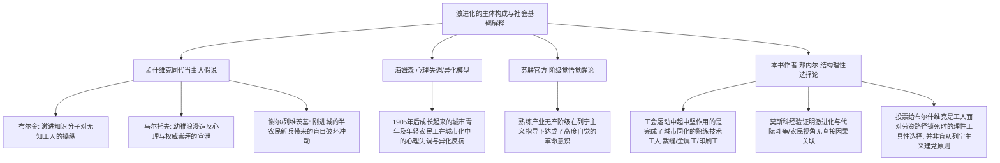

---
author: 研究者笔记
language: zh
related_cards:
- '[[cards/文献/反叛的根源（邦内尔）]]'
- '[[cards/概念/俄国工人运动]]'
- '[[cards/概念/合法工会]]'
source_text: Victoria E. Bonnell《反叛的根源：圣彼得堡和莫斯科的工人政治与组织，1900-1914》
tags:
- research-note
- 俄国工人运动
- 邦内尔
- 圣彼得堡和莫斯科
title: 反叛的根源——章节深度学术总结
type: research-note
---

# 维多利亚·E·邦内尔《反叛的根源》章节深度学术总结

本报告对著名社会历史学家维多利亚·E·邦内尔（Victoria E. Bonnell）的学术巨著《反叛的根源：圣彼得堡和莫斯科 of 工人政治与组织，1900-1914》（*Roots of Rebellion: Workers' Politics and Organizations in St. Petersburg and Moscow, 1900-1914*）进行全面、系统的分章节深度学术总结。以下总结分为“事实部分 (Facts)”与“论述部分 (Analysis)”，旨在详实还原原书的历史数据与理论脉络。


---

## 第一章：圣彼得堡和莫斯科的工人阶级（约1900年）

# 维多利亚·E·博内尔《反叛的根源》第一章学术总结
## 圣彼得堡和莫斯科的工人阶级，约1900年

---

### 引言

在维多利亚·E·博内尔（Victoria E. Bonnell）的代表作《反叛的根源：沙皇俄国工会与工人政治，1900-1914》（Roots of Rebellion: Workers' Politics and Organizations in St. Petersburg and Moscow, 1900-1914）中，第一章“圣彼得堡和莫斯科的工人阶级，约1900年”构成了全书的社会学与历史学背景基础。作者在这一章中，通过详实的市政人口普查数据、工厂监察局报告、行业调查以及工人回忆录，对20世纪初沙皇俄国两大核心城市——圣彼得堡和莫斯科的工人阶级进行了细致的“人口解剖”与社会学透视。博内尔不仅厘清了当时极其多元和异质的城市劳动力构成，还深入探讨了工人的社会背景、技能等级、学徒经历、城乡联系以及工作与生活空间如何交互作用，进而形塑了工人们独特的社会身份认同。这为理解1905年革命的爆发及后续俄国工会运动的发展提供了关键的社会结构性解释。

---

### 1. 事实部分 (Facts)

#### 1.1 城市化、人口增长与地理分布事实

十九世纪下半叶，伴随着俄国工业化的迅猛起飞，两大首都圣彼得堡和莫斯科经历了剧烈的人口膨胀与城市扩张。
- **移民规模与人口增长率**：在19世纪90年代这一工业“起飞”的黄金十年中，圣彼得堡接纳了约40万移民，其中绝大多数是农民，平均每年新增4万人口。莫斯科在1892年至1902年间，平均每年接纳26,000名移民。
- **城市总人口规模**：到1900年，圣彼得堡的总人口已达140万；到1902年，莫斯科的人口也超过了110万。至第一次世界大战前夕（约1914年），圣彼得堡的人口进一步飙升至220万，莫斯科则达到170万。这两座城市成为了俄罗斯帝国名副其实的超级大都市，也是贫困农民寻求生计的主要避难所。
- **工人居住区的地理空间分布**：两市的工厂和工人阶级呈现出明显的地理聚集特征。
  - 在圣彼得堡，工厂和工人住宅区主要集中在维堡区（Vyborg）、瓦西里耶夫斯卡亚区（Vasil'evskaia）、亚历山德罗-涅夫斯卡亚区（Aleksandro-Nevskaia）和彼得堡区（Peterburg）。这些工业郊区笼罩在肮脏、煤烟与阴郁的氛围中，遍布着破旧的啤酒馆、小酒馆和杂货铺。
  - 在莫斯科，类似的工业区则分布在普列斯年斯卡亚区（Presnia，即后来的红普列斯尼亚）、列福尔托夫斯卡亚区（Lefortovo）以及扎莫斯科列奇耶区的拉基曼斯卡亚（lakimanskaia）和皮亚特尼茨卡亚（Piatnitskaia）等地。

#### 1.2 工人阶级的定义与制造业构成

博内尔指出，传统的苏联劳动史学界（如A. G. 拉斯林 A. G. Rashin 等人的研究）受马克思列宁主义教条影响，普遍将“工人阶级”等同于“工厂工人”（fabrichno-zavodskie rabochie），刻意忽略了其他雇佣劳动群体。
- **工厂工人的真实占比**：在20世纪初，受监察局监管的工厂工人在圣彼得堡总雇佣劳动力中仅占25%（1902年为161,924人），在莫斯科仅占21%（1902年为111,719人）。
- **工厂与手工业（Remeslenniki）的相对规模**：即使在制造业内部，工厂工人也并未占据绝对主导。在圣彼得堡，手工业工人数量为150,709人（占比48%），工厂工人为161,924人（占比52%），两者几乎平分秋色；在莫斯科，手工业工人甚至达151,359人（占比58%），远超工厂工人的111,719人（占比42%）。（见下表）

| 城市 (调查年份) | 工厂工人数量 (占比) | 手工业工人数量 (占比) | 制造业工人总数 |
| :--- | :--- | :--- | :--- |
| **圣彼得堡** (1900-1902) | 161,924 (52%) | 150,709 (48%) | 312,633 |
| **莫斯科** (1902) | 111,719 (42%) | 151,359 (58%) | 263,078 |

- **监管与法律定义**：工厂工人和手工业工人在沙皇法律下具有明确的区别。工厂工人受雇于受**工厂监察局**（1905年前属财政部，后属贸易和工业部）管辖的企业。
  - 工厂监察局是根据1882年6月1日的法律设立的，其核心职能基于1886年6月3日的法律得到完全确立。该法律赋予监察局审查工资标准、批准工厂内部秩序规则、调解雇主与工人的纠纷、收集劳工统计数据等职能。
  - 1901年之前，官方将“工厂”定义为雇用15人或以上，或使用发动机驱动机械的制造企业。1901年，财政部将标准修改为雇用20人或以上的制造企业（无论有无发动机）。这些法规限制了雇主的特权，赋予了工厂工人一定的法律救济渠道。
  - 与此相反，数以十万计的手工行业工人则完全不受工厂法保护，没有工作时间限制，也没有针对雇主任意克扣工资或解雇的法律救济手段。

#### 1.3 手工业劳动力（Remeslenniki）的具体特征与分布

手工业群体在世纪之交不仅数量庞大，且在结构和分布上呈现出以下特征：
- **三大基本特征**：生产依赖手工劳动、分工极少；工作需要通过长期学徒期获得的专业技能；劳动力内部存在等级森严的分层，即学徒（ucheniki）、熟练工（podmaster'ia）和师傅/大师（mastera）。
- **行会（Tsekh）制度的衰落**：源于18世纪的行会制度在20世纪初名存实亡。圣彼得堡的行会数量从历史上的21个锐减至1900年的8个。行会成员仅占手工业者的一小部分（在圣彼得堡占28%，约41,800人；在莫斯科仅占16%，约24,500人）。
- **资本主义工业化对手工业的重塑**：
  1. **手工业向工厂环境的转移**：以**印刷业**为典型。19世纪70年代起，机械印刷机被引入，但排字工作直到1906年第一台排字机问世前，始终是高度依赖手工技能的劳动密集型工种。1905年以前，每3至4名印刷工人中就有一名排字工。这些在大型机械化印刷厂工作的排字工被称为“工厂工匠”（factory artisans），在统计上归为工厂工人，但保留了深厚的手工行会传统。
  2. **分包商作坊（masterskaia khoziaichikov）的兴起**：以**服装和制鞋业**为代表。为了满足大众对廉价、低质成品的需求，大型零售和批发公司大量将生产外包给这些分包作坊，这极大地恶化了劳动条件，削弱了传统的技能培训。而在高档定制市场中，迎合富裕市民的传统大师作坊（masterskaia khoziaev）依然普遍存在。
- **行业分布与性别特征**（根据表2和表3数据）：
  - **服装业**是最大的手工业部门。在圣彼得堡拥有45,784名手工业工人，在莫斯科拥有51,574人。女工占服装业劳动力的三分之二左右，但她们主要集中在技能和薪资极低的细分工种。
  - **建筑业**是圣彼得堡第二大手工业部门，拥有32,287名熟练建筑工（莫斯科为12,297人），如木工、泥瓦工、管道工等。
  - **金属加工业**同样包含庞大的手工业部分，特别是在莫斯科，32,647名金属工人中有14,645人（45%）属于手工业，而非工厂。
  - **性别隔离**极为严苛：烘焙、制皮、制鞋、珠宝制作、印刷和木工等行业在20世纪初几乎完全被男性垄断。

#### 1.4 工厂劳动力（Fabrichno-zavodskie rabochie）的集中度与部门特征

世纪之交的工厂工人表现出极高的企业集中度，这与欧洲其他国家形成鲜明对比。
- **企业集中度数据**（见表4）：
  - 圣彼得堡省（1901-1905年）：有37.9%的工厂工人集中在雇用1000人以上的巨型工厂中，100-499人规模的工厂工人占31.8%。
  - 莫斯科市（1910-1911年）：有34.2%的工人集中在1000人以上的大厂。
  - 与此相比，整个欧洲俄罗斯的1000人以上大厂工人均值为31.2%，而工业强国德国（1895年数据）的这一比例仅为6.6%。
- **核心工业部门与代表性企业**：
  - **圣彼得堡的金属与机械制造工业**：是首都的第一大工业。拥有70,032名工厂工人和10,802名手工工人，总数超8万。该行业可细分为军需品、造船、铁路建设、机械制造和电气工程。
    - **代表性巨型企业**：私营普梯洛夫工厂（Putilov，拥有12,000名工人）；私营涅夫斯基造船和机械厂（Nevskii，拥有约4,000名工人）；由海军部直接管理的国营波罗的海造船厂（Baltic，拥有约5,000名工人）。其他国有军工厂包括：奥布霍夫工厂（Obukhov，1898年有4,300人）、新海军部工厂（New Admiralty，1905年有3,000人）、奥鲁季尼工厂（Orudinyi，1905年有700人）、帕特龙尼和特鲁博奇尼炮兵工厂（Patronnyi and Trubochnyi，1905年有6,693人），以及阿列克谢·桑德罗夫斯基铁路工厂（Alexandrovskii，1900年有8,000人）。
    - **劳动力特征**：几乎全为男性，熟练工比例极高（在许多工厂中占到五分之四）。
  - **莫斯科的纺织工业**：是莫斯科的工业支柱，占工厂劳动力总数的46%（达51,932人）。
    - **代表性巨型企业**：普罗霍罗夫斯卡亚·特列赫戈尔纳亚公司（Prokhorovskaia Trekhgornaia，雇用6,000人），另有11家工厂雇员在1000人以上。
    - **劳动力特征**：以非熟练和半熟练的纺纱织布工为主，女性占总劳动力的44%以上，普遍处于技能和收入的底层。
  - **食品和烟草加工业**：
    - 糖果制造和烟草加工属于高度集中的大型企业。女工在其中占有极高的比例，如圣彼得堡糖果业女工占30%，莫斯科占53%；在圣彼得堡烟草业，女工占7,318名工厂工人的85%，在莫斯科占60%。
    - 烘焙业以手工和男性为主，但也有大型企业，如莫斯科的菲利波夫面包店（Filippov，1899年有350多名工人）。
  - **国营纸张与印刷业**：
    - 国营造纸印刷厂（Ekspeditsiia zagotovleniia gosudarstvennykh bumag）是该领域的巨头，1899年有3,700名雇员，其中印刷部门约1500人，造纸部门约900人。

#### 1.5 非工业行业与服务业劳动力事实

除了制造业，两大城市的城市工人阶级还包含了一支数量极其庞大、但在以往劳动史中常被忽视的非工业劳动力队伍：
- **销售文员（Commercial clerks）**：
  - 圣彼得堡拥有109,479人，莫斯科拥有85,821人（见表6）。
  - 该职业分为五个主要子群体：售货员（prikazchiki）、收银员（kassiry）、簿记员（bukhgaltery）、职员（kontorshchiki）和学徒（ucheniki）。
  - 售货员是其中最庞大的群体，占总数的一半左右（圣彼得堡近6万，莫斯科超4万），其中90%为男性。女性只在低档零售店工作。
  - 大多数销售文员受雇于散布在全市的小型食品零售店（占零售商家的三分之二），但也有少数受雇于缪尔和梅里利斯百货公司（Muir and Mirrielees）等大型百货商厦，以及批发商行、银行和工业办事处。
- **建筑工人**：
  - 由流动性的季节性农民工（非熟练工，冬季回乡，春季返城）和常驻城市的熟练建筑工（木工、泥瓦工、管道工等，圣彼得堡有32,287人，莫斯科有12,297人）组成。管道工通常集中在大型建筑车间，具有较强的集体行动倾向。
- **交通运输与通信工人**：
  - 交通运输工人（不含铁路车间机械师）在圣彼得堡有46,483人，莫斯科有49,799人。
  - 客运在世纪之交主要依靠私人马车夫（izvozchiki），圣彼得堡直到1907年才开通有轨电车，随后有轨马车和公共马车系统开始向市政公营过渡。货运主要依赖运河和马车，季节性强，吸纳大量码头工人。
  - 铁路工人是交通部门的核心：圣彼得堡有5,389人，莫斯科有21,281人，包括列车员、检票员、办公室办事员和工程师。
  - 通信工人受雇于国家及市政运行的邮政、电报和电话系统，圣彼得堡有3,689人，莫斯科有2,530人。
- **服务业工人**：
  - 规模极其庞大：圣彼得堡有166,479人，莫斯科有133,167人。
  - 家政服务人员（女佣、厨师等）是第一大群体，圣彼得堡有128,045人，莫斯科有78,728人，绝大多数为农村迁入的女工。
  - 酒店、餐饮和茶馆雇工：圣彼得堡有19,289人，莫斯科有33,700人，高档场所的厨师和服务员几乎全是男性，且需经过长期学徒培养。

#### 1.6 技能、学徒经历与识字率事实

工人的技能高低不仅决定了他们的经济地位，还直接与其学徒经历、识字水平及城乡联系的性质绑定：
- **学徒制的年龄与法律差异**：
  - 在手工作坊和销售公司中，学徒的招收年龄非常低，通常在10至15岁之间。1902年莫斯科排字学徒的平均年龄为13.2岁；1907年调查显示，印刷业十分之七的工人在14岁前就进入了劳动力市场。服装业学徒一般从12或13岁开始。许多贫困省份（如伊罗斯拉夫尔、诺夫哥罗德、普斯科夫）的儿童在冬季被中间人“买断”并运送到大城市当学徒，形同奴役。
  - 在大工厂中，由于1882年以来的劳动法严禁工厂招收12岁以下儿童，并对12至15岁儿童的工作时间限制在8小时内（而工厂正常轮班为11至11.4小时），工厂主普遍不愿雇佣16岁以下的少年。因此，工厂学徒一般从16岁开始（如卡纳奇科夫在16岁进入古斯塔夫·李斯特工厂做2年模具工学徒）。
- **识字率的行业与性别对比（1897年人口普查数据）**：
  - 圣彼得堡男性工人的识字率为74%，女性为40%；莫斯科男性为66%，女性为25%。
  - 熟练工人的识字率极高：1907年莫斯科印刷工的识字率中，有81%接受了小学教育，11%自学成才。莫斯科裁缝店的熟练裁缝识字率达90%，而服装外包作坊工人的识字率仅在66%至75%之间。
  - 圣彼得堡金属工人的识字率为73%，而纺织工人仅为44%。瑞典埃里克森金属加工厂（Erickson）的工人识字率高达85%。
  - 销售文员的识字率全帝国最高：男性为95%，女性为86%，少年学徒为90%。
- **城乡联系的阶层差异调查数据**：
  - **排字工 vs 石印与装订工**：1907年，莫斯科有65%的高技能排字工表示与农村家乡完全没有联系；而在技术较低的石印工和装订工中，该比例仅分别为24%和28%。
  - **波罗在线造船厂（1901年）调查**：该厂在册工人中80%在护照上登记为“农民”，但车间分化极大：要求极高的制模车间只有50%登记为农民，其余为市民（meshchane/remeslenniki）；而在钢铁铸造车间（重体力、低技能），农民比例高达89%。全厂五分之三的农民工人与农村的联系“纯粹是形式上的”，只有五分之二的人在农村保留有土地所有权。
  - **已婚工人家属的地理分布**：1897年人口普查显示，已婚工人将妻子和孩子留在农村的比例为：纺织工人87%，金属工人69%，印刷工人67%，而波罗的海造船厂仅为29%。这显示了越非熟练的行业，越难以在城市建立家庭。

#### 1.7 工作场所与工作场所之外的生活事实

- **工作时间**：在手工业作坊、面包店和商店中，工人每天在工作场所劳动14至16个小时（每周六天或七天）是常态。而在受工厂监察局管辖的工厂中，1899-1902年间全国平均工作日为11至11.4小时，圣彼得堡为11小时。
- **冷热车间的分裂**：大型金属加工厂内部存在着明显的职业等级壁垒。涅夫斯基造船厂的铁匠铺学徒阿列克谢·布济诺夫回忆称，“冷车间”（机械、金属装配和车床车间）的熟练工极度瞧不起“热车间”（冶炼、轧钢和铁匠铺）的工人，这深深地伤害了热车间工人的自尊心。
- **行业认同与 tsekhovshchina**：工人们对自己的特定工种有着强烈的、有时是狭隘的忠诚。1908年圣彼得堡金属工会的一项调查列出了一百多个不同的职业类别，织工、纺纱工、染色工等互不混淆。
- **车间社会习俗**：
  - “蓝色星期一”（Blue Monday）：周一因为周末宿醉而继续聚众饮酒，导致作坊停工。
  - 入职仪式：新来的人必须请全车间喝酒，否则会被叫外号“塔拉斯”。
  - 礼品与贿赂：在工头命名日或过生日时，工人集资买礼物送给工头以换取关照。
  - 惩罚工头：用脏麻袋套住苛刻的工头，用手推车推出去，这在金属工和面包师中很常见。
- **居住条件**：
  - 许多手工业者、面包师和售货员被迫住在工作场所内，如莫斯科服装分包作坊中，三分之二与村庄有联系的人直接睡在作坊里。许多面包店在下班时大门会被老板锁死，以防止工人夜间外出。
  - 工厂工人则多住在厂外。1897年圣彼得堡仅有10%的工厂工人住在工厂宿舍（以纺织厂和食品厂非熟练女工为主）。住在厂外的工人通常租住拥挤、潮湿的房间或床位，或者加入同乡“合租小组”（artel，由同乡合租并由某位工人的妻子做饭）。
- **闲暇与自我提升途径**：
  - 宗教：去东正教堂礼拜（20年代调查显示，革命前70%男性和85%女性工定期去教堂），圣像普遍挂在宿舍和车间角落。
  - 学习班：俄国技术协会莫斯科分会于1897年创立了**普列奇斯滕斯基工人培训班**（Prechistenskii courses），在晚上8点至10点授课，分初、中、高三级，向工人教授基础技能、历史、文学和经济学。到1910-1911年已吸引1700人报名。
  - 改良组织：1902-1903年莫斯科的**祖巴托夫协会**（Zubatov associations）和次年在圣彼得堡成立的**加蓬组织**（Gapon assembly）提供了社交舞会、讲座和会议，在熟练工人中极受欢迎。

---

### 2. 论述部分 (Analysis)

#### 2.1 阶级范畴的重构：多元城市无产阶级模型

在《反叛的根源》第一章中，博内尔展现出明确的学术意图：挑战并重构苏联官方历史学中单一、同质且目的论式的“工厂无产阶级”阶级范畴。苏联学者将工人运动的领导权和革命意识的觉醒完全归功于大型工厂中的金属工人和纺织工人，而将手工艺者、销售文员、建筑工人等边缘化，视其为带有小资产阶级或农民落后意识的“非无产阶级”群体。

博内尔通过丰富的社会统计事实，提出了一个**多元且异质的“城市工人阶级”模型**。她指出：
- 第一，在世纪之交的圣彼得堡和莫斯科，工厂工人在整个雇佣劳动大军中仅占少数（21%-25%），如果把手工业者和其他非工业工人排除在阶级分析之外，将无法解释为什么1905年之后的反叛运动能够呈现出如此惊人的社会动员广度。
- 第二，在社会实践中，手工业的“工厂工匠”（如排字工）、建筑行业的管道工、零售商店的售货员以及大工厂的熟练金属装配工，在面临沙皇专制体制、资本主义剥削和城市社会不公时，表现出了高度一致的利益认同。
- 第三，这些看似不同的行业通过复杂的社会网络交织在一起。工人在工厂、作坊和商店之间横向流动，家庭成员在不同的职业部门就业，并且在拼租房间、酒馆和同乡会（artel）中共同生活。

因此，博内尔的分析模型表明，俄国工人阶级的阶级意识并非仅仅诞生于大型工厂的流水线和机器轰鸣中，而是诞生于一个由工厂、手工作坊、商业网点和工人社区共同构成的多元城市社会生态系统之中。这一异质性无产阶级概念，为解释1905年革命和工会化运动中各行业工人的协同罢工和广泛参与提供了更具说服力的社会学框架。

#### 2.2 城乡纽带的辩证法：技能、保障与双重身份认同

关于沙皇俄国工人的城乡联系，学术界长期存在着两种对立的简单化解释：苏联学派强调工人与农村的快速、彻底决裂，以论证“纯粹无产阶级意识”的成熟；而以罗伯特·E·约翰逊为代表的部分西方学者则过分强调农民工对乡村的依附，认为“一只脚在农村，一只脚在工厂”的工人阶级本质上依然保留着农民的传统认同和保守心理。

博内尔提出了一种更为辩证的社会学分析框架。她认为，工人的城乡联系和身份认同不能用简单的“断裂”或“维护”来衡量，而必须**与其在城市劳动等级制度中的技能位置相绑定**。
- **高技能工人的“脱农入城”机制**：对于金属模具工、机械工 and 排字工而言，长期的城市学徒生涯使他们在生理和心理上很早就适应了城市节奏。高工资和高文化水平使他们有能力在城市成家立业、购买西装、参与市民文化。他们虽然在法律身份（户籍护照）上可能仍然是“农民”，但心理上已经将农村视为“负担”或“弊大于利”。他们不再将剩余工资寄回村里，甚至为此与农村的父亲对簿公庭。他们以自己的“手艺人”（masterovye）身份为荣，这是一种全新的、城市化的工人阶级自我认知。
- **非熟练与半熟练工人的“双重保险”机制**：对于纺织工、黑工、面包店雇工或服装外包工而言，他们在城市面临着极高的失业风险和微薄的薪资，无法在城市高昂的物价下养活家小。因此，他们必须将妻子和孩子留在农村，并极力维持在村庄里的土地所有权。此时，农村不仅是名义上的家乡，更是他们在遭遇失业、伤病或年老时的**社会保障网**。

博内尔的论证表明，城乡联系的强弱并不是一种“落后”或“先进”的意识形态指标，而是工人根据自身在城市劳动市场中所处位置做出的**理性生存策略选择**。这种双重身份认同（既是城市雇工，又是农村土地拥有者）使得非熟练工人在斗争中更容易受到农村波动的影响，而熟练工人则因为彻底根植于城市，成为了追求工作场所权利和政治民主的先锋。

#### 2.3 劳动过程控制与尊严政治：阶级意识觉醒的微观基础

博内尔在本章中深入剖析了工作场所的微观权力关系，指出了**技术所有权、劳动过程控制与工人政治主体性**之间的内在联系。她探讨了为什么在面临剥削时，高技能工人往往比非熟练工人表现出更强烈的主动反抗精神。

- **对劳动过程的自主掌控（Control over the work process）**：在20世纪初，虽然大工厂不断扩张，但由于排字机、电动裁剪机和自动揉面机等尚未普及，许多关键的生产工序仍然依赖工人的手工技艺和主观判断力。熟练金属装配工、模具工和排字工在接到工作任务后，可以自主决定操作步骤和工作节奏，不受机器速度的强迫。这种工作性质培养了他们强烈的独立性、掌控感和自尊心。
- **相反的机器奴役**：与此形成鲜明对比的是，纺织厂的女工只是自动纺纱机的看管者，她们的工作完全由机器的物理运动决定，缺乏任何自我发挥的空间，因而也难以在工作中获得尊严和掌控感。
- **尊严政治的兴起（Politics of Dignity）**：正因为熟练工人在生产过程中体验到了自主性和掌控感，他们对工作场所中任何侮辱人格的专制行为都极为敏感。当工厂管理层试图取消“masterovye”（师傅）这一带有体面色彩的称呼、改用贬义的“rabochie”（工人）来统称他们时，或者当工头在搜身时粗暴地使用非礼貌的“你（ty）”而非尊称“您（vy）”时，熟练工人会感到强烈的自尊心受挫。

博内尔的论述表明，工人的阶级意识和反抗情绪，首先是对工作场所微观尊严的捍卫。熟练工人将他们在劳动过程中获得的自主性，转化为在劳动关系中要求自主权和受尊重的政治诉求。这解释了为什么最早要求建立工会、限制雇主任意处罚、争取人格尊严的，总是那些识字率最高、薪资最丰厚的高技能“劳动贵族”或“工厂工匠”。

#### 2.4 行业认同（Tsekhovshchina）与车间习俗的辩证作用

博内尔对车间习俗（Workplace customs） and “行业认同”（tsekhovshchina，即行会意识）进行了深入的辩证分析，揭示了它们在工人动员和阶级整合过程中的双重作用。

- **车间习俗的团结与惩戒功能**：
  - “蓝色星期一”、入职仪式（如新工人被叫“塔拉斯”并请客）、选举车间长老（starosta）以及为困难工友集资等传统，在非正式层面上构筑了车间的社会连结。
  - 这些习俗创造了一种独特的“车间共同体”，使工人们在面对资方压力时拥有某种非正式的心理防线。
  - 特别是“用手推车把苛刻的工头推出去”这一仪式化惩罚，实际上是工人阶级在缺乏合法工会的情况下，对车间微观权力滥用的一种集体自卫和道德惩戒机制。
- **行会认同（Tsekhovshchina）的割裂与阻碍作用**：
  - 然而，这些传统的、基于具体车间或特定手艺的习俗，同时也孕育了狭隘的行业爱国主义和特权意识。
  - 如布济诺夫所指出的，机加工冷车间的熟练工瞧不起冶炼和铁匠等热车间的工人；排字工瞧不起石印工和装订工。
  - 这种“行会化”的狭隘认同，导致工人们将自我界定局限在特定的“车间”或“公司”内，对其他部门同胞的处境冷若冰霜。

博内尔分析道，这种行会认同在平时起到了**割裂工人阶级整体性**的作用。知识分子劳工活动家（如布尔什维克和孟什维克）常常对此感到痛心，并将其视为落后的行会残余。然而，这种狭隘的职业凝聚力，在特定的政治危机时刻（如1905年革命爆发时），却能够迅速转化为行业工会的组织基础。一旦外部环境允许，排字工、面包师、裁缝和金属工等各自拥有的狭隘行业认同，会成为他们率先建立起本行业强大工会的物理催化剂。

#### 2.5 空间政治与非正式社交网络：从微观车间到市民社会的动员路径

博内尔对工人生活和居住空间（Spatial organization）的分析，体现了空间政治学在劳工研究中的重要性。她指出，工人的物理空间分布直接决定了他们是否能够建立跨企业、跨行业的社交网络，进而影响其组织化的可能性。

- **作坊居住的空间囚笼**：对于被迫睡在面包房、服装分包作坊或商店里的工匠和售货员而言，他们的时间和空间被24小时禁锢在雇主的监视之下。大门被锁死、无法外出、无法与外界交流，这种彻底的物理隔离使他们几乎不可能参与任何集会或建立有组织的联系。
- **厂外居住的空间解放与社交网络**：相反，绝大多数工厂工人和部分富裕工匠居住在工厂之外。这种工作与居住的分离，为工人夺回了非工作时间的主导权。
  - 他们在拥挤的工人街区租房，在街角、杂货铺和酒馆里相遇。
  - 普梯洛夫工厂附近的五十多家小酒馆不仅是消遣饮酒的场所，更是工人交流小道消息、讨论工作条件、宣泄反叛情绪的**非正式公共领域**。
  - 跨行业的共同居住（如同一套出租房内住着工厂金属工、售货员和鞋匠）打破了“行会认同”的藩篱，促进了不同职业群体之间的信息互通和阶级同情。
- **市民社会教育与改良空间的组织化作用**：
  - 普列奇斯滕斯基工人培训班等夜校，虽然由自由主义知识分子和帝国技术协会主办，客观上却为来自不同工厂和铁路车间的技术工人提供了一个合法的、跨厂际的物理聚集空间。工人们在这里不仅学习了历史和文学，更建立起了互信的骨干网络。
  - 祖巴托夫协会和加蓬组织利用工人对社交、教育和尊严的渴望，在官方特许下建立了广泛的俱乐部。这些俱乐部举办的舞会和讲座，将数以万计分散的工人凝聚在一起，建立起了前所未有的组织架构。

博内尔总结指出，正是这些在市民社会边缘发展起来的非正式社交网络、夜校空间以及改良主义的特许组织，在1905年革命的洪流中，被工人们迅速接管和政治化。原有的同乡网络、夜校骨干小组和祖巴托夫/加蓬组织的物理架构，在一夜之间转变为罢工委员会、独立的阶级工会和工人代表苏维埃。这表明，反叛的根源不仅埋藏在资本主义剥削的经济事实中，更生发于工人阶级在日常城市空间中一步步编织起来的社会连结与自主生活实践之中。

---

### 结语

维多利亚·E·博内尔在《反叛的根源》第一章中，通过精湛的社会学解剖，为读者呈现了一个充满活力、高度分化却又在城市空间中不断交织的俄国工人阶级群像。她证明了，世纪之交的俄国工人并非一群被动受动、面目模糊的“无产阶级”符号，而是在技术控制、尊严抗争、城乡纽带的张力以及城市社交空间的拓展中，逐步摸索并确立了自身阶级主体性的历史行动者。这种细致的社会结构与微观生活史分析，避开了宏大叙事的空洞，为后续章节探讨工会组织的诞生和政治派系的博弈奠定了坚实而深刻的微观基础。

---

## 第二章：1905年前有组织工人运动的基础

# 俄国劳工运动的组织基础（1905年以前）——《反叛的根源》第二章学术摘要

本章主要探讨了1905年革命爆发前，圣彼得堡和莫斯科两地工人阶级组织化经验的积累过程。作者维多利亚·E·波内尔（Victoria E. Bonnell）通过考察手工业行会、互助会、政府资助的劳工组织（“警察社会主义”实验如祖巴托夫协会和加蓬大会）、工厂层面的常设代表制（工厂长老制）以及地下激进政党和工会，揭示了1905年独立工会和群众性劳工运动迅速兴起的历史与社会学基础。

---

## 一、 事实部分 (Facts)

### 1. 工作环境与日常生活数据
*   **工时与工作制度**：在20世纪初，圣彼得堡和莫斯科的工人在工作场所每日工作时间长达16小时，每周工作6天甚至7天。
*   **手工劳动的存续**：尽管俄罗斯作为工业化后发国家在大型工厂中采用了先进的技术设备，但手工劳动和有限的劳动分工在手工业中依然占据统治地位。即使在大型金属加工和印刷等已经高度机械化的工厂中，许多关键车间仍主要依赖高技能的“工厂工匠”（zavodskie remeslenniki）。这些工人需要经过长期的学徒期培训，并在车间内形成了熟练工人的劳动等级制度，对劳动过程拥有相当大的控制权。
*   **外部生活经验**：工人们在工作场所之外的闲暇时间、用餐时间以及参与城市生活的体验，使工人们在20世纪初逐渐确立了新的城市社会身份，感到自己是城市社会更大集体的一部分。

### 2. 手工业行会（Tsekhi）的历史、数据与运作
*   **立法背景**：
    *   俄国的德式行会（tsekhi）正式成立于1721年彼得大帝统治时期，当时颁布了首部规范手工业的法律。
    *   1785年，沙皇政府颁布《手工业条例》（Remeslennoe polozhenie），规定了进入和从事城市手工业的法定条件。该条例成为此后所有关于城市手工业立法的基础。
*   **1900年行会统计数据**：
    *   **登记人数**：圣彼得堡共有 52,075 名工匠在行会中登记；莫斯科则有 51,581 名。
    *   **成员分类**：行会成员分为师傅（masters）、工匠（journeymen）和学徒（apprentices）三类。
    *   **师傅（作坊主）人数**：圣彼得堡有 10,275 人，莫斯科有 27,174 人。
    *   **雇工与学徒人数**：圣彼得堡有熟练工匠和学徒共 41,800 人，占全市手工业劳动者总数的 28%；莫斯科有 24,407 人，占全市手工业劳动者总数的 16%。
*   **社会构成与流动限制**：行会工匠（熟练工和学徒）通常是第二代或第三代工匠，或者是熟练工厂工人或城市工人阶级家庭的后代。他们在作坊中构成技艺精湛的精英阶层，享有特权地位和高工资。然而，到20世纪初，绝大多数行会工匠终其一生都只能靠打零工维持生计，无法晋升为作坊主。
*   **管理机构**：负责管理行会事务的“地方手工业委员会”（remeslennye upravy）完全受制于作坊主。委员会对《手工业章程》中有关劳动保护的规定执行松懈，活动仅限于注册和通过作品样本评判（由专门 of 工艺认证委员会进行）授予资格认证。工人和学徒被完全排除在管理层之外。

### 3. 互助会（Mutual Aid Societies）的建立与地理对比
*   **早期互助会运动**：
    *   印刷工人在俄罗斯最早成立互助会：华沙（1814年）、里加（1816年）、敖德萨（1816年）。
    *   **圣彼得堡**：德国印刷工人率先于1838年成立互助会；1854年成立了俄罗斯印刷工人互助会。销售文员（retail clerks）于1865年成立互助组织。
    *   **莫斯科**：互助会发展慢于首都。店员于1863年成立互助组织；印刷工人于1869年成立。
*   **1863年法规改革**：政府修改了互助社团合法化程序，将此前需要沙皇亲自批准的权限，下放给内务大臣（内政部长），简化了审批流程。
*   **1860年代至1904年成立的互助会名录**：
    *   **圣彼得堡**：德国工匠互助会（1862年）、园丁互助会（1864年）、排字工互助会（1866年）、俄罗斯工匠互助会（1867年）、售货员互助会（1885年）、金银匠互助会（1892年）、布料裁剪工互助会（1896年，主要由作坊主组成）、印刷工人丧葬互助会（1899年）、理发师互助会（1899年）、服务员互助会（1902年）、药剂师互助会（1902年）、会计师和簿记员互助会（1904年）。
    *   **莫斯科**：工匠互助会（1875年）、药剂师互助会（1885年）、商业雇员互助会（1889年）、纺织厂的雕刻师和滚筒印刷机操作员互助会（1898-1899年）、服务员互助会（1902年）。
*   **工厂级互助会**：
    *   1860年，圣彼得堡皇家瓷器玻璃厂成立互助会。
    *   1861年，亚历山德罗夫斯基铁路机械厂成立互助会。
    *   19世纪80年代，圣彼得堡涅夫斯基造船机械厂金属工人试图为全市金属工人成立互助会，但组织者遭逮捕。
    *   1899年，圣彼得堡工程厂工人互助协会（Engineering Factory Workers Mutual Aid Society）获得合法地位。至20世纪初，波罗的海工厂、奥布霍夫工厂、伊若尔斯基工厂、塞斯特罗列茨基工厂等国营金属加工厂，以及莫斯科的古斯塔夫·李斯特金属加工厂均存在合法的工厂互助会。
    *   19世纪末，圣彼得堡的瓦西里岛和亚历山德罗-涅夫斯卡亚区还出现了一些由社会民主党人组织的非法互助基金，用于资助因政治活动被捕或解雇的工人家庭。
*   **财务与会员数据**：
    *   互助会门槛高，限制了普通工人加入。例如，圣彼得堡印刷工人互助会仅有 300 名会员，月费为 1 至 1.25 卢布。排字工互助会拥有 910 名会员。
    *   莫斯科销售员互助会在世纪之交拥有 2,726 名会员；圣彼得堡印刷业工人丧葬互助会拥有 2,000 名会员。
    *   莫斯科印刷工人互助会有 460 名会员，仅占全市印刷工人的 4%。
    *   **收入对比**：1907年对莫斯科印刷工人互助会调查显示，65%的成员月收入超过 40 卢布，12%的成员月收入在 35 至 40 卢布之间，而当时印刷行业的平均月工资为 34.70 卢布。
*   **活动与期刊**：
    *   1900年3月，圣彼得堡排字工人互助协会提出星期日休息诉求。
    *   1902年，创办期刊《排字工》（*Naborshchik*，1905年更名为《排字工与印刷界》，持续出版至1916年）。
    *   1896年（下诺夫哥罗德）和1898年（莫斯科）召开了全俄销售文员互助协会大会。
    *   1905年前后，圣彼得堡存在 11 个印刷业互助协会，拥有 3,000 至 5,000 名会员，吸引了首都印刷和装订行业 16% 至 27% 的劳动力。排字工人中每 4 或 5 人中就有 1 人加入了互助会。

### 4. 莫斯科的祖巴托夫实验（The Zubatov Experiment）
*   **时间与主要人物**：
    *   实验于1901年在莫斯科发起。
    *   **谢尔盖·祖巴托夫**（Sergei Zubatov），1896至1902年担任莫斯科秘密警察（奥赫拉纳）局长。
    *   **政府内支持者**：莫斯科警察局长特列波夫、莫斯科省总督、大公谢尔盖·亚历山德罗维奇、莫斯科都主教以及内务部官员。
    *   **意识形态支持者**：保守派记者列夫·季霍米罗夫（《莫斯科新闻报》专栏作家）、莫斯科大学教授伊·赫·奥泽罗夫（1902年1月23日向莫斯科警察局长提交备忘录，极力主张引入工会吸引10%-15%的“工人阶级精英”，后于1906年出版《俄罗斯近现代工作问题政治》）。
*   **组织构成与规模**：
    *   1901至1905年间，莫斯科共有 10 个祖巴托夫小组活动。
    *   行业涵盖金属工、织工（最活跃、规模最大）、木匠、纽扣工、纸箱工、糖果工、烟草工、香水工、印刷工和鞋匠。
    *   祖巴托夫协会排除了工头、副工头和文员，但允许警察、工厂督察、雇主和神职人员作为顾问或顾问成员加入。
    *   烟草工人协会有 150 至 200 名会员（全行业共 3,000 名从业者）；糖果制造商协会吸引了 200 名会员（全行业共 3,000 多人）。
    *   集会参与人数众多：高峰期一千人集会常见，后期转向宗教道德讲座后仍能吸引 500 至 700 名工人参加。
*   **法律活动与1902年古容与穆西罢工**：
    - 1902年，祖巴托夫指派一名警官接收工人请愿书并提供法律咨询，莫斯科法院随后被工人起诉厂主的诉讼案件挤满。
    - 1902年，祖巴托夫织工组织在古容（Goujon）金属厂和穆西（Moussy）丝绸厂发起罢工，波及 1,500 名织工。要求包括：雇主承认工人的集体谈判代表、实行封闭式工会制度。古容后来成为莫斯科工厂主协会主席。
    - 1902年8月，祖巴托夫调任圣彼得堡，莫斯科实验因实业家和财政部的极力反对而转向宗教灌输，但部分社团活跃至1905年。

### 5. 圣彼得堡的加蓬大会与乌沙科夫组织
*   **加蓬大会（Assembly）**：
    *   **全称**：“圣彼得堡俄罗斯工厂和纺织工人大会”（Assembly of Russian Factory and Mill Workers of the City of St. Petersburg）。章程于1904年2月15日获得政府批准。
    *   **历程**：1903年中期在维堡区设立茶室兼阅览室起家。1904年5月仅 170 名缴纳会费的会员。到1905年1月初，已在全市设立 11 个地区小组，估计有 9,000 名会员（其中 1,000 名是女性）。
    *   **组织规则**：章程限制会员必须是俄罗斯裔且信仰基督教，但在1904年底实际操作中并未严格执行。
    *   **行业与企业分布**：划分为金属工、织工和石印工三大职业分支（其中石印工分会拥有 150 名成员，但从未召开会议），另有鞋匠、裁缝、钟表匠等部门。最大的企业级团体位于普梯洛夫厂、涅夫斯基厂和西门子-哈尔斯克厂。
*   **核心骨干人员**：
    *   **P. I. 克罗平（P. I. Kropin）**：37岁，普梯洛夫工厂金属装配工。出生于沃洛格达省村庄，11岁来到首都，13岁进入金属装配作坊当学徒。1898年加入普梯洛夫厂。1904年7月加入大会，后任纳尔夫斯卡亚地区小组主席、冲突委员会委员。1905年2月当选希德洛夫斯基委员会委员，同年晚些时候当选圣彼得堡苏维埃委员。
    *   **G. S. 乌萨诺夫（G. S. Usanov）**：30多岁，第二代工人，石版印刷工。19世纪90年代参加过由A. 卡列林（A. Karelin，高技能彩色石版工，后为加蓬运动核心人物）组织的SD小组。乌萨诺夫任瓦西里岛分会书记，1905年转而从事工会工作，成为圣彼得堡石印工人工会的书记和工会理事会成员，并担任马库斯石印公司派往圣彼得堡苏维埃的代表。
*   **乌沙科夫组织**：
    *   **名称**：“机械制造工独立互助会”（Independent Mutual Aid Society of Workers in the Mechanical Industry）。章程于1904年3月8日获法律批准。
    *   **领导人**：M. A. 乌沙科夫（M. A. Ushakov），铸造工人，曾在加蓬大会积累组织经验，在国营造纸印刷厂担任过工厂长老。他是这一时期圣彼得堡和莫斯科唯一真正领导合法劳工组织的工人。
    *   该组织得到内务部财政赞助，提倡与雇主和解并效忠沙皇。到1904年底，其成员主要来自国营造纸印刷厂和普梯洛夫工厂的高薪金属工和基层管理人员，与加蓬大会构成直接竞争。
*   **普梯洛夫冲突与请愿书内容**：
    *   **导火索**：1904年12月，一名隶属于乌沙科夫组织的工头在普梯洛夫工厂解雇了 4 名加蓬大会的木工车间工人，引发罢工。
    *   **请愿书起草**：大会领导层起草了在血腥星期日前夕广泛讨论的呈递给沙皇的请愿书。
    *   **核心经济与组织诉求**：
        1. 在工厂和车间设立常设的选举产生的工人委员会，与管理层共同处理纠纷；未经这些委员会同意，不得解雇工人。
        2. 立即允许合作社和工人工会的自由。
        3. 立即允许劳工自由地与资本斗争。
        4. 立即允许工人阶级代表参与起草一项为工人提供国家保险的法案。

### 6. 工厂层面代表制度与1903年《工厂长老法》
*   **早期探索**：
    *   1901年春，拥有 4,000 多名工人的国营奥布霍夫金属加工厂爆发罢工，要求设立常设工人代表。管理层最终接受该要求，允许在各车间选举代表，并赋予代表免遭报复的豁免权。涅夫斯基造船机械厂也做出了类似让步，但冲突结束后选出的代表被逮捕。
*   **立法博弈与1903年6月10日《工业企业长老制》**：
    *   财政部于1901年底起草工厂长老法律草案，1902年转交给由奥博连斯基亲王领导的特别委员会。
    *   **实业家的强烈抵制**：
        *   以S. P. 葛莱兹梅尔（S. P. Glezmer）为首的圣彼得堡36位主要实业家向财政部提交报告，坚称“雇主雇佣的是单个工人，而不是工人联盟”，没有义务承认工人代表。
        *   莫斯科纺织巨头A. I. 莫罗佐夫（A. I. Morozov）于1903年5月9日致信财政部长，指出该法风险极大，“不仅可能对本国工业和商业造成严重后果，而且可能对政府造成严重后果”。
        *   另一位莫斯科实业家声称，工厂长老将成为“不断向工厂管理层提出新要求、要求让步的代理人”。
    *   **法律最终条款（1903年6月10日颁布）**：允许工人选举代表候选人，但引入该制度的决定权完全由工厂管理层掌控，管理层保留从候选人中筛选长老的权利。长老会议的时间和地点必须获得批准。长老职责仅限于在管理层和工人之间传递信息。
    *   **实施结果**：截至1905年初，整个俄罗斯只有 30 至 40 家企业实施了该法律，且多为雇员不足 500 人的中小企业。
    *   **政党态度**：1903年8月，俄国社会民主工党（RSDRP）第二次代表大会上，马尔托夫提出决议，呼吁工人利用该法进行组织 and 宣传。列宁随后在《火花报》发文分析此类改良立法。

### 7. 1905年前夕的非法工会与政党实力
*   **1903年莫斯科印刷工人罢工**：
    *   9月爆发，波及莫斯科印刷业 80% 的工人和 60% 的企业。
    *   **排字工人联盟**：1903年7月成立“为改善劳动条件而斗争的排字工人联盟”，发行非法刊物《工会先驱报》（*Vestnik soiuza*）。9月罢工要求提高工资、缩短工时并根据1903年6月10日法律选举长老。12月，工会采纳RSDRP纲领，但拒绝正式组织联系，成员仅有几十名，与群众隔离。
    *   **祖巴托夫印刷协会**：罢工结束后成立，公开运作，每周会议吸引 50 至 300 名印刷工，创办消费合作社，1904年底衰落。
*   **1904年底圣彼得堡社会民主党实力（Somov记录）**：
    *   **纳尔沃斯卡亚区**（有约30,000名工人）：仅有 6 或 7 个社会民主党工人小组，每个小组最多 5 或 6 人，总计最多 35 名工人。主要招募自普梯洛夫厂等金属加工厂。
    *   **亚历山德罗-涅夫斯卡娅区**：仅有 3 个小组，分别设在奥布霍夫工厂、涅夫斯基造船机械厂以及桑顿/瑙曼工厂。
    *   **党员特征**：大多数工人党员非常年轻，刚完成学徒期，在工厂中没有任何影响力。党组织因布尔什维克与孟什维克的分裂而陷于混乱。首都孟什维克组建了“圣彼得堡集团”，脱离布尔什维克控制的“圣彼得堡委员会”。
*   **莫斯科面包师与糖果工**：
    *   19世纪90年代，面包师在菲利波夫公司（Filippov，有350多名面包师）建立首个SD小组。1902年被捕，1904年中期重建了八人组织中心。社会革命党（SR）在面包师中招募的人数少于SD。
*   **工人口述与态度记录**：
    *   **对工会的信念**：1904年，萨维列夫糖果厂14岁工人与前祖巴托夫工会成员对话。工会虽被关闭，但工人坚信：“我们会组织一个新的工会，更强大，更有力量。当我们都加入工会后，你们就不用比我们先到工厂来启动燃烧器了。”
    - **对政党的疏离**：1904年底，一位女织工向孟什维克索莫夫坦承：“最好的工人不会来我们（SD）这里……因为要冒着家人挨饿和坐牢的危险，最好去加蓬组织，因为那里人多，人们对它抱有希望。”
    - **传统的沙皇信仰**：涅夫斯基工厂铁匠阿列克谢·布济诺夫在《致涅夫斯基工人：工人记录》中回忆，1905年1月9日前，绝大多数工人深信沙皇会伸张正义，“任何胆敢对此产生怀疑的人，即便是你的工作伙伴或朋友，也会成为我们所有人的死敌”。

---

## 二、 论述部分 (Analysis)

### 1. 直接工作环境与工人阶级能动性（Agency）的塑造机制
作者波内尔采用社会历史学和工作场所社会学的视角，深入剖析了工作场所的微观环境如何塑造了工人的阶级意识和集体行动的能动性。

*   **手工劳动与劳动过程控制权的存续**：俄国虽然在工业化起步上具有“后发优势”，能够直接引进西方先进的机械设备，但在20世纪初，手工劳动和极不完全的劳动分工在手工业中依然广泛存在，甚至在高度机械化的工厂内部也未被完全消灭。金属加工和印刷等行业中的“工厂工匠”（zavodskie remeslenniki），在技术和身份特征上与传统手工业者具有极强的延续性。他们依赖长期的学徒期积累手艺，对劳动过程本身拥有相当大的控制权。
*   **手艺自豪感（Craft Pride）作为动员的心理基础**：这种对劳动过程的控制权，不仅赋予了熟练工人掌控感和自尊心，更培养了强烈的手艺自豪感。在车间内部，由于熟练工人的聚集以及围绕技艺形成的习俗、传统的延续，工人们建立起了稳固的非正式社会关系纽带。这种手艺认同和行内团结，构成了他们发起集体诉求和抵制雇主专断的天然基础。
*   **城市化与新社会身份的建构**：本章强调了工作场所之外的社会交往对工人世界观的塑造。工人在闲暇时间、用餐时间离开车间的机会，以及逐步参与更为广阔的城市文化生活的体验，帮助他们摆脱了狭隘的乡土纽带或单一作坊的孤立状态。这使他们逐渐产生了一种作为“城市工人阶级”一部分的全新社会身份认同，为他们超越企业局限、走向跨行业的联合奠定了认知基础。

### 2. 手工业行会与互助会的组织网络及其社会资本效应
行会和互助会作为沙皇俄国最古老的合法社团，在动员劳工运动的过程中扮演了“双刃剑”的角色。作者通过中西欧的对比，细致阐明了它们的社会资本效应。

*   **俄国行会的制度异质性与局限**：与西欧历史上的行会不同，俄国行会（tsekhi）从18世纪彼得大帝创立之初就缺乏封闭性法人的独立地位，也未获得对生产和分配的绝对垄断权。它们完全受制于沙皇国家的行政法规和直接监督。到1900年，虽然两大城市仍有超过10万名登记行会成员，但在工业化浪潮下，大部分生产已脱离其管辖。行会内部管理层完全被作坊主（师傅）控制，学徒和普通工匠毫无发言权。这使得行会在制度上未能如西欧那样成为直接孕育独立劳工协会的温床，而是退化为一种保护“贵族”手工业精英特权的保守机制。然而，行会所传承的“行业自豪感”和“行业忠诚”，却成为革命期间手工业工人抵抗去技术化、寻求联合的精神资源。
*   **互助会的精英主义壁垒**：互助会的成立同样受到沙皇政府极具限制性和干预性政策的制约。大多数互助会设立了高昂的准入门槛（如圣彼得堡印刷互助会的月费高达平均工资的3%左右），这直接将大部分中低收入的非熟练工人排除在外。此外，互助会通常是“劳资共建”或由高级官僚、神职人员控制的慈善性机构（例如圣彼得堡销售员互助会中包含波贝多诺采夫和特列波夫等帝国高官），其章程严厉禁止涉足工资、工时等劳资争议领域。因此，在正常时期，它们并未给工人提供真正的民主管理实践。
*   **“社会资本”与组织网络的孵化**：尽管存在上述局限，但互助会具有不可忽视的“社会资本”孵化效应。以圣彼得堡印刷业为例，11个互助会吸纳了全市高达16%至27%的印刷劳动力。排字工人作为高技能精英，更是每四五人中就有一人加入。这在印刷工人内部建立起了一个长期存在的、合法的沟通与信任网络。当1905年革命提供组织空间时，这一关系网络被证明是不可或缺的组织资源，使得印刷工人群体能够以极快的速度完成从互助会到独立工会的制度跃升。同时，互助会提倡的“集体自助”理念，为工人在面对工业资本剥削、疾病和事故时提供了最初的制度防线，这一诉求随后被转化为独立工会运动的群众基础。

### 3. “警察社会主义”的悖论与社会控制的自我消解
莫斯科的祖巴托夫实验与圣彼得堡的加蓬大会，是沙皇政权为了将工人的组织化倾向收编进专制体制而进行的制度尝试。作者深刻分析了这种“警察社会主义”（Police Socialism）的内在逻辑与后果。

*   **专制仲裁者的神话构建与危机**：祖巴托夫主义的核心逻辑在于：国家可以作为一个“超阶级仲裁者”直接干预劳资关系以主持正义，从而在不触动政治制度的前提下实现劳资调和。祖巴托夫和加蓬都试图将工人的精力引导到自我提升、自助和非政治性的物质改善渠道，维持他们对沙皇的忠诚。然而，这一逻辑面临着双重冲突。一方面，它必须允许工人组织起来向雇主施压，这不可避免地导致了实业家和主导国家经济的财政部（如维特系统）的联合抵制，引发国家机器内部的严重分裂。另一方面，正如古容丝绸厂罢工所表现的那样，一旦允许合法的群众性劳工组织存在，工人们提出的要求（如集体谈判权、封闭式工会）就会迅速超越“警察社会主义”所设立的狭隘藩篱。
*   **合法平台的动员效应与“道德义愤”的聚集**：这些政府资助的组织无意中扮演了“特洛伊木马”的角色。由于其合法地位，它们提供了沙皇俄国极度匮乏的公共辩论空间。成千上万的工人得以在合法的掩护下聚集，讨论工厂中的不公。这种聚集产生了一种叠加效应：工人的诉求在集体互动中被赋予了“寻求正义”的道德光环（如索莫夫所论述的，工人们的动机往往是寻求正义的“道德愿望”，而非单纯的物质计算）。
*   **本土工人阶级领导层（Indigenous Leadership）的生成机制**：由于这些组织排除知识分子参与，它们客观上迫使并训练了一批本土工人担任分会主席、书记和冲突委员会委员。这些本土骨干（如普梯洛夫厂的克罗平、石印工乌萨诺夫）通过起草请愿书、接收申诉、主持地区会议，获得了在西欧劳工运动中常见的集体谈判、劳动合同和组织管理的实践经验。当1905年革命爆发、加蓬的组织解体后，这批本土工人领袖并未消失，而是迅速转入独立的工会和苏维埃，提供了革命运动急需的干部队伍。

### 4. 工厂代表制度的演变与雇主的契约逻辑博弈
围绕工厂层面常设工人代表制度（工厂长老制）的建立，本章展现了劳工、雇主与国家之间复杂的三方博弈。

*   **从非正式的车间习惯到合法制度化**：在微观车间层面，维护圣像的“圣像基金”等非正式车间组织，使工人初步熟悉了选举长老、筹集和管理资金的程序。1901年奥布霍夫工厂罢工首次将“设立常设车间工人代表”作为罢工的政治诉求提出，试图在工厂层面建立一种常规化的博弈机制。
*   **实业家的自由雇佣逻辑与抵制**：面对国家试图通过《工厂长老法》规范劳资冲突的尝试，圣彼得堡和莫斯科的实业家（如葛莱兹梅尔、莫罗佐夫）表现出了极大的敌意。他们的论点基于纯粹的资本所有权和自由契约逻辑：雇主雇用的是单个工人，雇主与工人之间是单纯的个体契约关系，雇主没有义务承认任何工人联盟或集体代表。他们敏锐地意识到，任何国家强制的工人代表制，都会成为工人不断提出新要求、破坏工厂纪律的代理人，并为“极其不良的工人组织奠定基础”。这种强烈的抵制导致1903年《工厂长老法》成为一个高度阉割的法案，其实施权被完全赋予雇主。
*   **法律的工具性利用**：尽管1903年法律充满限制性，但它在法理上使“工厂层面存在工人代表”这一概念合法化。社会民主党人（包括孟什维克马尔托夫与列宁）认识到这一法律漏洞的宣传价值，主张利用这一合法渠道进行组织和宣传。这表明，即便在严酷的专制体制下，改良性的法律框架也能成为阶级斗争的工具，为工人争取更广泛的代表权提供法理依据。

### 5. 地下激进政党的边缘化与沙皇家长制的破灭
在1905年之前，激进政党在普通工人中面临着深刻的社会隔离状态。作者对此进行了社会学的解释。

*   **地下活动的社会成本与工人的务实选择**：沙皇政权对地下政治团体的严酷迫害，使得参与社会民主党（SD）或社会革命党（SR）具有极高的个人与家庭风险（如面临逮捕、家人挨饿）。普通工人，尤其是背负家庭负担的中老年熟练工人，在面临生存压力时倾向于选择风险较小、能够提供即时互助或合法集会机会的加蓬大会。这解释了为什么在1904年底，圣彼得堡的社会民主党工人党员呈现出“极其年轻、缺乏车间影响力”的特征，而“老牌工厂工人贵族”则普遍流向了加蓬组织。
*   **反智主义与组织自主性的追求**：部分熟练工人（如莫斯科排字工人）对激进政党中的知识分子抱有天然的警惕。他们担心知识分子会试图夺取领导权、将工人运动工具化，因而拒绝与党建立正式的组织联系，主张“处理自己的事务”。这种对组织自主性的追求，使得合法的、由工人自我管理的协会比非法的、由知识分子主导的地下党支部更具吸引力。
*   **沙皇家长制信仰的彻底瓦解**：1905年以前，圣彼得堡和莫斯科的两地工人中普遍存在着根深蒂固的“沙皇家长制”信仰（Tsarist paternalism）——即认为沙皇是仁慈的、超脱于贪婪雇主和官僚之上的正义化身，之所以存在压迫是因为沙皇被蒙蔽，必须通过递交请愿书的方式告知沙皇。这一信仰构成了激进政党向群众推广革命思想的最大障碍。然而，加蓬大会起草的请愿书将这一信仰推向了极致，试图通过和平请愿的方式解决经济与宪法诉求。1905年1月9日“血腥星期日”的枪声，以一种极具戏剧性和悲剧性的方式，在一天之内彻底粉碎了千百万工人对沙皇的传统信仰。这不仅是沙皇家长制神话的破灭，也彻底打通了工人阶级从改良主义、合法的集体自助走向彻底的阶级反叛与接受激进左派动员的通道。

---

## 结论
通过对1905年以前圣彼得堡和莫斯科工人阶级组织化经验的系统梳理，本章论证了：1905年革命中的工会运动和工厂委员会并非“无源之水”。手工业行会的行业纽带、互助会的社会资本网络、工厂长老制的制度尝试，以及祖巴托夫和加蓬大会提供的合法公共空间与本土领袖人才，共同在专制制度的缝隙中为俄国工人阶级编织了一张组织网络。正是这一前期积累的组织基础设施（organizational infrastructure）和实践经验，决定了1905年工人运动能够以惊人的速度和成熟度动员起来，拉开了俄国现代劳工运动的序幕。

---

## 第三章：1905年革命中工人组织的形成

# 1905年革命中俄国工人组织的形成：第三章学术总结

本报告对维多利亚·E·邦内尔（Victoria E. Bonnell）所著《反叛的根源：圣彼得堡和莫斯科的工商业劳工组织（1900-1914）》（*Roots of Rebellion: Workers' Politics and Organizations in St. Petersburg and Moscow, 1900-1914*）第三章——“1905年革命中工人组织的形成”进行详尽的学术总结。

---

## 事实部分 (Facts)

### 一、 革命爆发的社会经济与政治背景
1. **血腥星期日与政治震荡**：
   - **时间与事件**：1905年1月9日（星期日），在格奥尔基·加蓬神父（Father Georgii Gapon）的“俄罗斯工厂与作坊工人大会”（简称“加蓬大会”）旗帜下，圣彼得堡工人们手持圣像和请愿书向冬宫进行和平请愿。政府军在毫无预警的情况下开火，造成数十名工人死伤。
   - **个体反响**：金属工人阿列克谢·布济诺夫（Aleksei Buzinov）在回忆录《在内瓦关卡之外：一个工人的笔记》（*Za Nevskoi zastavoi: Zapiski rabochego*）中指出：“我为血腥星期日付出了惨痛的代价。在那一天，我重生了——不再是那个宽恕一切、遗忘一切的孩子，而是一个充满怨恨、准备投入战斗并取得胜利的男人。”这代表了当时工人阶层心理的普遍转变。
2. **长期与短期诱因**：
   - **经济背景**：始于19世纪与20世纪之交的旷日持久经济衰退，导致工资缩水、工时过长（标准工作日通常长达11小时或更久）及严重的失业问题。通货膨胀进一步削弱了工人的实际收入。
   - **政治与军事危机**：灾难性的俄日战争暴露了沙皇专制政府的无能，凸显了进行政治改革和实现国家军事工业能力现代化的迫切需要。
   - **宴会运动（Banquet Campaign）**：1904年末，受过教育的俄国社会（知识分子、自由派贵族和实业家）通过宴会运动公开反对专制制度。
   - **加蓬大会的发展**：1904年11月和12月，数百名新成员加入了圣彼得堡的加蓬大会，并迅速在普梯洛夫（Putilov）工厂的劳资纠纷以及改善工作场所的运动中动员起来。
3. **一二月罢工潮**：
   - 1905年1月至2月，大规模罢工在工厂和商店蔓延，工人们要求提高工资、缩短工时（要求实行八小时工作制）并改善工作条件。

### 二、 企业层面的劳工斗争与工厂委员会的诞生
1. **劳资关系改革诉求**：
   - 工人要求雇主承认其在企业层面**选举常任代表**的权利，以及**参与有关雇佣、解雇和工资水平决策**的权利。
   - 类似诉求曾出现在1901年圣彼得堡金属工人罢工、1903年莫斯科印刷工人罢工、以及加蓬的请愿书中。在1905年1月9日之前，一些圣彼得堡工厂（如1月8日的桑普松耶夫斯基纺织厂[Sampsonievskii]和首都排字工人）已直接向管理层提交此类要求。
2. **具体工厂的斗争案例**：
   - **莫斯科克廷兄弟金属加工厂**：1月15日，工人要求在工厂每个部门设立选举产生的委员会，审查解雇理由，在招聘时确定工资，并作为调解人防止工头任意开除工人。
   - **莫斯科巴里（Bari）金属加工厂**：1月12日，600名工人通过22项要求，提出设立一个由等额工人代表和雇主代表以及双方均接受的中立仲裁员组成的“仲裁委员会”（*treteiskii sud*），拥有管理雇佣/解雇、确定计件工资、管理食堂、维护卫生安全以及培训学徒等权力。
3. **工厂委员会（Fabric-works committees / Zavodskie komitety）的成立**：
   - 工人代表要求的提出直接催生了革命中首个工人组织——工厂委员会。
   - 工厂委员会建立在车间层面（车间是大型工厂选举代表的基本单位）。车间是工人发展社会网络以及通过选举“长老”（*starosty*）管理圣像基金等事务积累组织经验的直接工作环境。与革命前短暂的罢工委员会不同，工厂委员会运动的目标是建立永久性的、受雇主认可的工人集体代表组织。

### 三、 希德洛夫斯基委员会（Shidlovskii Commission）的选举
1. **背景与成立目的**：
   - 1月9日屠杀后，财政部长V. N. 科科夫佐夫（V. N. Kokovtsov）建议通过启动改善性劳动立法来展现政府的善意和公正。1月13日政府宣布重审立法。
   - 国务委员会授权成立两个委员会：**科科夫佐夫委员会**（审议全国劳动立法，如缩短工时、废除罢工刑事处罚、消除组织障碍、提供医疗援助等）和**希德洛夫斯基委员会**（调查首都的劳动问题，由参议员希德洛夫斯基主持，成员包括国家官员、工人和雇主的民选代表）。
   - 1月30日政府正式宣布成立希德洛夫斯基委员会，首次授权在拥有100名或以上员工的圣彼得堡工厂工作的工人（男女皆可）进行自由选举。
2. **两阶段选举程序**：
   - **第一阶段（企业级选举）**：每500名工人选出1名选举人（*vyborshchik*），大型企业按比例递增，100-500人的企业选出1名。选举程序由工人自定，但当选的选举人必须为男性，年满25岁，且在该企业工作至少一年。
   - **第二阶段（行业与全市集会）**：选出的选举人在全市范围内按9个行业区划（纺织、造纸和印刷、木工、金属加工、矿物加工、动物产品加工、食品加工、化学和炸药）集会，选举代表参加委员会。
3. **工人的不同反应**：
   - **积极参与者**：部分工人（特别是受前加蓬大会影响的“经济学家”群体）对委员会抱有极大热情，将其视为政府对1月9日请愿书的积极回应（如金属工人费多尔·布尔金[Fedor Bulkin]和孟什维克D. 科尔佐夫[D. Kol'tsov，原名B. A. 金兹堡]的观察）。
   - **抵制者**：部分金属工人对政府抱有怀疑，倡导抵制选举（这一立场得到社会民主党某些圈子的支持）。在举行选举的企业中，仅57%的金属工人参加了第一阶段选举。新兵工厂（1000人）、费尼克斯（385人）和亚历安德罗夫斯基（2000人）工厂完全抵制了选举。
4. **递呈请愿书与政治要求**：
   - 工人借选举机会向希德洛夫斯基递交请愿书。国营**波罗的海造船厂**的请愿书要求当选代表享有个人不可侵犯权、允许媒体旁听委员会审议、并立即重新开放加蓬大会的地区分支。
   - 孟什维克活动家索莫夫（S. I. Somov）指出，雇佣8000名工人的**俄美橡胶厂**（多为非熟练工）对委员会信心极高，主张不提出苛刻要求以防煽动分子介入。
   - 自由派律师**格奥尔基·诺萨尔**（Georgii Nosar'，在文献中常被称为赫鲁斯塔列夫-诺萨尔[Khrustalev-Nosar']，因其冒充切舍尔纺织厂的选举人P. 赫鲁斯塔列夫以进入会议，后任圣彼得堡苏维埃主席）在此期间介入工人运动，协助起草请愿书。2月16日至17日，选举人会议通过了一系列先决条件（代表豁免权等），2月18日希德洛夫斯基参议员宣布无法满足，该委员会活动就此夭折。
5. **选举人团体的构成与派系分布**：
   - **选举人人数**：共有417名工人担任选举人。
   - **精英构成**：选举人多为技术娴熟、经验丰富且识字的工人。普梯洛夫工厂选出了“最有智慧”的代表（如一名40多岁的金属装配工，是博学且杰出的演说家）；拥有4000人的列奇金铁路车辆制造厂由一名30岁、在加蓬运动中积累了经验的活跃电工领头；俄美橡胶厂选出了最年长、经验最丰的工人；内瓦（涅夫斯基）工厂选出了V. 齐察林（V. Tsytsarin，社会民主党人）。
   - **政治归属估算**：社会民主党报纸报道称20%的选举人是社民党人，40%是“政治激进”工人，30-35%是“经济学家”（可能为前加蓬主义者）。另一份报告称加蓬主义者有180人，占选举人的43%。当时，圣彼得堡党内活跃成员仅几百人，但有大量非党派但自命为社会民主党人的“社会组织”工人（孟什维克维克托·格里涅维奇[Victor Grinevich，原名M. G. Kogan]语）。
6. **对工厂委员会运动的合法化催化**：
   - 选举过程中，车间一级的选举产生了一批车间代表，工人们顺势将其转为工厂委员会。
   - 2月期间，普梯洛夫、诺贝尔、内瓦（涅夫斯基）、亚历山德罗夫斯基、奥布霍夫、波罗的海、拜尔铜冶炼厂、列奇金铁路车厂、奥赫坚斯克、帕尔、马克斯韦尔和桑顿纺织厂等大型企业均建立了委员会。
   - **内瓦（涅夫斯基）工厂长老会（Zavodskii komitet / Starosty）**：3月，管理层提出在遵守1903年《工厂长老法》的前提下承认工人代表。工人们于3月20日重选，但拒绝遵守该法的限制性条款，重新授权了2月初选出的12名代表。内瓦长老会获得了巨大的社会声望和工厂事务话语权，到11月，每月预算达一万卢布（通过从工人工资中扣除固定比例筹集），管理食堂、商店，为普梯洛夫罢工工人筹款，开展互助。但其未能突破1903年法律的界限，仅充当劳资调解中介，未获得雇佣、解雇或工资决定权。

### 四、 雇主与沙皇国家的政策应对
1. **实业家集团的强硬态度**：
   - **雇主组织**：圣彼得堡工厂工业发展与改进协会（成立于1893年，1897年1月29日获财政部正式授权）。
   - **拒绝妥协**：1905年1月6日，该协会宣布：工人代表不应被允许参与制定工资或解决矛盾，不承认非工人（指加蓬大会知识分子）参与制定的工人宣言。
   - **格列兹默备忘录**：2月11日，圣彼得堡协会主席S. P. 格列兹默（S. P. Glezmer）散发备忘录，坚称“工人参与工厂管理是绝对不允许的”，称劳动人民表现出“不成熟和无知”，识字率低且与农村有长期联系，警告此类组织将导致工人在共同利益的基础上建立团结，并最终与国际工人组织联合。
   - **莫斯科决议**：3月10日至11日，全俄工业界代表在莫斯科举行会议，莫斯科实业家推动了一项决议，禁止工人参与工资制定、解雇决定和工厂秩序规范，反对设立劳资联合委员会。该决议得到圣彼得堡实业家的支持，首都116家主要雇主签署表示遵守。
   - **印刷行业的例外**：圣彼得堡和莫斯科的印刷企业主态度温和，血腥星期日后同意与排字工人代表谈判全行业的用工及工资条款（行业关税税率）。
2. **国家政策与立法草案**：
   - **科科夫佐夫委员会的改良倾向**：表明政府劳工战略的转变，财政部取代内务部占据主导，主张减少政府干预，由合法的工人和雇主协会相对自主地解决冲突。
   - **福明草案（Fomin Draft）**：1905年春由F. V. 福明（曾起草1903年长老法）起草，拟使三种组织合法化：企业层面的“工人协会”（*rabochie tovarishchestva*）、跨公司的同行业“工会”以及“雇主协会”。草案赋予工厂代表自由选举、集会和工人自发起草章程的权利，但也附加了限制（提前三天通知警方、选民年满25岁、会议只能在厂内且经雇主同意、不保障代表免遭解雇的豁免权）。科科夫佐夫委员会还草拟了罢工合法化提案（后于12月2日颁布，但有限制）。
   - **季米里亚泽夫的修改**：1905年夏天，福明草案提交给即将担任新工贸部部长的V. I. 季米里亚泽夫。在其指示下，草案中关于企业层面“工厂协会”的部分被删除，保留了工会和雇主组织部分。该立法直到1906年3月4日才颁布，且已被大幅修改和限制。
3. **秋季莫斯科工厂委员会运动的复苏**：
   - 8月和9月，莫斯科织带工人发起，后扩展至印刷、木匠、烟草等行业，成立了由工厂代表组成的行业罢工委员会。
   - 10月4日，莫斯科各行业代表会议（莫斯科苏维埃前身）召开，呼吁建立工厂委员会。到12月初，莫斯科大多数工厂都选举产生了委员会。

### 五、 工会的兴起与规模构成
1. **工会化的爆发与“自由日”**：
   - 工会运动于1905年春起步，夏季继续，但至10月前仍受压制。
   - **大学自治法令**：8月底政府宣布恢复大学自治（自1884年以来首次）。学生向工人敞开大门，大学礼堂成为大规模未受警方干预的集会场所。
   - **政治解禁**：10月12日颁布临时法律允许未经警方事先批准举行集会。10月17日沙皇发表《十月宣言》，承诺新闻、结社和集会自由，并建立拥有立法权的国家杜马。
   - 在“自由日”期间（10月17日至12月7日莫斯科起义），工会蓬勃发展。11月圣彼得堡成立42个工会，莫斯科41个。至1905年底，圣彼得堡共成立74个工会，莫斯科91个（详细名单见原书附录一）。圣彼得堡举行了80多次工会会议，莫斯科举行了200多次（一说400次官方授权的集会，其中半数与工会有关）。
2. **集会出席率与会员数据**：
   - **出席规模**：10月19日800名莫斯科印刷工人集会；11月27日3000名莫斯科裁缝及900名茶叶包装工人集会。圣彼得堡方面，10月30日3000名裁缝集会，11月6日2000名售货员集会，11月13日6000名鞋匠集会，11月下旬2000名服务员集会。
   - **会员统计**：虽然区分会员与非会员较为困难，但有数据可查的12个圣彼得堡工会共有12000名会员，23个莫斯科工会共有近25000名会员。
     - **印刷行业**：圣彼得堡印刷工会拥有3000多名会员（占行业19%），莫斯科印刷工会拥有4000多名会员（占行业32%）。
     - **食品加工**：莫斯科面包师工会有1700多名会员（占劳动力的18%）；圣彼得堡面包师工会拥有800多名会员（占12%）。莫斯科茶叶包装工人工会（源于10月维索茨基[Vysotskii]茶厂的罢工和消费者抵制）拥有2000名会员，占行业的2/3（67%）。莫斯科烟草工会1000人（占30%），糖果工会800人（占23%）。
     - **销售与白领**：圣彼得堡销售员工会拥有3000名成员（占5%）。

| 城市 | 制造业工会数 | 销售文员工会数 | 建筑工会数 | 运输工会数 | 通信工会数 | 服务业工会数 | 市政工会数 | 其他 | 总计 |
| :--- | :---: | :---: | :---: | :---: | :---: | :---: | :---: | :---: | :---: |
| **圣彼得堡** | 41 (55%) | 8 (11%) | 3 (4%) | 2 (3%) | 1 (1%) | 11 (15%) | 4 (5%) | 4 (5%) | **74** (100%) |
| **莫斯科** | 41 (45%) | 21 (23%) | 6 (7%) | 4 (4%) | 2 (2%) | 9 (10%) | 5 (5%) | 3 (3%) | **91** (100%) |

3. **全俄铁路职工和工人联合会（All-Russian Railway Union）**：
   - 1905年春在莫斯科成立，为全国性工会之一。
   - 莫斯科和圣彼得堡的铁路工会分会主要由白领和专业技术人员控制，体力劳动者很少。其政治立场的自由主义倾向及混合构成，导致其对铁路线路上的普通蓝领工人吸引力不足。

### 六、 工会化的路径与多元组织来源
1. **由罢工委员会与行业委员会演变**：
   - **圣彼得堡排字工人**：在1-2月为争取全市统一工资标准（关税）而进行的罢工失败后，认识到各工种团结的必要性。6月起草章程，8月召开大会正式通过成立大会，将排字、石印等工种联合。
   - **莫斯科织带工人**：8月由孟什维克领导的工厂间罢工委员会直接促成了工会的建立。
   - **莫斯科茶叶包装工人工会**：源于10月维索茨基公司因解雇厂委会代表而引发的行业罢工与抵制活动。
2. **由革命前旧有组织转型（成功与失败）**：
   - **莫斯科侍者及酒店人员协会**：成立于1902年，到1905年初拥有1200名会员，春夏被卷入罢工，10-11月发起大规模罢工后顶住阻力转型为工会。
   - **莫斯科印刷工人互助基金会（建于1869年）**：1905年11月，以孟什维克奇斯托夫（Chistov）为首的激进派试图修改章程，加入救济失业和罢工工人的条款以将其转为工会，但在大会表决中遭多数否决。莫斯科商业雇员协会（建于1889年）的转型尝试也告失败。
3. **创始领袖的组织化背景**：
   - **祖巴托夫运动（Zubatovism）背景**：莫斯科印刷、烟草、糖果和金属工会的很多工人骨干来自祖巴托夫运动。如莫斯科烟草工人联合会的创立者F. 博格丹诺夫-叶夫多基莫夫（F. Bogdanov-Evdokimov）和阿列克谢耶夫（Alekseev）；糖果工会的彼得罗夫（Petrov）；烟草工会首任主席I. Ia. 季霍米罗夫（I. Ia. Tikhomirov，1904年加入社民党小组）。
   - **加蓬运动背景**：前加蓬大会积极分子在圣彼得堡铜冶炼、石印、木工及办公室职员的组织中表现活跃。加蓬核心人物A. E. 卡列林（A. E. Karelin）担任了石印工人工会的理事。
   - **地下政党与激进团体背景**：莫斯科面包师工会理事会8名成员中有6名来自1904年的社会民主党小组，社会革命党人M. E. 拉泽列夫（M. E. Lazerev）任副主席。
   - **官方背景**：革命前领导政府资助的“机械工业工人互助协会”的乌沙科夫（Ushakov），在政府默许下创立了中央工人联合会和女工联合会。

### 七、 手工艺工人与技术精英的组织化特征
1. **手工艺工会的突出表现**：
   - 莫斯科工会中约有1/4，圣彼得堡略多于1/5主要或完全由手工艺人组成。如服装皮革行业的裁缝、鞋匠、钱包、手套、束身衣、马具制作工等；有色金属领域的铜匠、珠宝商、锡匠、青铜冶炼工、金线工等；建筑行业的木匠、水管工、石膏工、大理石工等。
   - 他们是1905年最早且组织最完善的工会群体，率先出版工会报纸（如圣彼得堡裁缝工会、金银匠工会）、提供医疗援助、主导行业斗争。
2. **动员主力并非小作坊工人**：
   - 规模最大、最活跃的手工艺工会首先出现在非机械化的**大型企业/作坊**中。
   - **面包行业**：始于拥有近400名工人的大型菲利波夫面包店。
   - **服装行业**：莫斯科裁缝工会始于曼德尔和拉马诺瓦两大高级女装作坊（各有约200名工人，为业内技能最高、收入最高的裁缝）。
   - **木工行业**：始于雇佣250名工人的施密特木工厂。
3. **行业控制与排除女性的企图**：
   - 面临分包制和外包带来的恶劣环境，手工艺工会试图限制新人进入。
   - 莫斯科印刷工人工会（1905年11月规章）规定由工人代表控制学徒人数；圣彼得堡面包师工会章程要求工会与雇主共同决定学徒准入；莫斯科木匠和丝带织工也有类似要求。
   - 莫斯科珠宝商工会和两市的侍者工会试图将女性排除在工会和行业就业之外。

### 八、 手工业工会主义、工厂爱国主义与政治分歧对金属工会建立的阻碍
1. **手工业倾向与割裂**：
   - 工会多按手艺而非工业组织。圣彼得堡面包师工会分为面包师、糕点师、饺子师傅等十余个独立部门；莫斯科裁缝工会、文员和簿记员联合会（6个部门）、莫斯科建筑工人联合会（木匠、石膏工、油漆工、大理石工、水暖工等独立部门）也采取了类似的半自治手工艺联合体形式。圣彼得堡绘图员工会招募了3225名成员，来自8个不同的金属厂。
2. **工厂爱国主义（Factory Patriotism）**：
   - 表现为对特定大型企业的强烈忠诚（如自称为“普梯洛夫斯基人”、“奥布霍夫斯基人”或“谢米安尼科夫人”）。
   - 1905年7月，内瓦长老会曾牵头讨论建立金属工会，但由于谢尔盖·普罗科波维奇（Sergei Prokopovich）提出的方案是以工厂为基础、由工厂工会组成的松散联邦，导致全市大联合未能实现。金属工人忙于工厂委员会的高效运转，厂委会领导人不愿让渡权力给行业工会，且许多代表同时兼任圣彼得堡苏维埃代表，精力被分散，导致圣彼得堡金属工人工会在1905年未能成立。
3. **莫斯科金属工会的延迟与政党分歧**：
   - 10月，莫斯科许多金属加工企业成立了工厂委员会。10月29日和11月24日，70家企业的代表会议同意按照联邦原则将金属装配工、车床工、青铜工、铜工、金箔工、锡工等职业部门联合成立工会。
   - 12月4日，在理工博物馆举行的联盟成立大会上，以布尔什维克为主的社会民主党人坚持工会与政治斗争不可分割，要求工会正式加入俄国社会民主工党。因政治归属争议，章程未获通过，随后因十二月起义爆发，会议被迫中断。莫斯科金属工人工会直至1906年4月才得以正式成立。

### 九、 知识分子的角色与理论引进
1. **翻译和思想引入**：
   - 1905年大量关于西欧工会主义的著作被翻译出版。包括保尔·拉法格《德国的职业运动》、维尔纳·桑巴特《工人问题》、卡尔·考茨基《工人阶级的产生》《职业运动与无产阶级政党》、波尔·舍恩兰克《法国的帮工工会》、麦克斯·希佩尔《职业工会》，以及俄国作者阿·克德罗夫《西欧工人工会》、拉夫里诺维奇《工人工会》等。
2. **组织建设的实际支持**：
   - **格里涅维奇**：簿记员，孟什维克。6月抵达圣彼得堡后，在手工业城区秘密组织鞋匠（包括芬兰、爱沙尼亚、犹太裔工人），8月中旬当选为印刷工人工会理事会成员。
   - **其他知识分子**：孟什维克A. A. 伊萨耶夫（A. A. Isaev）协助圣彼得堡出租车司机；妇女平等联盟协助莫斯科家政服务员；自由大学教授V. 斯维亚特洛夫斯基（V. Sviatlovskii）协助园丁；社民党人叶·阿·奥柳尼娜（E. A. Oliunina）和克·米·科洛科利尼科娃（K. M. Kolokol'nikova）协助莫斯科裁缝；帕维尔·科洛科利尼科夫（Pavel Kolokol'nikov）在莫斯科工会中央局为工人们提供法律援助、起草章程并提供编辑支持。

---

## 论述部分 (Analysis)

Victoria E. Bonnell在第三章中，通过详实的实证材料展示了1905年俄国革命中劳工组织形成的动力学机制。本部分将围绕作者的学术观点、社会学解释以及阶级意识发展模型进行理论化梳理。

### 一、 象征性断裂：“血腥星期日”与沙皇家长制的幻灭
1. **政治认同的突变**：
   - 邦内尔指出，“血腥星期日”不仅是一场物理意义上的大屠杀，更是一次象征性的断裂（symbolic rupture）。在俄国工人的历史记忆中，沙皇一直被奉为“小父亲”（*tsar-batiushka*），这种家父长制（paternalism）观念是沙皇专制统治合法性的根基。加蓬大会的和平请愿正是这种观念的最高体现。
   - 1月9日的枪声瞬间打破了工人的这一幻觉。阿列克谢·布济诺夫口中的“重生”，在社会学意义上代表了工人从“臣民认同”向“公民/阶级认同”的集体跨越。政治态度的彻底失望，转化为对工作场所民主和制度化权力的追求。
2. **经济诉求的政治化**：
   - 枪击事件后，工人们关注的焦点迅速从单纯的请愿转向工作场所的直接斗争。八小时工作制、选举常任代表、参与管理决策等要求，本质上是对工业专制（industrial autocracy）的夺权斗争，也是国家层面政治反专制斗争在微观工厂维度的镜像投射。

### 二、 微观控制权的争夺：工厂委员会的“企业民主”内涵
1. **对“管理特权”的挑战**：
   - 邦内尔强调，工人提出的工厂委员会诉求（如莫斯科巴里厂和克廷厂的案例）具有极强的革命性。工人要求的不仅是提高工资或缩短工时等分配性利益，而是要求建立共同决策权（co-determination）或仲裁机制。
   - 这一诉求直接侵犯了资本主义雇主神圣不可侵犯的“管理特权”（managerial prerogative）。工人要求控制雇佣、解雇、确定计件工资标准和学徒准入，这实际上是试图将工厂的专制管理体制改造成民主自治空间。这种微观层面的“控制权争夺”，是1905年工人阶级意识成熟的重要标志，也为1917年革命中的“工人监督”（workers' control）埋下了制度和心理伏笔。
2. **车间网络的天然粘性**：
   - 工厂委员会之所以能够成为1905年首个成型的工人组织，是因为它以工厂车间为基础。车间是工人们进行日常交往、建立社会互信的物理空间，且工人已有通过“长老”管理小钱箱、互助基金等事务的传统。这种早已存在的车间社会资本（social capital），为工厂委员会的动员提供了极低的组织门槛和极高的组织粘性。

### 三、 希德洛夫斯基委员会选举：国家改良意图与组织溢出效应的博弈
1. **防御性改良的悖论**：
   - 沙皇政府（特别是财政部科科夫佐夫）设立希德洛夫斯基委员会的初衷，是进行防御性的分化瓦解（defensive co-optation）。通过提供有限的合法选举渠道，引导工人将政治热忱转移到合法的体制内协商。
   - 然而，这一举措产生了严重的溢出效应（spillover effect）。这是沙皇俄国历史上首次由政府授权的大规模工人自由选举，它无意中充当了劳工运动的“组织孵化器”（organizational incubator）。
2. **精英网络的形成与机构的“借尸还魂”**：
   - 选举虽然夭折，但它在客观上产生了两大遗产：
     - 第一，选出了417名具有极高素质的工人选举人（主要是技术娴熟、经验丰富且识字的工人）。这个群体构成了解放运动和未来工会、苏维埃的领导骨干核心。
     - 第二，工人们采取“借尸还魂”的策略，利用希德洛夫斯基选举车间代表的机会，顺势建立了工厂委员会，并在希德洛夫斯基委员会夭折后，逼迫雇主承认这些委员会（如内瓦工厂对1903年《工厂长老法》的创造性篡改和利用）。政府原本用于限制工人的制度框架，反被工人用来作为实现自身组织合法化的工具。

### 四、 雇主与沙皇国家的二重动态分析
1. **资产阶级的阶级自觉与阶级防御联盟**：
   - 邦内尔敏锐地指出，面对工人对管理特权的挑战，雇主阶级表现出了高度的阶级自觉。圣彼得堡协会主席格列兹默的备忘录，清晰地揭示了工业资产阶级的内在焦虑：他们将工人组织视为对资本主义秩序的致命威胁，并极度恐惧其走向国际无产阶级团结。
   - 3月莫斯科决议和圣彼得堡116名雇主的联合签署表明，资产阶级为了维护其管理特权，迅速超越了个体资本之间的商业竞争，形成了紧密的阶级同盟。这种强硬立场导致工厂委员会在劳资关系决策权上的探索困难重重。
2. **国家政策的撕裂与迟滞性**：
   - 科科夫佐夫委员会春季起草的福明草案体现了政府中自由派官僚的“前瞻性”视野。他们试图将冲突引入法治和合法的社会行动轨道，以换取社会秩序的稳定。
   - 然而，专制政权内部的保守力量（如季米里亚泽夫对草案的删减）以及内务部的镇压本能，使得这一妥协方案不断缩水并被无限期拖延。这种“半开半闭”的合法化态度，耗尽了工人通过合法渠道改善处境的耐心。当政府在10月被迫发表《十月宣言》时，工人们早已建立起体制外的对抗性自信，国家失去了将劳工运动规训在改良主义轨道内的最佳时机。

### 五、 动员霸权与手艺意识：技术工人工会化的阶级意识双重性
1. **技术精英的动员霸权**：
   - 无论是工厂委员会、选举人团，还是秋季爆发的工会运动，技术工人（特别是手工艺工人和工厂匠人）始终占据着统治地位。
   - 邦内尔从社会学角度对此进行了分析：高识字率、长期稳定的城市居住（使其脱离了农民思维模式，确立了工人身份认同）、职业技能带来的尊严与独立性。这些因素转化为丰富的文化资本和社会资本，使他们能够从容应对起草章程、租用场地、主持集会、与雇主开展契约性谈判等复杂的组织管理工作。
2. **手艺意识（Craft Consciousness）与阶级意识的张力**：
   - 1905年俄国工会的组建表现出鲜明的手艺/职业导向，而非产业导向。这一现象折射出工会化进程中技术精英独特的“工艺视角”：
     - 一方面，他们展现出强大的集体行动力，通过同盟罢工和苏维埃积极参与政治斗争。
     - 另一方面，由于面临工业化、分包制和外包（Sweating system）导致的地位衰退和失业威胁，他们倾向于将工会作为保护本集团利益的防御性工具。例如，控制并限制学徒人数、排斥女工（如珠宝商和侍者工会）。这种排他性策略带有行会主义色彩，旨在限制行业内部竞争以维护自身经济特权。这表明在革命初期，狭隘的“手艺人意识”与追求无产阶级大团结的“阶级意识”是共存且相互交织的。

### 六、 工厂爱国主义与虹吸效应对产业工会化的制约
1. **工厂爱国主义的向心力**：
   - 在圣彼得堡和莫斯科，最先进的金属加工业中全市范围的金属工会直到1905年底都未能成功建立，这一反常现象主要归因于“工厂爱国主义”（Factory Patriotism）。
   - 巨型军工和机械制造企业（如普梯洛夫厂、内瓦厂等）的工人们，对特定工厂拥有长期的归属感。1905年初建立的工厂委员会由于实力雄厚、资金充足（如内瓦长老会月预算达万卢布），实际上扮演了企业工会的角色。这种强大的“企业向心力”阻碍了工人向全市行业工会的横向流动。工厂委员会领导人担心，行业工会的发展将削弱或取代其在企业内部已经取得的特权和地位。
2. **苏维埃的政治虹吸效应**：
   - 圣彼得堡苏维埃在10月中旬总罢工中的迅速诞生，对金属工人的组织力量产生了“虹吸效应”（Siphon effect）。
   - 金属工人是苏维埃运动的绝对核心，绝大多数工厂代表直接投入到苏维埃的政治运动中，甚至发起了争取八小时工作制的激进政治罢工。这种高强度的政治动员，在客观上分流了建立全市性金属工会的组织资源与时间精力。

### 七、 政治化分歧与工会自主性的张力
1. **政党干预与莫斯科金属工会的难产**：
   - 莫斯科金属工会未能在1905年底成立，原因不同于圣彼得堡，它根源于激进政党之间的政治意识形态冲突。
   - 12月4日的成立大会上，以布尔什维克为主的社会民主党人坚持工会不能保持中立，必须接受党的领导、正式加入俄国社会民主工党。这一政治化诉求引发了工会倡议者内部的严重分歧，导致章程无法达成一致。随后的十二月起义使得工会化被迫无限期推迟。
2. **政党目标与工人经济自主权的冲突**：
   - 邦内尔指出了这一时期劳工组织发展中的核心矛盾：以布尔什维克为代表的先锋党，倾向于将工会视为党的“外围组织”和政治动员的传送带；而工会组织者和工人们则更倾向于建立具有自主权、包容性、以改善工作条件和提供经济福利为主的无党派工会。这一关于“政治化”与“自主性”的辩论贯穿了整个1905年革命，并在随后的1906-1907年间继续深化。

### 八、 知识分子与工人的互动模型：接生婆与译介者
1. **启蒙与技术援助**：
   - 1905年的俄国工人运动正处于从自发的罢工浪潮向现代组织化转型的关口，工人们对工会的具体运作、章程起草及财务管理机制存在理论上的“惊人无知”。
   - 知识分子活动家在其中扮演了关键的“接生婆”角色。他们不仅带来了西欧（尤其是德、法）工会运动的成熟理论和规章文本，还利用自身专业技能，为缺乏组织经验的工人提供了编辑报纸、起草章程、向警方申请许可、提供法律咨询等一系列技术支持。
2. **猜疑与合作的辩证法**：
   - 工人对知识分子的态度是复杂的，合作中伴随着戒备。例如圣彼得堡印刷工人最初对孟什维克格里涅维奇的政治灌输持怀疑态度，担心其政治言论会招致政府取缔从而瓦解工会。
   - 随着革命的深入，工人们逐渐认识到知识分子的专业资本对新兴工会的巨大价值，而知识分子也通过深入工厂和工匠社区，将其政治诉求有机地编织进工会的日常斗争中。这种良性互动深刻地重塑了1905年俄国劳工运动的发展轨迹和政治方向。

---

## 第四章：1905年革命中有组织工人的政治

# 《变革的根源：沙皇俄国工人的组织与政治（1905年革命）》第四章学术摘要

本摘要针对维多利亚·E·波内尔（Victoria E. Bonnell）所著《变革的根源》第四章——“1905年革命中工会的政治”（Politics of Trade Unions in the 1905 Revolution）进行系统整理。内容分为“事实部分”与“论述部分”两个主要模块，全面梳理1905年下半年圣彼得堡和莫斯科工会运动的历史细节与作者的社会学论证。

---

## 1. 事实部分 (Facts)

### 1.1 工会组织及其实践
在1905年下半年，圣彼得堡和莫斯科涌现出大量工会，形成了俄国历史上第一次公开的、群众性的工会运动。根据波内尔整理的统计数据（特别是针对会员人数超过500人的大型工会），两座城市的工会组织呈现出不同的规模与政治倾向：

#### 1.1.1 圣彼得堡的主要工会（表10数据）
1. **印刷工人工会（Printers' Union）**：会员峰值达 **3,339人**。其政治倾向表现为多元化，受到社会民主党（包括孟什维克、布尔什维克及无派系社会民主党人）以及自由派“解放盟”（Liberationists）的共同影响。
2. **售货员工会（Sales Clerks' Union）**：会员峰值达 **3,000人**。主要政治倾向为社会民主党布尔什维克派。
3. **木工工会（Joiners' Union）**：会员峰值达 **866人**。主要受社会民主党孟什维克派主导。
4. **面包师和糕点师工会（Bakers and Confectioners' Union）**：会员峰值达 **856人**。由无派系社会民主党人领导。
5. **裁缝和皮货商工会（Tailors and Furriers' Union）**：会员峰值达 **751人**。受孟什维克、布尔什维克及社会革命党（SR）的多重影响。
6. **纺织工人工会（Textile Workers' Union）**：会员峰值达 **725人**。主要受孟什维克控制。

#### 1.1.2 莫斯科的主要工会（表10数据）
1. **印刷工人工会（Printers' Union）**：会员峰值达 **4,000人**。由孟什维克派主导，是莫斯科规模最大、最具组织性的工会。
2. **销售文员工会（Sales Clerks' Union）**：会员峰值达 **2,500人**。由孟什维克派主导。
3. **茶叶包装工工会（Tea Packers' Union）**：会员峰值达 **2,000人**。主要受孟什维克派控制。
4. **面包师工会（Bakers' Union）**：会员峰值达 **1,770人**。受布尔什维克派主导，该工会在1905年4月全行业大罢工中奠定了深厚的群众基础，是莫斯科第四大工会。
5. **木匠工会（Joiners' Union）**：会员峰值达 **1,200人**。受布尔什维克派主导。
6. **裁缝工会（Tailors' Union）**：会员峰值达 **1,200人**。受孟什维克派主导。
7. **烟草工人工会（Tobacco Workers' Union）**：会员峰值达 **1,000人**。受孟什维克派主导。
8. **服务员工会（Waiters' Union）**：会员峰值达 **1,000人**。受布尔什维克派主导。
9. **办公室职员 and 簿记员工会（Office Clerks and Bookkeepers' Union）**：会员峰值达 **950人**。其领导层倾向于立宪民主党（Kadet）与布尔什维克。
10. **织带工工会（Ribbon Weavers' Union）**：会员峰值达 **800人**。受孟什维克派控制。

除了这些大型工会外，书中还提到了许多其他专业或行业工会，如两座城市的**金属工人工会**（年底前未能成功建立起持续稳定的全市性工会，但工厂委员会极为活跃）、**电车工人工会**、**金银匠工会**、**手套制造商工会**、**鞋匠工会**、**建筑金属装配工工会**、**技术人员工会**、**药剂师工会**、**邮政电报员工工会**、**铁路工人工会**（包括莫斯科布列斯特铁路工厂工会）、**玩具和雨伞厂工人工会**、**大理石工人工会**、**玻璃工人工会**、**市政基层员工工会**以及**教堂艺术家工会**等。

### 1.2 关键历史人物与领袖
1905年工会运动的兴起，得益于一批具有深厚背景的工人阶级领袖和知识分子积极分子的协同努力：
1. **帕维尔·科洛科利尼科夫（Pavel Kolokolnikov，化名K. Dmitriev）**：莫斯科工厂主之子，19世纪90年代即加入社会民主党。作为孟什维克实践派核心，他于1905年春在圣彼得堡活动，6月转至莫斯科。他协助创立了莫斯科食品销售员工工会，并担任莫斯科苏维埃执行委员会主席，是平行组织（党与工会独立并存）模式的主要倡导者。
2. **尼古拉·奇斯托夫（Nikolai Chistov，被称为“基里里奇”）**：莫斯科排字工人，社会民主党人。他是莫斯科印刷工人工会（10月成立的非党派工会）的首任主席，并主持了莫斯科工人代表苏维埃的开幕会议。彼得·加尔维（Petr Garvi）评价他是工会的“道德和组织核心”。
3. **瓦西里·舍尔（Vasilii Sher）与伊万·克鲁格洛夫（Ivan Kruglov，原名奥尔洛夫）**：莫斯科孟什维克的知识分子活动家，与奇斯托夫密切合作，对莫斯科印刷工人工会的思想建设起到了关键作用。克鲁格洛夫曾主持莫斯科苏维埃的第二次会议。
4. **V. 格里涅维奇（V. Grinevich，化名米哈伊尔·G·伦茨）**：圣彼得堡孟什维克劳工组织的主要领导人，于1905年6月抵达首都。他强烈主张工会独立于一切政党，反对正式的党与工会组织绑定，并著有《俄罗斯工人职业史》等著作。
5. **弗拉基米尔·斯维亚特洛夫斯基（Vladimir Sviatlovskii）**：圣彼得堡大学自由主义助理教授。他在秋季成为首都工会运动的领军人物，担任圣彼得堡中央工会局早期成员，并编辑了工会重要刊物《专业工会》（Professional'nyi Soiuz）。
6. **格奥尔基·诺萨尔（Georgii Nosar，又名赫鲁斯塔列夫-诺萨尔）**：自由主义律师，自2月希德洛夫斯基委员会选举期间起，便担任首都多个工会的法律顾问并协助起草章程。他代表印刷工人联合会加入圣彼得堡苏维埃，于11月15日当选为苏维埃主席。
7. **安德烈·叶夫多基莫夫（Andrei Evdokimov，化名A. Belin）**：具有社会民主党和自由派“解放盟”背景的活动家，后转向工团主义。他曾于19世纪90年代在伊万诺沃-沃兹涅先斯克组织“俄罗斯曼彻斯特工人联合会”，后在哈尔科夫和莫斯科推动互助社运动，是莫斯科中央工会局的主要领导人。
8. **尼古拉·穆拉维耶夫（Nikolai Muraviev）**：自由主义者，1905年3月当选为莫斯科“劳动援助博物馆”（Museum of Assistance to Labor）馆长，将该馆转变为莫斯科工会和苏维埃的早期活动中心。
9. **斯坦尼斯拉夫·沃尔斯基（Stanislav Volsky，原名A. V. Sokolov）与马拉特（Marat，化名V. L. Shantser）**：莫斯科布尔什维克委员会的代表人物，主张工会必须正式加入俄国社会民主工党，在组织和思想上完全接受党的领导。
10. **索莫夫（S. I. Somov，化名I. M. Peskin）**：圣彼得堡的孟什维克组织者，对工人的独立意识形态极具同情，倾向于工团主义。
11. **阿基莫夫（V. Akimov，化名V. P. Makhnovets）与马尔科夫（Markov，化名F. Teplov）**：具有工团主义倾向的圣彼得堡孟什维克活动家，主张加强工会的自主性。阿基莫夫在1905年11月26日撰写并发表了一份以工会为社会民主党基础的宣言。

### 1.3 政治派系、论战与重要会议
在革命的高潮期，关于工会的形式、归属及其与政党的关系，各派系展开了激烈的论战，并体现在数次关键的会议中：

1. **布尔什维克与孟什维克的分歧**：
   - **布尔什维克**：受列宁在《怎么办？》（1902年）中对“工联主义”批判的影响，最初对工会持怀疑和排斥态度，认为其会使工人陷入片面的经济斗争而忘记革命目标。他们主张“党属工会”，即工会必须正式成为俄国社会民主工党的下属机构，并上缴部分收入（如10%）作为党费。
   - **孟什维克**：借鉴西欧社会民主党与工会的双轨制经验，认为工会是工人自我教育、迈向社会主义的必要学校。他们主张工会“非党派化”（non-party），保持组织独立，但在纲领上采纳党的最低限度经济纲领。
2. **食品销售员与印刷工人的早期尝试（1905年6-7月）**：
   - 在莫斯科，科洛科利尼科夫引导新成立的“食品销售员工工会”完全采纳了党的全部纲领。结果虽然招募了约300名店员，但由于政治色彩过浓，吓跑了普通员工，导致招募停滞。
   - 7月，非法印刷工人工会（约400名成员）决定正式加入莫斯科孟什维克小组，同样导致无法扩大群众基础。这两次失败促使莫斯科孟什维克放弃了党派工会政策。
3. **1905年11月16日莫斯科剧院大会**：
   - 由莫斯科中央工会局组织，1,500名工人参加。
   - 科洛科利尼科夫代表孟什维克发言，主张工会应致力于在资本主义框架内改善劳动条件，若贴上政党标签会限制其发展（如牛奶店店员的教训），提出工会与政党应“并肩作战”但保持正式独立的原则。
   - 斯坦尼斯拉夫·沃尔斯基与马拉特代表布尔什维克发言，坚称在俄国特殊国情下，工会必须是与社会民主工党紧密联合的政治组织，警告非党派工会是“自由派控制工人的敞开大门”。
   - 社会革命党发言人则支持工会不贴政党标签。最终，虽然现场听众更倾向于布尔什维克的激进言论，但大多数工会仍在实际运行中选择了独立原则。
4. **木匠工会的路线斗争（10月25日）**：
   - 在莫斯科木匠工会大会上，布尔什维克发言人提交的草案要求工会服从布尔什维克莫斯科委员会，并将10%的收入上缴给党。尽管孟什维克极力反对，但会议最终通过了该草案，并选举产生了全布尔什维克班子的指导委员会。此后，莫斯科的面包师、金银匠、金属轧制工和糖果制造工也采纳了布尔什维克式的党属章程。
5. **第一、二次全国性工会会议**：
   - **第一次全俄工会大会（会议）**：于1905年10月6日至7日在莫斯科召开。32名与会者中，工人代表不足半数，其余多为知识分子活动家（包括舍尔、科洛科利尼科夫、克鲁格洛夫、奇斯托夫、伊苏夫、伦茨、沃尔斯基、叶夫多基莫夫、普罗科波维奇和诺萨尔）。会议做出了两项决议：筹备在12月召开全国代表大会，以及在各大城市成立工会中央局。
   - **第二次全俄工会会议**：于1906年2月召开。因12月起义失败后的戒严，全国代表大会被迫延期，直至1917年二月革命后才正式召开。

### 1.4 苏维埃与中央工会局的运转机制
圣彼得堡与莫斯科的苏维埃（工人代表苏维埃）以及工会中央局是1905年秋季阶级动员的核心组织，二者在代表制 and 功能上紧密互嵌。

#### 1.4.1 圣彼得堡工人代表苏维埃与工会
- **建立与规模**：成立于10月13日。当晚，印刷工人工会3,000人在大学食堂开会，热烈欢迎苏维埃的创立。苏维埃鼎盛时期拥有 **562名代表**。
- **工会的代表权**：有16到20个工会正式向苏维埃派出了代表。印刷工会派出了15名代表，售货员工会派出了11名代表。工会正式代表人数达68人（占总代表数的12%），若加上以工厂代表身份参会但实际积极参与工会活动的成员，工会活动家在苏维埃中的比例估计达 **五分之一（20%）**。
- **执行委员会的构成**：
  - 11月17日当选的第一届执行委员会共有31人（22名工人，9名党派代表），其中 **8名工人代表工会**（印刷、办公室职员、售货员、药剂师）。
  - 11月19日当选的第二届执行委员会共有50人（28名工人、9名党派代表、13名工会代表），工会代表占了工人成员的 **近三分之一（13/41）**。
- **功能合作**：圣彼得堡苏维埃执行委员会最初在印刷工人工会总部办公。苏维埃报纸《人民代表报》（Izvestiia）由印刷工会负责排印，至11月7日发行量已达 **30,000份**。10月20日，苏维埃与印刷工会共同发起了反政府审查运动。

#### 1.4.2 莫斯科工人代表苏维埃的妥协
- **建立与延宕**：由于布尔什维克担心孟什维克在工会中的优势会主导苏维埃，组建工作被推迟至11月21日，且仅召开了四次全市会议。
- **代表权妥协**：布尔什维克反对按照圣彼得堡的方式直接赋予工会席位。最终达成折中方案：仅允许人数超过500人的工会选举1名代表参会，少于500人的工会需经过特别审查。最终，在莫斯科苏维埃的204名成员中，仅有8个工会派出了代表（印刷、裁缝、手套、鞋匠、金属装配、机械、商业雇员、药剂师）。
- **领导层重叠**：莫斯科苏维埃执行委员会由各区苏维埃代表和三大政党（布、孟、社革）代表构成，不设直接的工会席位。然而，执行委员会的实际核心人物（科洛科利尼科夫、伊苏夫、奇斯托夫、克鲁格洛夫）均为工会领袖，科洛科利尼科夫还担任了执行委员会主席。
- **军事动员**：12月6日莫斯科起义爆发后，印刷工会和面包师工会组建了武装民兵（druzhiny）。面包师工会甚至命令面包房在罢工期间只准烘焙黑面包以保障基本民生。

#### 1.4.3 工会中央局（Central Bureaus）
- **圣彼得堡中央工会局**：成立于11月9日，仅接纳成员人数不少于50人的工会。至12月底，共有 **35个工会组织** 参与。由斯维亚特洛夫斯基编辑出版刊物《专业工会》。
- **莫斯科中央工会局**：没有成员人数门槛，共有 **42个工会组织** 参与。主要办公地点设在“劳动援助博物馆”。出版刊物《劳动协会公报》（后为《劳动协会联合会公报》）。
- **主要职责**：每日提供建会咨询；为金属和纺织工人等起草章程；提供法律援助；倡导产业工会主义；规定工会基金主要用于罢工和失业救济，而非传统互助。

### 1.5 雇主组织的响应与国家立法背景
随着工人以工会形式联合，资本家也改变了分散竞争的局面，开始建立行业和跨行业的雇主协会：
1. **科科夫佐夫委员会（Kokovtsov Commission，1905年2月成立）**：政府试图通过该委员会草拟劳动立法改革，这促使各行业雇主联合起来进行游说和抵制。
2. **实业家协会的成立**：
   - **莫斯科**：“中央工业区工厂主协会”于1905年10月正式成立。
   - **圣彼得堡**：“圣彼得堡工厂主协会”在1905年下半年筹建，于1906年初正式成立。
   - **印刷行业**：圣彼得堡印刷厂主协会（10月）和莫斯科印刷厂主协会（11月）相继成立。
3. **经济斗争成果**：
   - 圣彼得堡金属加工业的日工作时间从原先的11至11.5小时缩短到 **10小时**，部分国营工厂甚至缩短至 **9小时**。金属工人的名义工资平均增长了 **27%**。
   - 莫斯科面包师工会在工资和缩短工时方面取得了前所未有的显着改善。

### 1.6 圣彼得堡与莫斯科的地理区域对比
| 对比维度 | 圣彼得堡 (St. Petersburg) | 莫斯科 (Moscow) |
| :--- | :--- | :--- |
| **苏维埃成立时间** | 10月13日（较早） | 11月21日（较晚） |
| **苏维埃的结构特点** | 以全市苏维埃为核心，权力高度集中，直接吸纳工会代表。 | 地方区级苏维埃（raion）比全市苏维埃更活跃；工会代表权受到布尔什维克限制。 |
| **派系力量对比** | 孟什维克在工会运动中占优势，但布尔什维克在工厂基层（如金属工）影响力上升。 | 布尔什维克在党委会中力量更强，但孟什维克在工会（如印刷、销售）中占据明显优势。 |
| **工会集会频率** | 10月中旬至12月中旬，举行了 **80多次** 工会会议。 | 同一时期，举行了 **200多次** 工会会议，基层讨论更频繁。 |
| **中央工会局准入** | 设限制，仅接纳会员数 $\ge 50$ 人的工会（共35个入会）。 | 无门槛限制，共42个工会加入。 |
| **雇主组织成立时间** | 圣彼得堡工厂主协会成立于1906年初。 | 中央工业区工厂主协会成立于1905年10月。 |

---

## 2. 论述部分 (Analysis)

### 2.1 “手工艺意识”（Tsekhovshchina）与阶级意识的同步演变
波内尔的社会学分析核心在于颠覆了西方劳工史关于“手工艺意识”与“阶级意识”递进发展的传统范式。

#### 2.1.1 俄罗斯城市化背景下的“手工艺意识”
在西欧（如英国、法国），手工业行会和传统手工业者拥有数百年历史，他们的工会运动早期带有极强的“排他性”和“行会自豪感”。与之相比，俄罗斯的行会传统薄弱，城市中心缺乏根基深厚的传统工匠阶层。然而，在1905年革命中，“采霍夫斯基纳”（tsekhovshchina，即手工艺/行业意识）却表现得异常强劲。

波内尔用**俄罗斯经济与城市化的超速发展**来解释这一悖论。由于大批农民工以极快的速度涌入圣彼得堡 and 莫斯科，城市中不存在现成的、能够接纳他们的社会团结机制。对于在庞大、陌生且充满敌意的都市环境中的熟练工人而言，最直接、最合乎逻辑的身份认同来源，就是他们在生产等级制中所占据的共同专业位置。因此，对特定手艺（手工技能）的自豪感和同行业认同，成为了最有效的初始凝聚力。

#### 2.1.2 阶级意识的同步涌现
在西欧，工人阶级的阶级意识（即跨行业的整体阶级认同）通常是在打破了狭隘的手工艺界限、经历了长期工联运动后才缓慢形成的。但在1905年的俄国，**手工艺意识与阶级意识是同步出现并相互促进的**。
- **空间与行动的重叠**：工人们既在手工艺工会（如木工、裁缝、面包师）中寻求行业利益，又积极参加全市性、跨行业的工人代表苏维埃和中央工会局。
- **不矛盾的认同**：在革命的极端政治化环境下，对特定行业的忠诚（手工艺意识）提供了微观的组织纽带，而对整个工人阶级与沙皇专制及资本家对立的宏观认知（阶级意识），则为这些微观组织提供了统一的政治诉求。这种“同步性”构成了俄国劳工运动激进化的独特动力。

### 2.2 政党与工会关系的理论模型与博弈
1905年关于党与工会关系的讨论，不仅是策略之争，更是关于无产阶级革命领导权和动员模式的深层理论博弈。

```mermaid
graph TD
    A[工人运动动员模式] --> B(布尔什维克: 前锋党模式)
    A --> C(孟什维克: 双轨平行模式)
    A --> D(工人阶级: 自治实用模式)
    
    B --> B1[受列宁"怎么办?"思想指导]
    B1 --> B2[严防"经济主义"与自由派渗透]
    B2 --> B3[工会必须正式成为党支部附属]
    
    C --> C1[借鉴西欧社会民主党经验]
    C1 --> C2[主张工会非党派化/自治]
    C2 --> C3[纲领上采纳最低限度经济纲领]
    
    D --> D1[恐惧地下非法政党带来警察镇压]
    D1 --> D2[要求工会保持开放性以利招募]
    D2 --> D3[逼迫布/孟两派在实际中转向"非党派工会"]
```

#### 2.2.1 布尔什维克的“前锋党”模型
布尔什维克的立场建立在列宁对自发性劳工运动的批判之上。列宁认为，工人阶级自发产生的心态只能是“工联主义”的（即局限于改良现有的资本主义雇佣条件），而无法自发产生社会主义意识。因此，工会如果不接受先锋党的绝对领导，就会沦为“资产阶级奴役工人的工具”。
在这种理论指导下，布尔什维克试图建立“党属工会”（如莫斯科枢纽铁路职工工会），将工会视为党的延伸机构。

#### 2.2.2 孟什维克的“双轨平行”模型
孟什维克则认为，工人阶级在自我管理、争取经济利益的过程中，能够自然地提高阶级觉悟并逐渐走向社会民主主义。工会与政党承担着不同但互补的使命：工会通过合法的、广泛的动员来提升工人的法律、智力和物质水平，为未来的社会主义过渡做准备；而政党则负责政治斗争。因此，工会应当是“非党派的”，以保持最大的群众开放性。

#### 2.2.3 工人实践对党派理论的重塑
历史事实表明，**普通工人的选择强力修正了政党的理论预设**。由于加入正式与地下非法政党挂钩的工会面临极大的被捕风险，且广大工人尚未准备好接受严密的党纪约束，党属工会（如牛奶店店员和早期印刷工人）在招募新成员时纷纷流产。
为了不失去对群众的联系，莫斯科和圣彼得堡的社会民主党实践家（包括部分布尔什维克）不得不做出策略调整，采纳了非党派工会的形式，仅通过在工会内部建立党团、担任工会领袖以及起草采纳社会民主党最低经济纲领的“范本章程”来输出政治影响力。这表明俄国工人并非被动接受党派操纵的客体，而是具有自主诉求的行动主体。

### 2.3 苏维埃与工会的非二元对立与互补结构
在传统的俄国革命史叙述中，苏维埃往往被贴上“激进、政治、革命”的标签，而工会则被归为“改良、经济、温和”。波内尔通过实证研究瓦解了这种二元对立，证明二者在1905年是**深层互嵌、功能重叠的共同体**。

1. **组织资源的互惠**：
   苏维埃是一个在革命风暴中迅速建立的“工人议会”，缺乏日常的行政机构、固定的办公地点和专职干部。而印刷工会等成熟组织为苏维埃提供了办公总部、资金来源和组织纪律。苏维埃的报纸出版与分发完全依赖印刷工会。
2. **功能的互换**：
   苏维埃在革命后期深度涉足劳资关系，代表全体工人开展“八小时工作制”斗争，并积极动员和组织基层工会的成立，这在实质上履行了“工会联合会”的准工会职能。
3. **领导层的重合**：
   如前所述，苏维埃的执行委员会中，大量席位由工会骨干占据。工会领袖同时也是苏维埃的决策者。这表明，在1905年，工人们并不认为争取经济改善的工会斗争与推翻专制制度的苏维埃政治斗争之间存在鸿沟。

### 2.4 工作场所民主、工人控制与尊严诉求的交织
1905年革命中俄国工人提出的诉求，不仅在广度上（从经济到政治）十分独特，在深度上更是直接触及了**工作场所的权力结构（工人控制）与尊严问题**。

#### 2.4.1 工人控制与管理权的争夺
工会章程和决议（如圣彼得堡纺织工会、莫斯科烟草工会）中，普遍要求建立永久性的“工厂委员会”或“车间代表制度”。这些代表的职能远超西方传统工会的劳资集体协商，而是要求：
- **控制雇佣与解雇**：未经工厂委员会同意，雇主不得解雇或雇佣任何工人。
- **学徒名额限制**：在莫斯科印刷工人工会拟定的《工厂代表条例》中，代表有权决定招收学徒的人数。这既是手工业工匠为了防止技能贬值、维持技能门槛和排他性的经济自保手段，也是对资本家劳动分工权力的直接剥夺。
- **内部秩序的自我规训**：条例规定代表要负责“维护工厂内部秩序”，防止迟到、醉酒和盗窃。这表明工人们试图建立一种自治的工作场所道德，将纪律处分权从厂主手中夺回，转化为工人的自我规训。

#### 2.4.2 尊严与公民权的诉求
工人们在工会章程中强烈要求雇主给予“礼貌的待遇”（vezhlivoe obrashchenie），如废除搜身、禁止打骂和使用侮辱性语言。这种道德诉求反映了工人们不再接受传统的沙皇“家长式”依附关系，而是要求在工作场所获得人之为人的基本尊严。
这种道德诉求与政治上的“公民权”（constitutional citizenship）紧密相连。圣彼得堡钟表匠工会主席在11月27日的发言中指出，工会的终极目标是通过提升自我意识、法律和知识水平，使工人“蜕变为自由公民”。在工人的认知中，工作场所的民主化与国家政治的民主化是不可分割的整体。

#### 2.4.3 集体谈判与调解的制度化尝试
1905年，工会开始普及“集体劳动合同”（tarify，即工资标准）和“仲裁委员会”（treteiskii sud）/“联合调解委员会”（primiritel'naia kamara）的概念。排字工人率先尝试通过行业协会与厂主进行集体合同谈判。尽管这些制度化尝试因雇主的抵制和12月后的国家镇压而大多夭折，但这标志着俄国劳资关系从传统的“个人依附/自发暴动”模式向“集体谈判/制度化调解”的现代模式过渡。

### 2.5 知识分子与普通工人的互惠互动关系
波内尔强调，1905年工会运动中知识分子（Intelligentsia）与工人的关系绝非简单的“知识分子启盟/操纵工人”，而是一种充满张力的**双向互惠互动**：

1. **相互吸引的动因**：
   - **工人对知识分子的需求**：初生的工会在起草复杂的法律章程、向政府申请登记、编辑刊物以及与雇主谈判时，急需具有法律知识和文字能力的知识分子支持。因此，工人们主动向大学教授（如斯维亚特洛夫斯基）、律师（如诺萨尔）和职业革命家（如科洛科利尼科夫）寻求援助。
   - **知识分子对工人的需求**：社会民主党、社会革命党和自由派都渴望在工会运动中扎根，以此作为赢取群众支持、输出自身政治意识形态的平台。
2. **知识分子政治霸权的局限性**：
   尽管知识分子在工会大会和苏维埃中占据了大量的发言时间，并在中央工会局中担任要职，但他们并不能任意塑造工人的行为。
   最显着的例证是：知识分子组织者普遍推崇西方先进的**产业工会主义**（Industrial Unionism，即将同一工厂内的所有工种不分技能统一组织起来），认为这是提高阶级团结的最佳方式。然而，1905年的工人（如印刷工、木工、面包师）基于自身根深蒂固的行业认同，顽固地坚持**行业/手工艺工会主义**（Craft Unionism）。知识分子导师不得不妥协，顺应工人的行业组织偏好。这证明工人在与知识分子的互动中保持了强大的“阶级自主性”（class autonomy）。

### 2.6 动员模式与阶级意识的心理转变过程
1905年的动员过程引发了工人主体意识的剧烈转变。

#### 2.6.1 从“家长式期待”到“集体自决”
“流血星期日”（1905年1月9日）之前，工人的抗争仍带有浓厚的皇权主义色彩，企图向仁慈的沙皇“父亲”递交请愿书以求得恩赐。流血惨案以及随后沙皇政府在劳动立法改革上的食言，彻底摧毁了这一家长式幻想。
工人们开始意识到，权利只能通过自身的集体组织去“夺取”，而非等待统治者的“恩赐”。这一心理转变促成了从自发罢工向建立常设组织（工厂委员会、工会、苏维埃）的飞跃。

#### 2.6.2 动员的空间与仪式：工会会议的作用
从10月中旬到12月中旬，圣彼得堡的80多次和莫斯科的200多次工会会议，在《十月宣言》带来的短暂自由空间中，扮演了**“阶级意识熔炉”**的角色。
- **公共讨论的启蒙**：在这些会议上，工人不仅听到了关于推翻专制和建立民主政府的政治演说，更听到了工友用最朴实的语言控诉工作场所的剥削。这种个人经验的公开交流，使工人们将个体的苦难转化为集体的阶级愤怒。
- **团结仪式的体验**：数千人挤在密闭的空间里，掌声、高唱《马赛曲》等集体仪式，产生了一种强烈的社会学共鸣（Collective Effervescence）。这种情感体验赋予了原本孤立、缺乏安全感的工人以尊严感、力量感和集体认同。

### 2.7 结论
波内尔在第四章中展示了1905年革命作为“俄国劳工运动起点”的复杂图景。在这里，手工艺意识与阶级意识并存，政治诉求与经济改良交织，知识分子的理论蓝图与工人的实践选择不断碰撞与妥协。
尽管12月武装起义失败后，政府开展了严厉的取缔与镇压，工会和苏维埃纷纷解散，但1905年下半年的“自由日”经历已经彻底重谱了这批熟练工人的主体性。他们第一次体验到了自治组织的力量，获得了自由公民的道德尊严。当1906年春天沙皇政府颁布新法允许合法建会时，工人们正是带着1905年锤炼出的组织经验与阶级觉悟，步入了合法工会的新时代。

---

## 第五章：合法工会运动的兴起，1906-1907

# 俄罗斯劳工政治与组织化历史研究：第五章“合法工会运动的兴起 1906-1907”深度学术总结

本总结对维多利亚·E·波内尔（Victoria E. Bonnell）所著《反叛的根源：圣彼得堡和莫斯科的工人政治与组织，1900-1914》第五章“合法工会运动的兴起 1906-1907”进行了详尽的学术梳理。内容分为“事实部分”与“论述部分”两个独立且相互关联的板块，全面还原了1905年革命失败后俄罗斯合法工会化时期的社会历史图景与社会学阐释。

---

## 第一部分：事实部分 (Facts)

### 一、 历史背景与关键时间节点
1. **十二月起义的失败及其后果**：1905年10月宪政改革所建立的反专制联盟，在1905年12月的莫斯科街垒起义中彻底瓦解。沙皇政府对起义实施了严厉的武力镇压，随后苏维埃、工会、群众大会、罢工及示威游行等在“自由时代”蓬勃发展的群众运动遭到全面取缔。到1906年1月，工人运动陷入严重混乱和退潮状态。
2. **经济衰退与失业潮**：
   - 1906年初，日俄战争后的军队复员使大量退伍军人重新涌入原本就因经济衰退而萎缩的劳动力市场，失业问题在圣彼得堡和莫斯科迅速恶化。
   - 雇主借机清洗工厂内的“激进分子”和“不稳定性因素”。在莫斯科印刷业，单凭持有工会会员证就会导致工人被即刻解雇。
   - 裁员规模巨大：1906年1月底，莫斯科普罗霍罗夫斯卡娅-特列赫戈尔纳娅纺织厂（Prokhorovskaia-Trekhgornaia）的6,000名工人中有1,200人被裁；莫斯科印刷行业有约1,500名工人失业；在圣彼得堡，几乎所有大型金属加工厂都发生了大规模裁员。
   - 截至1906年1月底，圣彼得堡的失业工人登记人数已达到39,000人。
3. **警力压迫与逮捕行动**：从1905年12月底到1906年1月底，仅圣彼得堡就有超过1,700人被捕，大量基层工人积极分子流失，被迫返回农村或加入失业大军，罢工委员会和工厂委员会大面积解体。
4. **合法化窗口期的起点与终点**：1906年3月4日，沙皇政府颁布了《关于工会 and 社团的临时条例》（简称“3月4日法令”），首次在法律上承认了工会和雇主协会的合法性。这一合法化“黄金期”持续了大约十五个月，直至1907年6月3日首相斯托雷平发动政变（解散第二届杜马并修改选举法）为止。

### 二、 1906年3月4日临时条例的立法博弈与条款内容
1. **立法历史沿革**：
   - 1905年5月，由财政大臣科科夫佐夫主持的委员会（Kokovtsov Commission）开始起草关于工会的立法草案，主要起草人为中央工厂事务局官员F. V. 福明（F. V. Fomin）。
   - **福明原始草案**：赋予工会广泛的“捍卫”工人经济利益和改善劳动条件的职能；明确允许工会为罢工工人筹集和发放资金；将工会置于普通法院系统的法律管辖下；允许工会跨地区、跨行业结成联合会（联盟）。
   - **国务院（State Council）修订版**：国务院保守派删改了草案的大部分自由主义条款，最终于1906年3月4日颁布。由于该法是在第一届国家杜马召开前以临时条例形式颁布，它在随后的11年中一直保持“临时”性质，直至1917年二月革命。
2. **临时条例的最终核心条款**：
   - **职能限制**：工会的法定职能被缩减为“通过协议或提交仲裁（treteiskoe razbiratel'stvo）来寻求消除雇主和雇员之间因劳动合同条款引起的误解”。“捍卫利益”等具有对抗色彩的词汇被剔除。
   - **罢工资金**：法律对工会筹集罢工基金保持沉默（尽管1905年12月2日的法律已使部分非政府部门的经济罢工合法化）。在实际操作中，内政部直到1907年11月30日才在一份报告中勉强承认罢工基金的合法性，但在实践中，许多工会仍因参与或资助罢工而被吊销登记。
   - **法定允许的活动**：
     * 阐明各行业和贸易部门的工资标准及其他劳动条件；
     * 为会员提供互助性物质福利（如设立丧葬费、嫁妆费等互助基金）；
     * 设立图书馆、职业学校、阅览室，并开设教育课程；
     * 协助会员寻找工作，提供职业中介服务；
     * 为会员购买必需品和工具提供优惠；
     * 为会员提供法律援助。
3. **行政审批与管辖权（工会特别局）**：
   - 取消了福明草案中由法院管辖的条款，改为设立行政机构“工会和社团登记局”（简称工会局）负责审批。
   - 圣彼得堡、莫斯科、敖德萨、喀琅施塔得、尼古拉耶夫、刻赤、塞瓦斯托波尔、顿河畔罗斯托夫8个核心城市设立了独立的市工会局，直接由省长或市警察局长领导。
   - **圣彼得堡工会特别市局的官方成员**包括：警察局长、省贵族元帅、省财政厅长、地区法院检察官、内务部代表、省地方自治委员会（Zemstvo）主席、市长、市杜马主席、市杜马议员以及高级工厂督察。实际会议中，这些高官多派代表出席，经常出现仅3人参会便做出行政决定的情况。
   - 登记局在一个月内必须做出批准或拒绝登记的决定，工会若不服只能向国家参议院提出上诉。
4. **禁止性条款**：
   - 严厉禁止工会参与任何政治活动，或追求“威胁政府或社会秩序的目标”。
   - 明确禁止工会组建跨地域或跨行业的联盟（Soiuz soiuzov），这阻碍了全国性劳工组织的统一。但允许工会设立分支机构（otdelenie），莫斯科的工会利用这一漏洞在周边工业区建立了区域网络。

### 三、 劳工界对3月4日法令的路线辩论
1. **第二次全俄工会大会（1906年2月底，圣彼得堡）**：来自全国10个工业中心的代表（包括莫斯科代表安德烈耶夫、扎哈罗夫/科洛科利尼科夫、克鲁格洛夫；圣彼得堡代表格里涅维奇、里亚扎诺夫、斯维亚特洛夫斯基等）在新法颁布前夕展开了激烈论战。
2. **主要派别与观点**：
   - **绝对抵制派**：以华沙的犹太总同盟（Bund）代表泽尔特塞尔（B. Grosser）为代表，认为遵守沙皇反动法律进行登记会磨灭工人的革命斗争意志。
   - **自杀警告派**：非派系社会民主党人里亚扎诺夫（D. Riazanov）认为，在缺乏基本公民自由和宪政保障的体制下，向警方递交会员名单和章程无异于“自杀”，工会根本无法获得真正合法的活动空间。
   - **实用主义登记派**（占多数）：莫斯科印刷工人工会孟什维克代表克鲁格洛夫（Kruglov）提出决议案，主张“工会的广泛和公开活动至关重要”，建议在不改变工会斗争性质的前提下，利用登记程序作为开展公开活动的合法掩护；在条件允许的地区则维持非法运作。该决议获得了大会多数支持。
3. **地方工会局的表决结果**：
   - **莫斯科**：孟什维克控制的莫斯科中央工会局迅速通过决议，敦促各工会根据新法律进行登记申报。
   - **圣彼得堡**：由于对十二月失败的抵触情绪更强，圣彼得堡中央工会局在首次表决中以10票赞成、21票反对拒绝登记；在第二次表决中仍以10票赞成、17票反对拒绝，但最终基层工会出于务实考虑，依然走上了登记道路。

### 四、 圣彼得堡与莫斯科工会激增的量化分析
1. **工会数量对比（1906年3月至1907年6月）**：
   - **圣彼得堡**：在3月4日法令下注册工会达72个（其中重复登记13个，实际注册59个），未注册的非法工会 17 个，合计 76 个工会组织。
   - **莫斯科**：注册工会65个（重复登记1个，实际注册64个），未注册的非法工会 11 个，合计 75 个工会组织。
   - **全国总量**：1906年3月至1907年12月，全国共注册904个工会，其中104个后来被取消资格，94个完全非法运行。
2. **注册波动的政治周期**：
   - 圣彼得堡的注册高峰期高度依赖第一届杜马（1906年4月-7月，当月注册30个）和第二届杜马（1907年2月-6月，当月注册26个）的召开。杜马的劳工代表和对政府的质询激发了工人热情，同时也迫使地方官僚在公众监督下放宽了审批。
   - 莫斯科在法令颁布后的前六个月（1906年3月至8月）即完成了52个工会的登记，呈现爆发式增长。
3. **会员规模统计**：
   - 峰值名义会员（指缴纳了初始入会费并登记者）：圣彼得堡42个有数据工会的名义会员峰值达到55,000人；莫斯科44个有数据工会的名义会员峰值达到52,000人。
   - 全国总量估算：贸易和工业部统计的273个注册工会有106,462名会员；全俄工会大会组织委员会调查的653个工会有246,547名会员。全国工会成员实际总数估计超过300,000人。圣彼得堡和莫斯科合计的107,000名会员占全国的三分之一。
   - 占城市劳动力的比例：圣彼得堡工会成员约占城市总劳动力的9%（以1900年人口普查641,656名工人为基准）；莫斯科约占10%（以1902年普查537,522名工人为基准）。这与公开合法运作17年之久的德国（1907年工会化率为22%）相比展现出极高的爆发力。
4. **重点行业的工会化渗透率**：
   - **印刷与装订业**：工会化率最高。圣彼得堡印刷工会成员达12,000人（渗透率66%）；莫斯科印刷工会达8,000人（渗透率65%）。
   - **面包与糕点业**：圣彼得堡面包师工会4,140人（渗透率63%）；莫斯科面包师工会4,000人（渗透率42%）。
   - **其他高渗透率行业**：莫斯科茶叶包装工（67%，2,000人）、莫斯科香水工（65%，692人）、莫斯科水暖与暖气工（62%，1,154人）、莫斯科壁纸工（43%）、摄影工（45%）、圣彼得堡染工（38%）、圣彼得堡贵金属加工工（32%）、大理石及花岗岩加工工（29%）。
   - **重工业支柱**：圣彼得堡金属工人联合会达10,700人（占行业总人数的13%）；莫斯科金属工人联合会达4,725人（占行业总人数的14%）。
5. **名义会员与会费缴纳的严重脱节**：
   - 多数工人未养成按月缴纳会费的习惯。工会规定拖欠会费4-5个月即除名。
   - 仅少数管理优良的工会定期缴纳率较高：印刷、金属、茶叶包装和面包师工会的缴费比例在31%至63%之间。在大部分小工会中，定期缴纳会费的成员仅占名册的六分之一甚至更少。

### 五、 工会成员的社会人口学与技能特征
1. **制造业与手工业的主导地位**：制造业工人（含工厂与作坊手工业者）在工会中占比最大（圣彼得堡63%，莫斯科55%），其次是销售店员（商业服务业占全国25.1%）、交通和建筑工人。
2. **高技能工人的主导优势**：
   - 两市约四分之三（75%）的工会成员为熟练技术工人（需要经历1至5年学徒培训的工种）。
   - **圣彼得堡金属工人联合会（1908年1月调查）**：对8,459名成员的分析表明，最大的两个工种是金属装配工（2,594人）和车床操作工（1,425人），占了总人数的近一半。工会共复盖116个专业，而非技术工仅占16%。
   - 金属领袖布尔金（Bulkin）的数据指出，在机床制造、电气工程和仪器制造等高技术“工人精英”部门，工会化率达24%-26%；而在制钉、铸铁、铸铜等低技术部门，工会化率仅有3%-7%。
   - **莫斯科金属工人联合会（1907年2月数据）**：金属装配工占32%、车削工占17%、冶炼工占16%，三大技术工种合占三分之二。高度熟练的模型工（Patternmakers）在莫斯科的500人中就有120人加入工会（24%）。
   - **印刷工会**：排字工（Compositors）占工会总人数的24%，全行业三分之二的排字工加入了工会，而非技术辅助工仅占3%。
   - **裁缝工会**：主要会员来自高档“雇主裁缝店”（masterskie khoziaev），而非低端、劳动密集型的“分包裁缝店”（masterskie khoziaichikov）。
3. **收入水平**：工会成员平均工资显著高于行业均值。1906年，圣彼得堡金属工会成员平均月薪为46.60卢布，而非会员仅为36.90卢布。莫斯科工会裁缝平均月薪为37.20卢布，而分包店裁缝仅为23.10卢布。
4. **性别失衡与代表性不足**：
   - 尽管女工数量庞大，但在工会中严重边缘化。莫斯科纺织业有26,000名女工（占行业劳动力40%以上），但女工会员仅有100人（占工会总数的4%）。
   - 服装行业中女性占48%，但圣彼得堡裁缝工会中女性仅占2%（27名女工/1420人），莫斯科占13%（322名女工/2430人）。
   - **例外行业**：烟草工人联合会（女工比例最高，占会员总数44%）、香水工会（女性占34%）、纽扣与钩子制造工会（女性占17%）。
5. **识字率与教育水平**：
   - 圣彼得堡金属工会成员识字率高达92%（全市金属业平均为73%）。
   - 莫斯科印刷工会成员识字率达96%（全行业平均92%），其中排字工有93%完成了小学教育。
   - 莫斯科高级裁缝店工人有90%识字（50%小学毕业），而分包店工人仅66%-75%识字（仅25%小学毕业）。
6. **年龄与城市稳定就业经验**：
   - 工会成员并非刚从农村流入的新移民，而是长期居住在城市的“永久工人”。
   - 圣彼得堡金属工会：72%的成员在25岁或以上；50%在同一家企业连续工作5年以上，40%工作5年以上，10%甚至工作了10至20年。
   - 莫斯科金属工会：52%的成员在26岁或以上，但其16-20岁的青年工占28%（远高于圣彼得堡的10%）。
   - 圣彼得堡裁缝工会：75%的成员在20岁至39岁之间（学徒期通常比金属业早3-4年，表明其已在城市工作7-8年以上）。

### 六、 企业规模、工作场所与技术变革的微观生态
1. **中小型企业员工的工会化热情**：
   - 1906-1907年，中小企业（11至50人，51至500人）表现出极高的工会参与度。
   - 圣彼得堡金属加工业中，雇员不足50人的微型企业（仅占全行业劳动力的3%），其工会化率达15%，高于雇员超过1,000人的超级大厂的10%。中型企业（51-500人）招募率最高，贡献了三分之一的会员。
   - 莫斯科金属加工业中，11-50人微型企业工会化率高达44%，而超过500名工人的大厂工会化率仅有10%。中型企业贡献了莫斯科金属工会59%的成员。
2. **生产组织与技术危机的倒逼**：
   - 服装和制鞋业的分包制（Sweating system）扩张，导致手工业者生存条件恶化，促使裁缝和鞋匠强烈要求废除服装转包。
   - 莫斯科烟草行业在19世纪末经历机械化改革，机器取代手工直接威胁到工人工资与就业，反而强化了烟草工人的团结。
   - 莫斯科糖果业（工会化率47%）中，雇主在1905年后系统性地用“顺从、廉价”的女性（占全行业53%）取代男工。男性为了保护自身职位，大量加入工会，导致该工会成员中97%为男性，女性仅占3%。

### 七、 领袖人物与政党网络
1. **外来知识分子（Intelligentsia）的关键角色**：
   - 领袖多为政党积极分子、学生、律师等知识分子，代表社会民主党、社会革命党、立宪民主党和工团主义派别。
   - 知名组织者包括格里涅维奇（V. Grinevich）、科洛科利尼科夫（P. Kolokolnikov）、舍尔（V. Sher）、克鲁格洛夫（Kruglov）。
   - 知识分子主要为缺乏文化和组织经验的工种（如地板抛光工、烟囱清洁工、出租车司机）提供行政支持。
   - 律师在中央工会局支持下成立“法律援助委员会”，起草了大量工会登记章程，并在行政诉讼中为工会辩护。
2. **工人阶级领袖的成长**：
   - **亚历山大·亚齐涅维奇（A. Iatsinevich）**：金属装配工，1901年在奥布霍夫工厂（Obukhov）参与社会民主党活动，1903年被捕并流放特维尔。1904年回京在奥德纳工厂（Odner）工作，1905年参加加蓬进军并负伤。他是圣彼得堡金属工会的创始人之一，历任财务主管、主席，并连续任职至1910年。他被描述为“冷静、务实、性格内敛甚至冷漠”的杰出组织家。
   - **罗曼·马利诺夫斯基（R. Malinovsky）**：车床工，1907年当选金属工人联合会秘书。他擅长鼓动和引导年轻工人，具有强大的个人魅力，后当选第四届国家杜马代表（后被证实为警方线人）。
   - **面包师工会领袖**：莫斯科面包师工会创始人斯米尔诺夫（Smirnov）并非面包师，而是文化水平较高的面包店售货员（Clerk），他利用自身的读写和协调能力，在1906年当选为工会首任主席。

### 八、 组织模式的分化：行业、产业与地区主义
1. **行业工会主义（Craft Unionism）的坚韧**：每个城市约三分之二（66%）的合法工会仍按行业划分。木工、建筑工以及手工艺工人群体极力抵制产业工会，具有强烈的“行会派系意识”（Tsekhovshchina）。
2. **产业工会主义（Industrial Unionism）的崛起**：在重工业 and 工厂工人中，产业工会展现出更大规模。圣彼得堡金属工人联合会（产业组织）名义会员峰值达10,700人，而该行业分散的各职业行业工会（铁匠、模型工、金银铜工匠等）合计仅有2,500名会员。
3. **组织整合与内部冲突**：
   - 莫斯科木工工会内部，镶木地板工、玩具制造工、雨伞和圣像制造工试图自建工会，最终折中并入木工联合会，成为其下属的自治“行业支部”。
   - 莫斯科金属工人在1906年组建时，模型工、锡匠、机械工和电工等强烈要求保留职业工会。经过辩论，最终通过在联合会内部设立“自治部门”（设有独立支部理事会，但统一服从联合会大局和财务）的方式实现整合。
4. **地区爱国主义（District Patriotism）的实践**：
   - 以城区为基础的忠诚在圣彼得堡尤为突出。1906年春，瓦西列夫斯基岛、涅瓦区和纳尔夫斯卡亚区积极尝试组建覆盖所有工人的“区级综合工会”。1907年4月，纳尔夫斯卡亚裁缝工会成功获得合法注册。
   - **斯梅索夫（V. I. Smesov）事件**：斯梅索夫是一名金属绘图员，同时也是奥赫拉纳（秘密警察）的线人。1906年1月，他在内务部官员接见下试图组建非政治性的“圣彼得堡总专业工人联合会”。同年夏天，他在瓦西列夫斯基岛区成功建立了地方总工会，吸引了西门子-哈尔斯克、波罗的海和特鲁博奇尼工厂的金属工人。该组织因地缘忠诚根基深厚，甚至干扰了圣彼得堡金属工会的招募。1907年4月斯梅索夫离职后，该区工会最终并入了金属工人联合会。

### 九、 内部民主治理结构向代议制的转型
1. **直接民主的困境**：1905年革命时期，工会依赖“全体会员大会”（General Meetings）作为最高决策机构。进入1906年，由于会员规模扩大，全体大会过于冗长无序，无法深入讨论行政实务；普通成员表现被动（“听讲、保持沉默、顺从理事会”）；加之警方限制会议，会员大会出席率急剧下降。莫斯科金属工会1906年12月报告显示，因参会人数不足法定四分之一，全体大会已失去决策效力。
2. **代表委员会制度（Delegate Councils / sovety delegatov）的建立**：
   - 1906年夏季起，工会纷纷在企业层面选举代表建立委员会，作为代议决策机构。
   - **比例标准**：圣彼得堡纺织工会每40-50名会员选举1名代表；圣彼得堡金属工会大厂每50人选举1名代表，小厂每25人选举1名代表。
   - **选举方式**：两阶段选举，由普通会员选举代表，再由代表选举产生理事会（Board）。
3. **民主合法性辩论**：工会领袖对此存在分歧。科洛科利尼科夫获以英国议会制内阁为代议制度辩护；格里涅维奇则批评这种间接选举“不够民主”；圣彼得堡电工工会的基层工人也认为，无法参与直接选举剥夺了小厂工人的权利。
4. **代表委员会的问题与整顿**：圣彼得堡印刷工会1907年中的文章揭露，由于代表权力过大，出现了个别代表挪用会费、醉酒参加委员会会议等现象，导致工会不得不取消在发薪日后召开代表大会的惯例。

---

## 第二部分：论述部分 (Analysis)

本部分旨在深入剖析波内尔在本章中展现的核心学术论点、社会学解释模型，以及俄罗斯劳工运动发展过程中的深层结构逻辑。

### 一、 1906-1907年“均势窗口期”的政治社会学透视
1. **国家强制力的暂时真空与雇主协会的不成熟**：
   波内尔提出了一个关键的社会学观察：1906-1907年是沙皇俄国劳资关系中唯一一次出现“均势”的短暂窗口期。这一局面的形成并非由于沙皇政权转变为宪政民主，而是因为在十二月起义的剧烈震荡下，旧国家的行政和官僚机器陷入了局部的功能性萎缩。政府在尚未完全收回权力时，对工人的压迫有所缓和；与此同时，雇主协会虽根据3月4日法令仓促成立，但内部利益分化严重，尚无力对工会组织设置系统的防线。
2. **“德意志帝国模式”的幻象与制度死胡同**：
   这十五个月的“均势”在客观上提供了一种历史可能性，即劳资冲突可以通过合法工会、集体协议和仲裁机制进行吸纳和制度化。这正是1890年反社会党人法废除后德意志帝国的道路——通过国家承认工会，将阶级冲突转化为非革命性的经济改良。然而，波内尔清醒地指出，这一“和平解决劳工问题”的道路在俄罗斯是一个无法实现的幻象。3月4日临时条例将工会置于由警察局长、贵族元帅等组成的“行政登记局”而非独立的普通法院管辖下，这意味着工会的生死依然取决于行政专断。这种“半合法化”并没有缓解阶级矛盾，反而由于法律与行政霸权的脱节，让工人阶级更深地体会到专制国家的体制性压迫，从而堵死了温和改良的道路。

### 二、 技能、城市经验与阶级意识的建构逻辑
1. **技能作为组织资源与阶级认同的催化剂**：
   波内尔对工会会员社会人口特征的详尽剖析，有力地回应了关于阶级意识形成的经典争论。数据表明，掌握熟练技能（Craft/Skill）是工人最显著的工会化特征。这挑战了“最受剥削、最底层的工人最具有反叛性和组织性”的朴素直觉。在社会学意义上，技能工人拥有更高的识字率和教育水平，能够胜任复杂的工会管理事务；且在生产流水线中处于核心控制地位，拥有更大的集体谈判筹码（Leverage）；此外技术壁垒赋予他们更强的自我价值感（Self-worth）和尊严感，这种尊严感是反抗雇主任意专断的心理基础。
2. **“工人群体”自我认知的空间与时间维度**：
   工会化率与工人的年龄结构、稳定就业及城市居住时间呈现正相关关系。这表明，稳定的城市生活和连续的工作经验对于将个体从“半农半工”的游移状态中剥离出来至关重要。新流入城市的农民往往将工厂劳动视为暂时的生计手段，其社会关系网络仍扎根于农村，因而缺乏为集体进步进行长期斗争的动力。相反，在城市生活达十年以上、在同一企业稳定工作五年以上的技术工人，在空间 and 时间上都确立了对城市“工人阶级”的永久归属感。这种身份认同的沉淀，正是工会组织赖以生存的社会土壤。

### 三、 阶级与性别的交叉性：女工的组织困境与替代危机
1. **父权制工业体制与女工的边缘化**：
   本章中女性在工会中严重代表性不足的事实，揭示了阶级与性别在沙皇工业化进程中的交叉压迫。女性工人主要集中在纺织、食品加工等低技能、高流动性的劳动密集型岗位。由于缺乏学徒期建立的行会认同，她们被排除在男性主导的熟练工社交网络之外。同时，低识字率和沉重的家庭负担使得女性难以参与工会的日常民主管理。
2. **危机驱动下的例外动员与男性的保护主义反应**：
   波内尔特别分析了烟草和糖果行业的例外现象，提供了深刻的行业微观权力斗争视角：
   - **莫斯科烟草工会**的女性高参与度，源于机械化直接摧毁了传统手工，使得全体烟草工人面临灭顶之灾，迫使女工打破被动状态参与团结；
   - **莫斯科糖果工会**的极度男性化，则是一种男性工人的“岗位自卫”。雇主在1905年后蓄意使用低廉、温顺的女工来替代易罢工的男工。男工大量涌入工会，实质上是为了通过组织化手段对抗这种“女性替代”危机。这表明，早期的工会运动不仅具有对抗资本的一面，也夹杂着技术男工排斥女工的内部排他性。

### 四、 中小型企业集体行动的微观生态学分析
1. **熟人社会的道德约束与动员机制**：
   本章关于企业规模与工会化率的关系得出了一个反直觉的社会学结论：中小型企业工人的工会化热情普遍高于大型工厂。波内尔借用舒斯特的解释，指出在小企业微观生态中：
   - 熟人网络极大地降低了集体行动中的“搭便车”（Free-riding）现象。由于工人们彼此熟识，背叛同志或不参与集体行动将面临极大的社区道德压力与社会孤立；
   - 小企业的劳动力流动更低，新进员工能迅速融入已有的道德共同体，使动员具有高度的粘性。
2. **雇主反制筹码的非对称性**：
   相较于超级大厂，小企业的雇主在资本实力和组织化程度上均处于劣势。大型托拉斯可以通过宣布全行业“停工”（Lockout）或大规模解雇成百上千名工人来压制罢工，而小企业主通常无法承受工厂停产数日的经济损失，更无力一次性解雇全部骨干。这种反制筹码的缺失，为中小型企业的工人组织提供了生存空间。
3. **宏观组织结构与微观车间环境的重合**：
   虽然大型工厂在工会成员绝对数量上占优，但波内尔强调，大型工厂内部也是由一个个小型的“车间”（机加工、铸造、模型车间等）构成的。技术工人正是依靠车间层面的小规模互动，建立起了类似于中小企业的微观人际信任。因此，无论企业规模如何，工会化最稳固的纽带始终源自于日常物理接触所孕育的微观社交网络。

### 五、 知识分子与工人精英在组织化过程中的角色调适
1. **西方劳工模式的“移植”与知识分子的“中介”作用**：
   俄国工会运动在缺乏自发结社传统的情况下，高度依赖外部知识分子（孟什维克、自由派律师等）作为“西欧经验的传播中介”。德国社会民主党和自由工会的组织蓝本被直接翻译并灌输给俄国工人。这种自上而下移植，帮助工会迅速建立了诸如法律援助、互助基金和图书馆等高度制度化的结构。
2. **知识分子与工人干部的权力让渡与转型**：
   在合法工会创立初期，知识分子由于拥有空闲时间、法律特权以及文字技能，在组织中居于主导地位。但波内尔指出，1906-1907年最重要的社会学意义在于，它为工人阶级自身领袖的成长提供了合法的温床。亚齐涅维奇等工人群体的崛起，标志着劳工运动开始摆脱纯粹由外部知识分子代笔的阶段。工人干部表现出比教条主义知识分子更强的务实性、纪律性和车间威望。这种工人阶级自身组织能力的成熟，为其在1917年扮演关键政治角色奠定了基石。

### 六、 行业/地域特殊主义与普世阶级认同的对抗与融合
1. **行业工会主义（采霍夫什奇纳）的顽固性**：
   波内尔指出，即使在1906年产业化转型加速的背景下，以行会手工业为根基的行业工会主义（Craft Unionism）依然占据主导地位。这种现象折射出工人阶级内部深层的身份割裂。镶木地板工、雨伞工、模型工等群体宁可加入木工工会，也不愿与同厂的非技术工人共享一个工会。这表明，在工人的主观认知中，“职业/技能”带来的特殊身份认同（Sectionalism）依然压倒了抽象的“无产阶级”普世身份。
2. **地区爱国主义的社会整合功能**：
   城区认同成为另一种将分散工人维系在一起的力量。这种地域认同往往能够跨越行业界限，组建混合工会。波内尔对斯梅索夫事件的剖析表明，沙皇秘密警察（Okhrana）敏锐地察觉到了这种地区认同和非政治化心理的潜力，企图通过资助斯梅索夫建立非政治的总工会，来分流和瓦解具有革命倾向的产业工会。然而，工人们自发的阶级联合倾向最终冲破了警方的控制，当斯梅索夫的骗局败露后，基层工人迅速并入金属工会，实现了从地域特殊主义向产业阶级联合的飞跃。

### 七、 直接民主的“常规化”危机与代议制工会官僚化的早期征兆
1. **从“克里斯玛”动员向合理-合法（Rational-Legal）常规化的转变**：
   工会内部民主模式从1905年的全体会员大会（直接民主）转向1906年中的代表委员会（代议制），是典型的韦伯式“克里斯玛型动员日常化”的过程。在革命高潮期，直接民主是激发群众激情的有效手段。但随着运动进入“巩固与例行化”阶段，繁琐的日常事务（收会费、办报纸、法律咨询）迅速磨灭了工人的革命热情。全体大会因出席率不足和讨论效率低下而陷入瘫痪，代议制代表委员会的建立成为维持组织运转的必然行政选择。
2. **代议制的代价：官僚化与代表的道德风险**：
   波内尔用批判的视角指出，代表委员会制度虽然提高了管理效率，但也带来了代议制固有的危机。代表逐渐脱离基层车间，决策权开始向理事会少数精英集中。更为严重的是，初生的工人代表在缺乏长期自治经验的背景下，迅速暴露出了贪腐和行为失范等道德风险。这表明，构建现代民主制度不仅需要设计精密的组织章程，更依赖于长期培育的“社会活动习惯”和组织内部的清廉文化，而这恰恰是专制俄国未能提供给工人阶级的历史欠账。

---

## 第六章：工会的组织与意识形态，1906-1907

# 俄国工会的组织与意识形态学术摘要（1906-1907年）——基于维多利亚·E·波内尔《反叛的根源》第六章

## 1. 事实部分 (Facts)

### 1.1 法律背景与国家法令的演变
* **1906年3月4日暂行条例（《工会法》）**：沙皇政府在革命压力下颁布的关于工会和社团的临时法律。该法令首次赋予工会公开合法运作的权利，但也设定了严格的限制条件：
  * 明确禁止建立跨行业、跨职业的工会联合会，旨在防止全国性或全市性的劳工统一组织出现。
  * 地方政府（各省省长和警察局长）拥有扣留或撤销工会合法注册的行政决定权。
  * 表面上该法律对雇主和工人的联合均有约束力，但实际上，强大的“圣彼得堡工厂主协会”与“莫斯科工厂主协会”在1906年均顺利获得了合法注册，引发了工人阶级的极大愤慨。
* **1906年3月至1907年6月的“过渡时期”**：在这一时期，尽管革命的城市民众运动势头有所减弱，但革命力量的威胁依然真实存在。沙皇政权的强制手段和干预政策相对减弱，对引发新暴乱的担忧促使政府在执行3月4日法案时相对宽容。工会在这一窗口期内，实际突破了法律的诸多限制，开展了全市性乃至全国性的协调活动。
* **1907年6月3日政变（斯托雷平政变）**：随着第二届国家杜马的解散，反动势力彻底复辟，沙皇政府正式开始严格执行3月4日法案，对工会展开全面进攻，取缔了大量的全市代表委员会和进步工会，宣告了合法化黄金时期的结束。
* **国家杜马选举与工人小组**：工会积极利用杜马选举开展政治鼓动，围绕如何对待杜马工人小组，工会内部及中央工会局爆发了激烈的意识形态争论。

### 1.2 圣彼得堡与莫斯科工会运动的地理、组织与政治对比
* **地方官僚取缔力度的地域差异**：
  * **圣彼得堡（帝国首都）**：地方官员和警宪行使扣留、撤销工会合法注册的行政权力远比莫斯科更为频繁和严厉。例如，圣彼得堡金属工人联合会自1906年7月起即被迫转入非法运作状态，虽然在1907年5月一度恢复合法地位，但圣彼得堡警察局长随即禁止其成立代表委员会，使其不得不继续依赖非法的秘密集会。
  * **莫斯科**：地方官员的干预在1907年中期以前相对较为宽松。但由于莫斯科工业区周边的各省省长普遍拒绝注册当地工会，莫斯科的裁缝工会、金属工人工会、纺织工人工会和印刷工人工会采取了“以莫斯科市为总部，在周边省份开设分支机构”的迂回扩张策略。
* **跨区域分支机构的设立**：
  * 莫斯科裁缝工会在外省设立了10个分支机构，包括：科斯特罗马、卡卢加、弗拉基米尔、伊万诺沃-沃兹涅先斯克、雅罗斯拉夫尔、奥列霍沃-祖埃沃、科洛姆纳、科赫马、科夫罗夫和梁赞。
  * 莫斯科金属工人工会在中央工业区的谢尔普霍夫、特维尔等12个地方设立了分支机构。
  * 法律的隐患在于，一旦莫斯科市的工会总部被政府关闭，其所有的外省分支机构也会被连带关闭。
* **中央工会局（Tsentral'nye Biuro）的政治与组织差异**：
  * **圣彼得堡中央工会局**：政治构成更为多元，委员中包括社会民主党人、社会革命党人以及工团主义者。但其核心的意识形态领导仍由社会民主党人主导，特别是孟什维克人格里涅维奇和非派系社会民主党人里亚扎诺夫。该局的规范性极强，允许各工会派出三名表决代表（通常包含一名知识分子），并允许政党代表以咨询表决权（无投票权）列席。
  * **莫斯科中央工会局**：几乎完全由社会民主党人所控制，其主席团中仅有一名非社会民主党代表（工团主义者A. A. 叶夫多基莫夫）。到1907年春，布尔什维克在莫斯科中央工会局中占据了多数席位，并完全控制了其机关报《专业人士报》。

### 1.3 具体工会组织及其政治归属
* **圣彼得堡鞋匠工会**：拥有2000多名成员，其理事会由社会民主党人主导，曾由一名仅加入工会一年的年轻鞋匠接管。
* **圣彼得堡金属工人联合会**：以拥有大量政治活跃的熟练工人而闻名，1907年春其理事会中仅有2名社会革命党人，其余均为社会民主党人（主要是孟什维克）。
* **圣彼得堡裁缝工会**：1906年4月时，其15名理事会成员中有12名是社会民主党人。
* **莫斯科金属工人工会**：布尔什维克与孟什维克在此进行了激烈的控制权争夺。1907年，该工会代表中80%为社会民主党人，仅有8%为社会革命党人。
* **莫斯科印刷工人工会**：孟什维克在此占绝对优势，建立了最庞大的有薪行政官僚体系。
* **莫斯科纺织工人工会**：布尔什维克在此具有最强的影响力，由维克托·诺金直接指导。
* **莫斯科销售文员工会（商店售货员）**：自由派立宪民主党人发起过大规模争取运动。1907年调查显示，有选举权的售员中57%支持立宪民主党，38%支持社会民主党。
* **莫斯科肉类、鱼类和蔬菜市场职员工会**：少数完全受社会革命党主导的工会之一。
* **建筑业工会（管道工、建筑工、金属安装工）**：受工团主义者叶夫多基莫夫影响极深，主张工会完全脱离政党。
* **微型工会**：圣彼得堡皮革工人联合会（成员不足800人）、技术工人联合会、编织工人联合会、石版工人联合会。这四个工会中社会民主党同情者的比例极高，组织方式与政党支部极为相似。
* **秘密警察（Okhrana）1909年9月报告**：详细统计了圣彼得堡34个工会的理事会政治倾向，其中超过一半（18个）由社会民主党主导，近四分之一（约8-9个）由社会革命党主导，另有7个工会无明显政治倾向。

### 1.4 工会领袖与积极分子名册
* **谢尔（V. Sher）**：孟什维克工会领袖，莫斯科印刷工人工会的主要组织者与历史撰写者，撰有《来自反叛者的记录》。
* **格里涅维奇（V. Grinevich，原名M. G. Kogan）**：孟什维克主要工会理论家，主持编辑《职业通讯》，极力推崇德国工会模式，反对间接选举制。
* **科洛科利尼科夫（P. Kolokol'nikov，笔名K. Dmitriev）**：孟什维克核心活动家，著有《俄罗斯职业运动实践》及《帮助工人》，大力支持代议制民主与区级小组建设。
* **里亚扎诺夫（D. Ryazanov）**：非派系社会民主党人，圣彼得堡中央局的核心智囊，反对直接给予政党代表在工会内部的决策表决权。
* **维克托·诺金（V. P. Nogin）**：布尔什维克杰出领袖，1898年入党，1907年当选中央委员，主导莫斯科工会局，与M. G. 伦茨（Lents）、A. 舍斯塔科夫（Shestakov）共同编辑布尔什维克工会刊物。
* **叶夫多基莫夫（A. A. Evdokimov，笔名Bogdanov-Evdokimov）**：莫斯科工团主义运动的核心领袖，坚持工会绝对独立。
* **帕维尔·阿克塞尔罗德（Pavel Axelrod）**：孟什维克领袖，极力倡导通过“全民工人代表大会”建立群众性劳工运动。
* **罗曼·马利诺夫斯基（Roman Malinovsky）**：圣彼得堡金属工人工会领导人，在工会中极力挑动工人对知识分子分子的敌意（后被揭发为沙皇秘密警察奸细）。
* **沃尔任（Volzhen）**：圣彼得堡金属工人联合会首任受薪秘书，身份为学生积极分子。
* **奥佐尔（Ozol）**：前工会活动家，在20世纪20年代回忆指出当时没有任何政党能行使“狭义上的党领导权”。

### 1.5 工会报刊与宣传网络
* **报刊出版规模**：在合法化时期，圣彼得堡共出版了52种不同的工会报刊，莫斯科出版了15种。通常为半月刊或月刊，单期发行量在2000至3000份之间。
* **主要报刊名称**：
  * 《金属工人报》（Rabochii po metallu，圣彼得堡金属工会机关报）
  * 《专业人士报》（Professional，莫斯科工会局机关报）
  * 《纺织事务》（Tekstil'noe delo，圣彼得堡纺织工会）
  * 《铁路工人生活》（Zheleznodorozhnaia zhizn，莫斯科铁路工会）
  * 《糖果制造商》（Konfetchik，圣彼得堡糖果工会）
  * 《售货员之声》（Golos prikazchika，莫斯科销售文员）
  * 《烟草工人之声》（Golos tabachnika，圣彼得堡）
  * 《钟表匠》（Chasovshchik）
  * 《工会先驱报》（Professional'nyi vestnik，圣彼得堡工会局）
  * 《印刷工人之声》（Golos pechatnika，莫斯科）与《印刷工生活》（Zhizn' pechatnika）
* **报刊内容结构**：包含固定的四大版块：第一版块为政治与经济形势的理论社论；第二版块为“国外劳工运动”专栏，专门介绍西欧（特别是德国）的工会经验；第三版块为“工厂通讯”，刊登由工人自己撰写的车间恶劣环境与雇主恶行的报告；第四版块为文学副刊，发表工人创作的短篇小说和诗歌。

### 1.6 财务数据、行政架构与受薪官僚体系
* **财务收支详情**：
  * **圣彼得堡裁缝工会**（1905年11月—1906年10月）：总会费收入2963卢布，支出1482卢布。
  * **圣彼得堡印刷工人工会**（1906年）：总收入26000卢布，总支出29000卢布（出现赤字，赤字资金来源在史料中不明）。
  * **圣彼得堡金属工人联合会**（1906年5月—8月）：三个月内总收入近10000卢布，支出4000卢布；月均收入稳定在1500至2000卢布。
  * **莫斯科金属工人联合会**（1906年）：月均收入仅600至700卢布。
* **贪污与挪用公款案件**：
  * 1906年春，莫斯科香肠工人联合会主席和财务主管窃取工会金库约200卢布。
  * 1907年，莫斯科糖果工人联合会一名官员卷走全部罢工资金。
  * 1907年年中，圣彼得堡印刷工人工会公开批评部分工会代表挪用会费并在发薪日后醉酒参会。
* **受薪官僚岗位与薪资标准**：
  * **莫斯科印刷工人工会**（6名带薪雇员）：秘书与财务主管月薪各50卢布（远高于当时普通印刷工的平均月薪34.70卢布），出纳员月薪40卢布，就业局局长月薪30卢布，信使月薪20卢布，保安/门卫月薪15卢布。此外，工会报纸编辑部秘书亦领取固定工资。
  * **莫斯科金属工人工会**：雇佣2名受薪人员，月薪分别为25卢布和35卢布。
  * **圣彼得堡金属工人联合会**：仅雇佣1名受薪秘书（沃尔任），月薪50卢布。
* **财务诚信保障**：由于工人们对经手公共资金的干部普遍抱有极高的警惕甚至愤世嫉俗的态度（受旧式工厂里管理“圣像基金”的长老挪用公款经验影响），工会普遍设立了独立的“审计委员会”，定期向全体会员大会汇报，并在工会刊物上公布详细账目。

### 1.7 地区与全国性合并会议及代表背景
* **第二次全俄工会大会（1906年2月下半月）**：代表共22人，其中投票代表18人（来自10个工厂中心）。代表中仅有2名布尔什维克，莫斯科3人代表团中没有布尔什维克。
* **工会大会组织委员会**：在全国范围内发挥协调机构作用，收集并发表了全国工会统计数据，后因1907年六三政变被迫停止筹备第三次全俄大会。
* **六次行业性全国/区域代表会议**：
  * 1. **私营企业职工互助会第三次代表大会**（1906年6月）：实际上是俄罗斯销售文员工会的全国性集会。
  * 2. **第一届全俄裁缝会议**（1906年8月）：确立了由工场选举代表委员会收取会费并宣传的决议。
  * 3. **第一次全俄茶叶包装工人大会**（1907年1月）。
  * 4. **第一次全俄建筑工人大会**（1907年2月）。
  * 5. **莫斯科工业区金属工人第一次代表大会**（1907年2月）：吸引了圣彼得堡代表参与，公布了详细会议记录。
  * 6. **全俄印刷工人第一次代表大会**（1907年4月）：在圣彼得堡召开。
* **大会代表政治背景统计**：
  * **全俄印刷工人大会**（72名代表，其中工人57名）：社会民主党党员48人，社会民主党同情者5人，社会革命党党员1人，犹太复国主义社会主义者4人，布恩德分子1人，无党派人士6人。
  * **莫斯科工业区金属工人代表大会**（29名代表，其中工人19名）：社会民主党人26人（包括孟什维克11人，布尔什维克5人，无派系社会民主党人10人）。
* **关于“全民工人代表大会”的表决**：孟什维克受阿克塞尔罗德影响，拟邀请罢工委员会、文化组织、互助会、合作社及工会共同参会；布尔什维克强烈反对，认为这会使工人运动受资产阶级影响。1907年3月，在莫斯科中央工会局的表决中，布尔什维克以13比11的投票结果否决了孟什维克方案，将会议限制在工会内部。

### 1.8 互助、文化与教育活动的具体数据
* **圣彼得堡工会1907年春季互助支出表（根据斯维亚特洛夫斯基统计更正）**：
  * 互助总支出：33722卢布（占总预算的47.1%）。
  * 支出细项：
    * 罢工工人援助：13005卢布（18.2%）
    * 被捕工人援助：1913卢布（2.7%）
    * 流放工人援助：1169卢布（1.6%）
    * 援助其他工会及组织：2073卢布（2.9%）
    * 紧急补助：175卢布（0.2%）
    * 免费补助：345卢布（0.5%）
    * 会员贷款：5208卢布（7.3%）
    * 失业工人救济：6717卢布（9.4%）
    * 丧葬费支出：66卢布（0.1%）
    * 宿舍与临时住宿：3029卢布（4.2%）
    * 医疗援助支出：22卢布（0.0%）
* **互助救济标准与实际工资对比**：
  * **圣彼得堡金属工会**：失业金为每周1卢布35戈比，最长发放4周。而当时普梯洛夫和涅夫斯基工厂的熟练金属工人日薪为2.32—2.65卢布，非熟练金属工人日薪为1.32—1.90卢布。
  * **莫斯科印刷工会**：单身失业男性每日领取100戈比，已婚失业男性每日领取25戈比，每个孩子加发5戈比。而莫斯科印刷工人的平均月薪为34.70卢布。
* **图书馆与文化设施**：
  * 至1907年初，圣彼得堡设有14个工会图书馆。其中最大的印刷工会图书馆藏书2000册；金属工会图书馆藏书500册。
  * 莫斯科的印刷、金属、面包师、殖民地及粮食行业售货员工会均建有图书馆与阅览室。
  * 圣彼得堡裁缝工会于1906年6月举办3场关于工会、劳动法和杜马政党的讲座，每场出席的裁缝人数稳定在200至250人之间。

---

## 2. 论述部分 (Analysis)

### 2.1 民主运作模式的转型：从直接民主到代议制民主的演变与辩论
* **直接民主制在巩固时期的破产**：在1905年的革命洪流中，工会普遍采用以“全体会员大会”为核心的直接民主决策模式。然而，进入1906—1907年的日常组织巩固期后，这一安排暴露出严重弊端。
  * 首先，工会规模的迅速扩张使得全体大会不再适合进行具体的业务讨论。例如，拥有两千名成员的鞋匠工会，其大会往往流于形式，无法解决复杂的组织治理问题。
  * 其次，俄国工人长期生活在沙皇专制统治下，极度缺乏自我管理的经验。普通会员在大会上表现得极其被动，往往只是听取理事会报告后盲目投票，形成了“形式上通过”的冷漠局面。
  * 最后，到1906年下半年，大会出席率呈断崖式下跌。莫斯科金属工人联合会报告指出，全体大会因达不到四分之一的法定人数而频繁导致决议在法律上失效。这种现象表明，革命狂热消退后，枯燥、程式化的日常工会事务无法再维持工人的自发参与。
* **代议制民主（代表委员会）的构建与合法性争议**：为了维持组织的存续，工会引进了西欧的代表制原则，建立了全市范围的“代表委员会”（sovety delegatov / vybornykh）。
  * 这一制度采取间接民主形式：工人在工厂或车间层面按比例（如每40-50名会员选举1名代表）选举出基层代表，再由代表委员会选举并监督理事会。这一结构与1905年“工人代表苏维埃”的组织原则高度相似，因而在心理上极易被工人接受。
  * 然而，工会知识分子对代议制的民主性质产生了激烈的理论分歧。孟什维克组织者科洛科利尼科夫积极捍卫这一制度，他通过类比英国议会选举内阁的方式，认为代议制是克服工人阶级“冷漠”与“缺乏自治习惯”的唯一科学途径，是现代工会建设的必由之路。
  * 与此相反，孟什维克理论家格里涅维奇在圣彼得堡金属工会中对该制度提出了尖锐批评。他认为代议制“不够民主”，特别是间接选举剥夺了小型企业工人的直接参与权，将导致工会内部权力的官僚化和集中化。
* **代议制的实践异化**：代表制度在执行中出现了治理危机。部分代表在发薪日后挪用工会会费，醉酒参加委员会会议，在车间中行事不端，损害了工会的公共声誉。这迫使工会不得不调整会议时间，并引入更加严格的受薪审计机制。

### 2.2 地方主义、城区认同与中央集权主义的组织张力
* **工人多重集体认同的并存与冲突**：在1906—1907年，工会运动的发展不仅面临外部政权的压迫，更面临内部工人阶级狭隘的地方主义和手工艺意识的撕裂。作者指出，工人的身份认同在三个维度上平行发展：
  * **手工艺意识（Craft consciousness）**：在这一时期仍然是一种极为强大的凝聚力。手工业工会与产业工会并存，熟练工人的职业自豪感往往超越了更宏大的“阶级”认同。
  * **工厂爱国主义（Factory patriotism）**：一种以特定企业为忠诚核心的传统意识。大型工厂的“工厂委员会”往往独立于工会运作，显示出工人对工厂内部事务的优先关注。
  * **地区爱国主义（District patriotism）**：这是1906年最显著的新现象。工人表现出强烈的基于所在城区的归属感。这种城区忠诚可追溯到加蓬协会的地方分支，并在1905年区苏维埃的实践中得到强化。
* **区级小组的崛起与地方自治的张力**：为了顺应工人的地区爱国主义，各大型工会纷纷成立了“区级小组”（District groups）。
  * 在动员工人方面，区级小组取得了巨大成功。相比于虚无缥缈、地址遥远的全市性工会总部，区级官员就驻扎在工厂附近，能与工人保持紧密的私人关系，并对劳动争议做出迅速响应。
  * 然而，区级小组的膨胀对工会的“中央集权”构成了严重威胁。特别是在财政体制上，如莫斯科金属工会将50%的会费留存给区级小组，导致区级小组掌握了雄厚的独立资金，进而开始行使对抗工会中央理事会的自主权。
  * 在圣彼得堡，这种中央与地方的冲突在地下运作期间达到了顶峰。由于全市性金属工会长期非法，中央理事会权力瘫痪，而地方政府对区级小组的干预相对较少，导致区级小组的自主权无限膨胀。即使1907年5月工会恢复合法，警察局长对全市代表委员会的禁令也使得工会的权力实质上继续滞留在地方性的区级小组手中。
* **工会与工厂委员会的协同关系**：值得注意的是，在1906—1907年这一历史节点上，工会与工厂委员会的关系并非如1917年那样处于权力对立状态。金属工人联合会并未将工厂委员会视作竞争对手，而是将其视为行会主义向阶级工会过渡的“组织雏形”。工会积极引导成员加入工厂委员会，试图通过和平渗透将其逐步吸收到统一的产业工会框架中。

### 2.3 政党与工会关系的意识形态拉锯：孟什维克与布尔什维克的路线斗争
* **两大派系的理论建构与博弈**：俄国社会民主工党第四次（统一）代表大会与第五次代表大会关于工会地位的决议，构成了这一时期党派斗争的主线。
  * **孟什维克路线**（主导第四次代表大会及斯德哥尔摩决议）：主张工会应当保持“非党派性质”（non-party character）。他们试图复制德国工会与社民党的非正式盟友关系，认为工会应是独立的、合法的经济斗争工具，是无产阶级的“训练场”。通过在工会和国家杜马中的合法活动，工人能够积累宝贵的自治经验，在“有机的斗争中”自发产生社会主义觉悟。
  * **布尔什维克路线**（主导第五次代表大会及伦敦决议）：列宁极力反对“工会中立论”，主张工会必须在组织上直接加入政党，并接受党“在所有政治行动中的绝对领导”。布尔什维克认为，非党派工会极易受到资产阶级自由派意识形态的侵蚀，使无产阶级丧失革命性。
* **工人阶级对正式政治联系的务实抵制**：尽管社会民主党知识分子在工会理事会中占据绝对主导（如圣彼得堡34个工会理事会中超半数由社民党把持），但普通工会成员普遍拒绝与非法地下政党建立正式的组织联系。
  * 这种抵制并非源于对社会主义的敌视，而是出于一种极度实用的生存策略。在沙皇专制统治的严酷政治现实下，工会一旦挂上地下革命政党的招牌，将面临立刻被取缔的灭顶之灾，且会使普通成员面临被捕和流放的巨大个人风险。
  * **面包师与木匠工会的典型案例**：莫斯科面包师工会和木匠工会在1905年曾采纳了布尔什维克的党派性章程，但到了1906年初，由于普通成员因害怕政治牵连而大量退会，工会陷入瓦解边缘。为了在3月4日法案下顺利获得合法注册，两家工会最终均选择放弃与社会民主党的正式组织联系，宣布转向“非党派立场”。这一事实表明，工人在维护组织合法存续这一根本利益上，战胜了激进政党的意志。

### 2.4 互助基金的社会学功能与工人功利主义倾向
* **意识形态纯洁性与工人经济功利主义的对抗**：在1906—1907年的工会化浪潮中，互助计划（失业救济、疾病津贴、丧葬补助）的引入成为了知识分子激进领袖与普通工人之间最深层的紧张关系来源。
  * **社会民主党知识分子的理论担忧**：工会的孟什维克和布尔什维克干部最初对互助计划抱有极大的保留态度。他们将西欧工会的历史经验教条化，认为互助会将把工会引向“改良主义的泥潭”，使工人专注于眼前的蝇头小利，从而瓦解阶级斗争的锋芒，沦为纯粹的互助会。
  * **工人群体的实用性诉求**：广大普通工人（特别是流动性大、受失业威胁严重的群体）并不认同领袖的保留意见。由于沙皇国家在社会保障领域的长期缺位，普通工人面临着极高的生存风险。对他们而言，加入工会的首要动机并非高尚的“阶级斗争”，而是为了获得失业、疾病和丧葬时的物质保障。如莫斯科烟草工会成员所观察到的，多数人将工会视作“不幸者的庇护所”而非反抗剥削的工具；圣彼得堡纺织工人也只有在失业或生病时才会想起加入工会。
* **互助作为组织整合器的社会学功能**：
  * **向现实妥协**：在严峻的失业危机和工会招募受阻的逼迫下（如科洛梅斯基工厂工会因厂方失业救济计划的竞争而招募失败），工会领袖不得不妥协，将近一半的预算（47.1%）倾注于互助。
  * **巩固后方**：尽管发放的福利金极为微薄（金属工人的失业金仅为日薪的零头），但这种物质援助在心理上向工人证明了工会是“有血有肉”、切实关怀其生存状况的实体，从而在动荡的局势中巩固了工会的会员基础。互助基金在客观上充当了组织纽带，将工人的日常生存挣扎与工会这一新型制度结构紧密绑定在一起。

### 2.5 双重政治语境下的阶级意识塑造与意识形态建构
* **“革命记忆”与“合法斗争”的双重二元语境**：1906—1907年的工会意识形态不是凭空产生的，而是植根于一种奇特的二元历史情境中：一方面，1905年的革命余温未消，阶级对抗的记忆历历在目；另一方面，现实的城市民众运动已经退潮，迫使工人利用合法的制度化手段去争取眼前的改良。工会通过强大的宣传机器（52种圣彼得堡报纸和15种莫斯科报纸），在这一语境下系统建构了以社会主义为底色的工会意识形态，其包含三大核心母题：
  * **无产阶级团结（Proletarian Solidarity）**：工会致力于打破俄国传统工人中根深蒂固的狭隘行会界限、职业特殊性以及地域隔阂。通过报刊和大会，向工人灌输“各地雇工利益一致”的国际主义阶级观念，指出所有工人在本质上都是资本主义压迫的共同受害者。
  * **阶级利益的不可调和性（Irreconcilability of Class Interests）**：工会极力批判祖巴托夫时代宣扬的“劳资协调论”，指出“劳动与资本之间存在着永恒的斗争”，雇主与工人的利益如昼夜般水火不容。这种宣传帮助工人将个体的日常苦难上升为对资本主义整体社会经济体制的批判，极大地加速了反资本主义情绪在俄国工人阶级中的普及。
  * **斗争方式的制度化与集体谈判（Institutionalized Methods）**：工会开始大力普及西欧的集体协议（dogovory）和制度化谈判程序。尽管集体协议无法从根本上消灭剥削，但它能够限制工业家的专断权力，并在日常的妥协与协议中赋予工人作为“集体人格”的尊严和法律地位。

### 2.6 知识分子与工人阶级的互动及其社会学效应
* **知识分子作为“文化译介者”的角色**：在俄国工会运动的草创期，工人阶级缺乏处理财务、行政、法律和出版的专业技能。以社会民主党人为主的激进知识分子（学生、党内干校生、知识分子积极分子）扮演了至关重要的角色。他们将西欧（特别是德国）的工会理论、民主程序和斗争策略翻译并引介给俄国工人，充当了工会“意识形态家和西方经验传播者”。
* **双向塑造的动态过程**：知识分子与工人的关系并非单向的灌输，而是一个复杂的双向塑造过程。
  * 知识分子通过讲座、图书馆（如印刷工会的2000册藏书）和报刊，成功提升了工人的整体文化知识水平，帮助工人克服了下层阶级的政治冷漠，培养了“社会活动习惯”。
  * 与此同时，普通工人的功利性要求（对互助福利的坚持、对政治挂帅的抵制）也强力修正了知识分子领袖的教条主义立场，迫使他们将工作重心调整到日常的生存斗争和福利救济上。
* **独立社交空间的社会学意义**：工会的建立为俄国工人提供了一个前所未有的、独立于工厂主控制和传统酒馆（kabaki）文化的“自愿性社团空间”。工人在工会赞助的戏剧表演、音乐会、阅览室中聚会，第一次体验到了在社会网络中的独立性、平等性以及集体的尊严感。这种良性的非正式联谊，极大地增强了工人的身份自豪感，使得工人对工会的支持不再仅仅停留于经济功利，而是内化为一种精神上的阶级自觉。这种阶级自觉的觉醒，为俄国劳工运动在未来的再度爆发奠定了最坚实的社会心理基础。

---

## 第七章：工会、雇主与国家，1906-1907

# 俄罗斯劳工政治中的工会、雇主与国家（1906-1907）——《反叛的根源》第七章学术大纲与深度总结

## 1. 事实部分 (Facts)

### 1.1 历史背景与法律框架
*   **核心时间段**：1906年至1907年上半年（沙皇俄国第一次革命的退潮期与“合法工会”的黄金期）。
*   **关键法令**：
    *   **1905年12月2日法律**：沙皇政府首次在法律上授权了某些类型的经济性罢工，为工人的集体行动提供了一定程度的合法空间。
    *   **1906年3月4日临时规则（“3月4日法律”）**：正式允许工人建立专业协会（工会），但对工会的跨地区联合、政治参与以及跨行业组织进行了严格限制。
    *   **1905年12月11日选举法**：确立了国家杜马的选举体系，并设立了专门的“工人选民组”（Rabochaia Kuriia），允许雇佣50人以上的企业的男性工人参与多级间接选举。

### 1.2 国家机器内部的分歧与政策冲突
沙皇政府内部在处理劳资关系和工会运动时存在深刻的路线分歧，主要体现在两个部委之间：
*   **贸易和工业部（成立于1905年10月27日）**：
    *   **代表人物**：贸易和工业部长 M. M. 费多罗夫（M. M. Fedorov）、枢密顾问什托夫（Shtof）。
    *   **核心主张**：主张政府减少对具体工作场所纠纷的行政干预，建立一个崭新的法律框架，使劳资双方能够在相对自主的社会行动领域内解决分歧。费多罗夫认为，政府应从对劳资关系的详细行政规制转向引导双方通过专业协会进行自由自主的行动。
    *   **部委报告**：指出国家政策应从单纯的“维护秩序与安宁”转向平衡劳资双方力量，确保通过适当的国家行动改善工人境况，使双方在法律上处于互不凌驾的地位。
*   **内务部（由彼得·斯托雷平于1906年4月至1911年9月领导）**：
    *   **核心主张**：强烈反对贸易和工业部的自由放任主义。主张严格限制合法工会的活动，实行严密的警察监视，严防革命政党渗透，并随时准备通过行政 and 武力手段干预劳资纠纷。
    *   **主要反制行动与文件**：
        *   **布拉日丘克报告（1908年初提交）**：内务部官员布拉日丘克受命审查1906年3月法律的执行情况。他在报告中指责该法律赋予工会过多“不受控制的机会”，导致地方行政机关在应对结社浪潮时“无能为力”，使工会成为革命政党（如社会民主工党）策划阴谋、藏匿武器和印刷非法出版物的温床。但报告同时承认，鉴于西欧经验、雇主对产业秩序的需求以及国家委员会的声明，**彻底废除结社权在政治上是“不可想象的”**，因而建议通过修改法律收紧控制。
        *   **秘密警察（Okhrana）备忘录（1906年12月13日）**：警告圣彼得堡警察局长，俄国社会民主工党（RSDRP）正在系统性地利用合法工会进行地下宣传。
        *   **莫斯科省省长报告**：指出莫斯科地区在1906年成立的合法工会中，有一半以上追求反政府的政治目标，甚至成为地下武装的避难所。
        *   **内务部机密通告（1907年5月10日与7月27日）**：斯托雷平签发通告，警告工会已完全呈现出社会民主党组织的特征，并命令各省省长密切监视工会出版物，搜集非法工会名单，在工会违反登记范围时立即予以起诉。

*   **典型冲突案例：莫斯科丝带织工工会（Moscow Ribbon Weavers Union）登记案**：
    *   **过程**：该工会成立于1905年秋，于1906年4月11日向莫斯科工会局申请合法登记。工会局多数成员投票赞成。然而，莫斯科警察局长（工会局成员之一）持强烈反对意见，上诉至内务部，理由是工会章程中提议培养工人参与“解放斗争”的能力。
    *   **部委表态**：贸易和工业部代表什托夫于1906年6月9日表示支持登记，认为章程无违规之处，且设立罢工基金完全合法。但司法部于10月28日作出反驳，声称工会章程中的“争取（bor'ba）改善工作条件”一词超出了法定范围。
    *   **最终结果**：1906年11月14日，参议院终审裁定驳回该工会的注册申请，该工会此后未能获得合法地位。

*   **行政骚扰与默许的灰色空间**：
    *   根据法律，工会理事会（委员会）会议无需批准，但召开全体会员大会（General Assembly）必须获得当地警察局长的事先许可。警方常在最后一刻撤回许可（如1906年5月7日圣彼得堡建筑、裁缝及针织工会的大会被临时禁止）。
    *   但在1907年6月前，由于农村暴动不断且担心引发新的城市骚乱，当局表现出一定的克制。例如，**圣彼得堡金属工人联合会**在未获得合法地位的情况下，以“非法但半公开”的方式自由运作了10个月（1906年7月至1907年5月），警方对此采取了“视而不见”的默许态度。

### 1.3 雇主组织的重组与反制策略
面对1905年革命后风起云涌的工人运动，雇主们改变了以往松散的、仅向政府游说工业利益的模式，开始建立强有力的集体对抗组织。至1907年底，全俄共有**120个**雇主组织，其中圣彼得堡有18个，莫斯科有17个。这些组织主要分为两大类：

*   **跨行业的大型联合会**：
    *   **圣彼得堡工厂主协会（Obshchestvo zavodchikov i fabrikantov）**：
        *   **前身**：19世纪90年代成立的“协助工厂工业发展和改进协会”（1897年1月29日获得财政部正式授权）。
        *   **重组**：在会长 S. P. 格莱兹默（S. P. Glezmer）的主导下，于1906年6月20日向警方提交新章程，9月5日正式注册。尽管其跨越7个行业，违反了3月4日法律关于禁止跨行业联合的规定，但因其在维持产业秩序中的关键作用，获得了内务部的破例支持。
        *   **规模**：到1907年，拥有171家会员企业，雇佣工人达110,365人。其中**金属加工业**是第一大群体（72家企业，53,603名工人），纺织业次之（35家企业，29,216名工人）。
        *   **立场**：格莱兹默和协会宣布，绝不与任何工会达成集体协议或进行谈判，指责工会是“散播恐怖和无政府主义的政治组织”。
    *   **中央工业区工厂主协会（CIRA FWO）**：
        *   **成立与范围**：1906年8月19日在莫斯科注册成立，由莫斯科证券交易所委员会旗下的劳工问题委员会推动。其管辖范围涵盖中央工业区的9个省份（莫斯科、弗拉基米尔、科斯特罗马、下诺夫哥罗德、梁赞、斯摩棱斯克、特维尔、图拉和雅罗斯拉夫尔）。
        *   **主导力量**：由纺织业大资本家主导，会员资格严格受限（莫斯科市内企业须雇佣100人以上，外省企业须雇佣300人以上）。

*   **单一行业/职业的雇主协会**：
    *   活跃于手工业、半手工业（印刷、裁缝、制冷饮、面包烘焙、珠宝制造）以及商业服务业（酒馆、澡堂、乳品店）。
    *   **印刷业代表**：
        *   圣彼得堡：印刷企业主协会（1906年10月31日注册）和圣彼得堡印刷企业主联盟（1906年12月5日注册），由25家最大的印刷厂业主发起。
        *   莫斯科：莫斯科印刷-石印企业主协会（1906年12月正式注册），起初拥有49家会员，其中21家员工不足50人。
    *   **组织劣势**：与实力雄厚的工厂主协会相比，单一行业雇主组织内部冲突频发。大小企业主之间因经济承受力不同而分裂；俄裔与非俄裔（如圣彼得堡面包烘焙业中德裔与俄裔雇主）之间存在矛盾，导致其在集体对抗工会时经常出现“叛水”现象。

*   **雇主反制武器**：
    *   **黑名单（Blacklist）**：系统性记录并禁止录用因参与罢工而被解雇的工人（由圣彼得堡工厂主协会于1906年8月在金属加工厂首次系统性使用）。
    *   **同盟停工（Lockout）**：集体关闭工厂以迫使妥协。
    *   **反罢工基金**：莫斯科印刷雇主协会筹集了高达1万卢布的基金，用于补贴因罢工遭受损失的会员。
    *   **违约罚款**：对未经协会批准、私自向工人让步的会员企业处以巨额罚款。
    *   **西欧经验借鉴**：实业家系统翻译并研究了德国雇主协会（Arbeitgeberverbände）的组织模式，并向德国中央雇主组织直接咨询对抗罢工的策略。

### 1.4 工会促进劳资关系制度化的核心政策
工会在1906-1907年间致力于将工作场所的冲突引入规则化、合同化的轨道，提出了三项重大制度创新：
1.  **集体合同（“关税合同”，Tarif）**：借鉴德国和法国的工会实践，主张以行业或城市为单位，由工会代表全体工人与雇主集体签署统一的劳动条件合同，废除个人单独合同。
2.  **仲裁委员会（Treteiskii sud）**：依据3月4日法律授权设立，由劳资双方等额代表及双方共同认可的中立仲裁员组成，用于裁决集体合同实施过程中的重大争议。
3.  **调解委员会（Primiritel'naia kamera）与车间代表（Upolnomochennye）**：
    *   调解委员会负责处理日常申诉和合同条款解释。
    *   车间代表（或工厂委员会）由全体工人选举产生，负责监督集体合同在车间的执行，并作为工人在工会支持下与管理层交涉的常设中介。
    *   **典型案例**：1906年秋，莫斯科索尔达托夫（Soldatov）茶叶包装厂工会发动三周罢工，迫使雇主正式承认选举产生的车间代表。

### 1.5 典型行业博弈案例剖析

#### 案例一：莫斯科印刷工人工会的全市合同斗争（1906-1907）
*   **工会复苏**：工会在经历1905年十二月起义的打击后迅速恢复，至1906年5月成为莫斯科最大、最具纪律性的工会。
*   **罢工潮与博弈**：1906年5月1日至7月1日，莫斯科发生51起印刷罢工，工会领导了其中的47起，绝大多数取得胜利。另有28起冲突通过和平谈判解决。
*   **谈判与分裂**：5月25日，劳资代表首次会面。工会提出四项前提要求（设立车间代表、招聘须工会批准、复职被解雇代表、允许车间会议）。雇主代表口头接受，但次日雇主协会全体大会否决了让步并决议实行“同盟停工”。然而，中小印刷厂因无力承受经济损失而拒绝配合，导致雇主同盟瓦解。
*   **六月协议（1906年6月6日）**：实力受损的雇主协会被迫重新谈判，全面接受工会提出的四项前提条件，并同意启动全市综合性劳动合同（关税合同）的草拟，同时成立等额调解委员会。
*   **车间代表条例（1906年7月通过）**：
    *   规定所有工人（不分性别、工龄）均有权选举车间代表。
    *   工会出台指导方针，硬性规定**车间代表必须是工会成员**，且在业务上完全服从工会的指导与罢免权（改变了1905年代表独立于工会的松散模式），极大地强化了工会对车间的控制力。
*   **结局**：1907年6月12日，工会依法失去登记，谈判夭折，工人因失去组织防御手段，劳动条件迅速恶化。

#### 案例二：圣彼得堡印刷工人工会与《二十世纪报》抵制事件（1906-1907）
*   **苏沃林抵制案**：1906年春，工会推动六天工作制，大型出版社《二十世纪报》所有者 A. A. 苏沃林（A. A. Suvorin）拒绝让步。工会随即宣布对该报进行消费者抵制，获得圣彼得堡知识分子和广大读者的热烈响应，导致该报发行量锐减。苏沃林妥协，同意将争议提交仲裁。
*   **历史性仲裁（1906年5-7月）**：工会派出孟什维克领袖费多尔·丹（Fedor Dan）和社会革命党（SR）领袖维克托·切尔诺夫（Viktor Chernov）作为代表，工会活动家格里涅维奇（Grinevich）提交证据。7月4日，仲裁委员会裁决工人胜诉。
*   **取缔与地下运作**：因参与抗议第一届国家杜马解散的活动，工会于1906年7月21日被政府强行关闭，关税委员会成员悉数被捕。但在接下来的8个月中，工会以非法身份继续指导罢工。
*   **自发斗争策略（Partisan Strikes）**：1907年1月至3月，工会发动了约100起针对中小型印刷厂的滚动式罢工，配合“二次抵制”（其他印刷厂工人拒绝承接罢工企业的订单），迫使雇主纷纷让步。柯克纳（Kirchner）和索伊金（Soikin）等大型印刷厂因订单压力，反向督促雇主协会与工会谈判。
*   **彼得堡内部秩序规则（1907年夏天）**：
    *   1907年4月中旬工会重新合法化。5月24日劳资代表重启谈判，6月4日达成初步协议。
    *   **核心条款**：雇主同意新工人必须**完全从工会的招聘登记册中录用**（变相的“工会闭门制”）；设立车间代表监督秩序，雇主须为代表的活动每天额外支付1小时工资。
*   **扼杀**：1907年10月中旬，在合同即将签署前夕，圣彼得堡警察局长以工会设立跨厂代表委员会等“非法活动”为由，强行取缔工会，首个全市范围集体合同的试验胎死腹中。

#### 案例三：圣彼得堡面包烘焙业的阶级碰撞（1906-1907）
*   **罢工与动员**：面包师工会于1906年7月14日正式注册，但在此之前已公开活动。5月，工会促成成立了由150名成员组成的全市罢工委员会，提出10小时工作制、周日休息、废除食宿实物工资等要求。6月3日大罢工爆发，迅速波及全市。工会成员在罢工期间从1370人猛增至2000人（占全市面包师的30%）。
*   **罢工救济与团结**：工会罢工基金共支出2488卢布（其中929卢布来自工会，560卢布来自失业者委员会，500卢布来自同情者），向所有罢工者（包括非会员）每天发放20戈比的津贴，极大地维持了罢工队伍的凝聚力。
*   **冲突升级与市政干预**：6月5日，政府出动哥萨克骑兵驱散3000名面包师的和平集会，并逮捕了多名工会干事。随后，圣彼得堡市杜马介入调停，委派官方协调员。
*   **拉文仲裁与历史性合同（1906年6月14日）**：
    *   劳资双方在社会主义倾向的拉文（Lavrin）教授主持下成立仲裁委员会，并签署了**全行业集体合同**。
    *   **合同成果**：全市最大面包商菲利波夫（Filippov）率先签字，25家大面包店及后续数百家小作坊跟进。工人赢得工资上涨10%-20%、11小时工作制、周日休息、雇主提供个人床铺和独立餐具、推行工作手册（Workbook）、大赦罢工者等重大胜利。
*   **第二次总罢工（1907年4月）**：工会于1906年7月底被撤销登记。1907年初，新成立的面包店雇主协会宣布废除1906年合同，实行“同盟停工”。工会随即发动反击，此时工会会员已达4140人（占行业工人的63%）。强有力的总罢工迫使雇主在几天内全面恢复 1906 年合同条款。
*   **退潮**：斯托雷平政变后，政府彻底收紧了对面包师工会的打压，至1908年7月，会员人数从峰值的4000多人断崖式下跌至约600人。

### 1.6 工会与国家杜马选举政治
在1906-1907年的两次国家杜马选举中，工会经历了从彻底抵制到深度参与的策略转向：

*   **第一届国家杜马选举（1906年初）**：
    *   **社会民主党（RSDRP）分裂**：孟什维克主张“半参与策略”，即参加第一阶段（企业代表选举）以进行政治动员和宣传，但抵制第二阶段（选举人及代表选举）；布尔什维克则主张“彻底抵制”。
    *   **工会态度**：受激进情绪和怀疑主义影响，工会普遍冷淡或抵制。圣彼得堡和莫斯科的中央工会局几乎未做动员。圣彼得堡金属工人和印刷工人表现出极高的抵制率。例如，苏沃林印刷厂400名工人中仅73人投票，特伦克印刷厂90人中仅27人投票。
    *   **例外与冲突**：莫斯科《俄罗斯报》排字工、印刷工会成员伊·萨维列夫（I. Savel'ev）在立宪民主党（Kadet）帮助下当选杜马议员。起初，印刷和裁缝工会纷纷发表声明谴责他，认为第一届杜马是在极其不民主的限制下产生的，萨维列夫无权代表工人阶级。
*   **策略转变（1906年年中）**：
    *   第一届杜马召开后，其发表的激进言论改变了工人工会的看法。圣彼得堡中央局决议指出，应将杜马转化为“传播捍卫工人阶级响亮声音的论坛”。工会开始通过杜马中的“劳工小组”（Trudoviki）和社民党党团，提交关于警察侵犯工会权利的申诉。
    *   **1906年7月解散杜马后的罢工**：第一届杜马于7月9日被解散。7月21日圣彼得堡爆发政治总罢工，23日蔓延至莫斯科，两市各有约8万名工人参与（包括大量手工业和商业工人）。印刷工会在其中扮演了核心组织角色。罢工招致残酷镇压，大量工会因此被查封。
*   **第二届国家杜马选举（1906年末-1907年初）**：
    *   **全面动员**：社会民主党各派及各工会达成共识，一致转向“积极参选”。莫斯科中央局机关报《工人联盟报》撰文指出，工会从十月革命中走来，天然具有政治属性，绝不应局限于纯粹的经济斗争。
    *   **加尔维的倡议**：圣彼得堡金属工会领袖加尔维（Garvi）指出，工会的“政治中立”不等于“政治冷漠”，号召工人效仿德奥工会，与社会民主党“携手”参选。
    *   **选举结果与杜马互动**：工会广泛分发选票建议、派遣宣传员进驻工人宿舍、提供登记法律援助。在圣彼得堡工人选民组的选举中，调查显示**47%的工人投票支持社会民主党，36%投给社会革命党**（社民党在50至500人的中型企业中得票率高达61%-66%）。
    *   **政治中心的确立**：第二届杜马召开后，社民党党团成为首都工人运动的“政治中心”。议员们在杜马正式质询圣彼得堡警察局长对工会的非法取缔，并邀请工会代表协助起草新的《罢工法》草案。

---

## 2. 论述部分 (Analysis)

### 2.1 “被压制的历史选择”（The Suppressed Historical Alternative）
作者维多利亚·E. 邦内尔引入了社会学家巴林顿·摩尔（Barrington Moore Jr.）的“被压制的历史选择”这一理论模型，对20世纪俄国历史发展的必然性叙事提出了挑战：
*   **对苏联传统史学的批判**：传统苏联史学将1906-1907年纯粹视为1905年革命失败后的“反革命退潮期”，认为这一时期的合法工会斗争只是革命力量在沙皇残酷镇压下的被动防守，不具备独立的制度创新意义。
*   **对西方自由主义/冷战史学的批判**：部分西方学者倾向于认为，沙皇俄国缺乏西欧式的宪政土壤，其劳资关系注定走向暴力冲突与极权化，合法工会运动只是俄国工人走向布尔什维克革命道路上的一个微不足道的插曲。
*   **邦内尔的论点**：在1906至1907年间，俄罗斯城市工人阶级在短时间内创造了**一套极具生命力的、西欧式的、基于制度化集体谈判的劳资关系愿景**。通过全市关税合同、仲裁委员会、车间代表制和工会控制的职业介绍所，工人们几乎在俄国土地上成功建立了现代资本主义的劳资契约秩序。这一尝试的失败，并非由于工人阶级自身缺乏组织能力或只具有狂热的革命破坏性，而是由于国家威权主义政策的暴力干预以及大资本家阶级霸权的阻挠。这表明，**俄国历史在此时存在着走向温和、法治、社会民主式劳资妥协的替代性道路**，但这一选择最终被国家暴力“压制”了。

### 2.2 工会意识形态的“二元性”（Duality of Consciousness）
邦内尔深入分析了这一时期俄国工人阶级意识形态中并存的改革主义（Reformism）与革命承诺（Revolutionary Commitment）：
*   **并存的逻辑**：在西欧（如德国和法国），工会走向集体谈判和仲裁通常伴随着革命色彩的褪去和改良主义的成熟。然而在俄罗斯，工人们在积极实践西欧式“改良”机制（如谈判、妥协、日常劳动规章）的同时，其革命的火种和政治激进主义非但没有熄灭，反而更加高涨。
*   **理性的双重策略**：这种二元性在逻辑上并不矛盾，而是工人在沙皇专制环境下生存的“理性选择”。一方面，面对恶劣的工业剥削，工人急需通过合法的、改良的关税合同来取得立竿见影的切身利益改善；另一方面，沙皇政府和警察日常的搜查、骚扰、撤销登记，不断以肉眼可见的方式提醒工人：**在没有彻底推翻专制制度、没有建立真正的民主宪政之前，任何在车间里赢得的合同和权利都只是流沙上的建筑，随时会被行政命令剥夺。**
*   **辩证的阶级斗争观**：如格里涅维奇及杜马工会代表所指出的，集体合同的谈判与执行并非“阶级斗争的终结”，而是“阶级斗争在更高阶段的延续”。它是组织化的劳动与组织化的资本之间理性的、兼顾双方力量对比的“武装和平”（Armed Peace），在这个过程中，工人的集体纪律性、组织能力和政治觉悟得到了前所未有的锻炼。

### 2.3 行业结构、劳动力市场与阶级权力的地理分布
邦内尔通过对不同行业和城市的比较，构建了一个解释劳资博弈成败的社会学矩阵。集体合同和工会认可的达成，高度取决于行业所有制结构、企业规模、劳动力市场供需以及阶级力量的凝聚度：

| 行业类型 | 代表行业 | 企业规模与所有制 | 劳动力市场特征 | 雇主组织特征 | 工会动员成效与劳资关系走向 |
| :--- | :--- | :--- | :--- | :--- | :--- |
| **手工业与半手工业** | 面包烘焙业、印刷业、裁缝业 | 中小型私人作坊为主，缺乏国家直接垄断 | 劳动力市场处于扩张期，高技能工人供不应求 | 雇主组织松散，内部因大/小企业利益冲突和族裔（如俄/德）矛盾而极易分裂 | **工会取得重大突破**。工会会员比例极高（高达60%以上），组织纪律强，成功利用罢工和抵制迫使分裂的雇主签署了历史性的全市集体合同，确立了车间代表制和工会控制招聘的特权。 |
| **现代大工业** | 金属加工业、纺织业 | 大型骨干工厂，与国家财政 and 军工密切相关 | 市场恶化，失业率居高不下，工人面临生存危机 | 雇主协会（如工厂主协会）极度团结，财力雄厚，拥有强大的政府背景 | **工会全面受挫**。面对团结一致且强硬的工厂主协会，工会因会员比例低（如金属工仅1/7）且受失业威胁，无法组织有效的全市反击。雇主通过黑名单和停工彻底拒绝承认工会，关税合同无法推行。 |

*   **空间与地理的比较（圣彼得堡 vs 莫斯科）**：
    *   **圣彼得堡**：作为帝国的政治首都和大工业中心，这里的产业工人（尤其是金属工人）面临着全国最具战斗性、最严密组织的大资本家集团（圣彼得堡工厂主协会）。因此，圣彼得堡的劳资冲突呈现出极端的两极分化，大工厂的劳资妥协几乎不可能实现，逼迫工人更快地倒向革命政治。但同时，其手工业工人（如面包师）却能在一刹那展现出极高的阶级纪律。
    *   **莫斯科**：作为商业和轻工业中心，莫斯科的纺织和大工业资本家虽然同样强硬，但该市拥有更庞大的手工业、商业和服务业网络。莫斯科工会较早地与中小型雇主达成了妥协（如1906年6月的莫斯科印刷协议），其社会自治的灰色空间在一定时期内比圣彼得堡更为宽松，但随着1907年内务部控制力的加强，两地的合法空间最终均被收紧。

### 2.4 国家威权与社会自治的结构性冲突
本章的核心论述之一是沙皇俄国作为一个威权国家，其内部逻辑与市民社会、社会自治（Obshchestvennaia Samodeiatel'nost'）之间存在着无法调和的结构性冲突：
*   **资本主义转型的半途而废**：贸易和工业部所代表的“官僚改良派”，试图在不触动沙皇政治根本的前提下，引入现代资本主义的社会调节机制，即承认劳资双方作为“独立的法人主体”在法律框架下进行博弈，将国家从繁琐的车间监管中解脱出来。
*   **威权主义的致命焦虑**：内务部和警察部门的逻辑则完全被“安全与秩序”所主导。在斯托雷平及其官僚看来，允许任何下层阶级在国家控制之外建立全国性的、跨行业的、高度自主的组织（如工会和关税委员会），都等同于在专制国家的躯体上培育一颗革命的肿瘤。即使工会此时只追求纯粹的经济改良，其所激发的**社会自治能力**本身，就是对专制国家绝对主导权的根本威胁。
*   **政变的深层社会学逻辑**：1907年6月3日的斯托雷平政变，不仅是议会选举规则的改变，更是内务部路线对贸易和工业部路线的决定性胜利。它标志着沙皇国家彻底放弃了通过“社会自治”来化解阶级冲突的尝试，重新退回到高压统治与警察监管的旧轨道。这一路线选择的直接后果，是彻底关闭了温和改良的通道，使得俄国工人阶级在经历数年压抑后，最终不可避免地投身于更加激烈的暴力革命。

---

## 第八章：压迫岁月里的工人组织，1907-1911

# 维多利亚·E·波内尔《反叛的根源》第八章学术总结：镇压年代的工人组织（1907-1911）

## 事实部分 (Facts)

### 一、 历史背景与宏观经济形势的恶化（1907-1909）
1. **政治剧变与压迫的起点**：1907年6月3日，沙皇俄国首相彼得·斯托雷平发动了史称“六三政变”的政治行动，解散了第二届国家杜马，并大幅修改选举法。这一事件不仅结束了自1905年革命以来的大众合法工会蓬勃发展阶段，也正式开启了政府系统性摧毁工会、打压劳工运动的长期运动。
2. **严重的经济衰退**：在斯托雷平政变后不久，俄国在1907年底至1909年末经历了深刻而广泛的经济危机，几乎所有工业部门都出现了大范围的停产和裁员。
   - **失业率统计**：
     - **莫斯科地区**：截至1907年底，莫斯科地区的金属工人失业率已达到25%至30%。
     - **圣彼得堡**：作为帝国的首都，圣彼得堡的失业状况更为严重，失业率高达36%。
     - **纺织业与印刷业**：纺织业在1908年陷入严重萎缩，造成严重的裁员危机。印刷业也未能幸免，1908年初，在圣彼得堡13,000至14,000名印刷工人中，有大约2,500人处于失业状态。裁缝、皮革工人和其他手工业者的失业人数亦急剧增加。
3. **劳动力性别构成的调整**：面对革命后的危机，雇主开始在各工业部门用女性工人替代男性工人，以进一步削弱工会并降低人工成本。
   - 莫斯科省高级工厂督察在1909年的年度报告中指出，纺织业的多家工厂原则上决定只雇佣女性，并在解雇男性工人后用女性填补空缺。这一趋势迅速蔓延至制糖业、烟草业、钟表业、绳索业、玻璃业、水泥厂和砖厂等原本主要依赖男性劳动力的行业。
   - 督察报告明确指出，雇主青睐女性工人的核心原因在于：“女性在工厂里更加平和温和”，且“她们的劳动力成本远低于男性”。
4. **工人阶级的士气低落与文化转向**：系统性政治迫害与经济困难导致工人群众出现大范围的幻灭与麻木。劳工报刊上频繁出现关于工人对工会事务冷漠、士气消沉的抱怨。许多工人转而沉迷于酒精、通俗文学和廉价的城市“戈比”报纸（Bul'varnye gazety）。
   - 1908年6月创刊的《圣彼得堡戈比报》（Peterburgskii kopeichnik）和1909年4月创刊的《莫斯科戈比报》迅速获得了巨大的商业成功，其中圣彼得堡版在创刊十个月内发行量就突破了15万份。

### 二、 圣彼得堡与莫斯科工会规模的萎缩与地理对比
1. **圣彼得堡工会运动的衰落**：
   - 在六三政变发生一年后（至1908年7月），圣彼得堡的活跃工会数量从原先的76个骤减至37个。
   - 工会名义会员总数下降了40%，仅剩约22,000人。在这22,000人中，只有9,356人是定期缴纳会费的活跃会员。
   - 曾经规模庞大、充满活力的印刷工人工会和面包师工会在镇压下名存实亡，仅有金属工人工会（金属工人联合会）勉强维持了相对较多的会员规模。
   - 到1909年秋季，圣彼得堡运行中的工会数量进一步减少至25个。在此期间，印刷和皮革工人工会的会员人数略有回升，但金属工人联合会的会员人数持续下滑。
   - 在1907年中期至1911年期间，圣彼得堡共有46个不同的合法工会（以及4个因重复注册而未计入的团体，总计50个团体，除4例外均获得合法注册）开展过活动。这46个工会中，有39个工会的会员人数峰值合计仅为35,153人，远低于1906年至1907年初的55,000人。
2. **莫斯科工会运动的更加悲惨的处境**：
   - 莫斯科工会运动所受到的打击远比圣彼得堡沉重。1907年9月，莫斯科最强大的五大工会（印刷工人、金属工人、纺织工人、裁缝和茶叶包装工人）的名义会员人数已所剩无几。
   - 1909年6月的一项官方调查显示，当时莫斯科仅剩下16个工会处于运作状态。其中最大的8个工会中，缴纳会费的会员总数仅为1,231人。具体分布为：印刷工人519人、金属工人97人、纺织工人40人、贵金属工人22人、皮革工人111人、木匠25人、裁缝90人、售货员327人。
   - 在1907年中期至1912年期间，莫斯科虽然先后存在过47个不同的工会，但这些工会的会员总数峰值加在一起也仅仅只有12,433人，仅为同期圣彼得堡工会峰值会员人数的三分之一左右。
3. **全国范围内的工会取缔情况**：
   - 俄罗斯帝国警察部门（Okhrana）1910年5月的一份内部报告指出，从1907年到1910年，全国共有214个合法注册的工会被当局强制关闭。其中，105个工会因“违反章程规定”被解散，109个工会因被指控从事“革命活动”而被关闭。
   - 鉴于截至1907年12月全国共有904个合法注册的工会，这意味着在斯托雷平统治的前三年里，约有四分之一的合法工会失去了生存空间。此外，还有401个新成立或试图重新申请的工会团体被政府明确拒绝注册。

### 三、 镇压年代的工会化模式与人口学统计
1. **行业构成的变化**：在斯托雷平统治时期，工会运动的行业分布基本延续了革命前的格局。制造业工人组建的工会数量依然最多，其次是商业领域的销售文员和店员。手工业者（如裁缝、鞋匠、木匠等）依然在工会运动中扮演着活跃角色，两市手工业者组建了15个工会，占工会总数的三分之一。
2. **高技能工人的主导地位**：
   - **印刷工会**：1911年，圣彼得堡印刷工人工会拥有1,510名会员，其中排字工（naborshchiki）占58%（876人），石版印刷工占16%，技术工人的比例合计近四分之三。
   - **裁缝工会**：1910年，莫斯科裁缝工会的354名会员中，有超过四分之三受雇于男装作坊，而这些作坊通常只招收业内技术最精湛的裁缝。
   - **金属工会**：1908年上半年加入圣彼得堡金属工人联合会的1,005名新成员中，金属装配工有526人，车床操作员175人，冶炼工141人，技术工人占新成员的84%。而在该工会的总成员中，非熟练工人的比例从1907年的16%降至1909年的10%，到1910年仅占5%。
3. **城市化水平与年龄分布**：工会的主要成员通常是具有丰富城市生活和工作经验的资深工人。1908年上半年加入彼得堡金属工人工会的成员中，三分之二年龄在25岁或以上，其中25至34岁占44%，35至49岁占19%，50岁及以上占2%。
4. **女性工人的排斥与边缘化**：尽管女性大量进入工厂，但在这一时期，工会中的女性会员比例极低。
   - 1911年，圣彼得堡印刷工人工会1,510名成员中仅有49名女性（3%）。
   - 1911年，莫斯科纺织工人联合会693名会员中仅有63名女性（9%）。
   - 1910年，圣彼得堡裁缝工会中女性仅占4%；莫斯科裁缝工会中女性占8%（29人）。
   - 唯独圣彼得堡纺织工人联合会较为特殊，其会员中有约四分之一为女性。总体而言，几乎所有被招募进工厂的女性（大多为非熟练工或半熟练工）在这一时期都处于工会组织之外。
5. **行业工会与产业工会的关系**：尽管产业工会主义在名义上继续发展，但工人们仍倾向于按具体的行当（Trade）加入小型工会。
   - 圣彼得堡的46个工会中，有27个（59%）属于按行业划分的工会。
   - 莫斯科的47个工会中，有35个（74%）是行业工会，这一比例相比1906-1907年（约66%）甚至有所上升。
   - 在圣彼得堡，虽然一些专业行业团体并入了产业工会（如制版工人加入木工工会，电工加入金属工人工会，针织工人加入纺织工人工会），但行业忠诚依然存在。例如，并入纺织联合会的70名针织工人被允许成立一个半自治部门，并单独召开会议商讨本行业的特殊需求。

### 四、 工人俱乐部、教育社团与合法文化活动
1. **替代性合法组织的崛起**：在工会遭到严厉打压后，工人将注意力转向了其他合法的集体结社渠道，如俱乐部、文化社团、消费合作社和生产联合体（Artel）。
2. **圣彼得堡的俱乐部与教育社团**：
   - 1909年，圣彼得堡活跃着21个合法的俱乐部和文化社团，名义会员总数在峰值时达到6,830人。其中包括“启蒙”社团、“光”教育社团、“科学与生活”波罗的海社团、“光明与知识之源”协会等。
   - 这些组织大多依据1906年3月4日的结社法进行了合法注册。有些俱乐部围绕特定城区组织（体现了地区性特征），有些则以特定企业为中心（如大型的奥布霍夫工厂、波罗的海金属加工厂以及桑普松耶夫斯基纺织厂）。此外，还有全市性的印刷工人音乐、戏剧和教育圈子，以及成立于1907年的圣彼得堡工人夜校和妇女互助会。
3. **莫斯科的俱乐部与教育社团**：
   - 1910年，莫斯科共有7个活跃的工人俱乐部和文化社团，名义会员总数为3,124人。
   - 其中包括普列奇斯滕斯基工人培训班（Prechistenskie rabochie kursy），该校由俄罗斯帝国技术协会于1897年创办，1908年吸引了1,500名工人参加。
   - 莫斯科的两个俱乐部（哈莫夫尼切斯基区“知识”社团、第一感性娱乐社团）因被拒绝合法注册而被迫进行非法运作；大众娱乐俱乐部于1909年3月获得合法注册，但很快在1910年4月被警方以“招揽工人，违抗政府”为由强制关闭。
4. **活动内容与会费**：
   - 俱乐部为工人提供了举行会议、听取科学和社会学讲座、运营阅览室、组织郊游以及朗读国内外文学作品的场所。例如，彼得堡莫斯科扎斯塔瓦教育协会在六个月内举办了37场讲座，参与工人达5,271人次；彼得堡大学“启蒙”社团在三年内（1908-1910年）举办了354场讲座，吸引了19,834名工人参加。
   - 俱乐部的入会费和月费通常在20至25戈比之间，约为工会会费的一半，且大部分文化活动和演出都是免费向会员开放的。
5. **双重会员与政党渗透**：
   - 俱乐部与工会的成员高度重叠。由于1907年中期政府法令禁止工会为成员赞助音乐会、舞会和戏剧，大批工会成员流向俱乐部。在圣彼得堡的“科学与生活”和“知识”俱乐部中，分别有54%和41%的成员（在1913-1914年）同时是工会会员。
   - 秘密警察在1910年的报告中指出，圣彼得堡21个俱乐部中有8个由社会民主党（SD）控制。分区和区级委员会的许多党员干事同时也是俱乐部理事会的成员。例如，位于瓦西里岛的“光明与知识之源”俱乐部受布尔什维克控制，而“启蒙”社团则是孟什维克活动的温床。社会民主党人还成立了非法的“俱乐部间委员会”（Mezhklubnyi komitet）来协调活动，并利用俱乐部的合法会址作为非法的中央工会局（Tsentral'noe biuro soiuzov）的秘密碰头点。

### 五、 消费者合作社与生产者合作社（阿特尔）的蓬勃发展
1. **消费者合作社**：
   - 到1909年，莫斯科成立了32家工人消费者合作社，拥有17,808名成员；圣彼得堡也成立了31家合作社。
   - 莫斯科的合作社进一步联合成立了“消费者合作社联盟”，并出版了自己的刊物。合作社在当时成为唯一拥有广泛群众基础的合法工人组织。
   - **历史争论与事件**：
     - 1906年，圣彼得堡的工团主义者创立了第一个大型工人消费合作社“劳动联盟”（Trudovoi soiuz），最初遭到社会民主党人的强烈反对，认为其偏离了政治斗争。
     - 1907年4月莫斯科商业雇员工会大会上，布尔什维克理论家斯克沃尔佐夫-斯捷潘诺夫极力反对建立合作社，而工团主义领袖叶夫多基莫夫表示支持。孟什维克工会成员S. A. Regekampf（此人后来在1912年成为奥赫拉纳的线人）提出了折中决议，主张工会成员加入现有合作社以利用其进行阶级斗争。
     - 1907年5月俄国社会民主工党第五次代表大会（伦敦）讨论了合作社问题，1908年2月，党中央成立了工会和合作社特别委员会，成员包括莫斯科布尔什维克维克托·诺金和圣彼得堡孟什维克M·布拉金（M. I. 罗伊多），但该委员会因党内派系冲突几乎没有开展工作。
     - 1908年4月，在莫斯科召开的第一次全俄合作社代表大会上，时任圣彼得堡“特鲁热尼克”（Truzhenik）合作社代表的社会民主党人罗曼·马利诺夫斯基（未来的布尔什维克杜马代表及著名警方的卧底）首次在公共政治舞台亮相，他在会上发言反对合作社采取赊销方式。
2. **生产者合作社（阿特尔 / Artel）**：
   - 莫斯科建筑业的工人率先发起了绕过中间承包商的“阿特尔”运动。到1909年，圣彼得堡有69个此类生产者合作社，莫斯科有40个，涵盖裁缝、糖果、皮货、鞋匠、皮革工人、钢琴制造、木匠、工程师等行业。
   - 工会与合作社紧密相连：莫斯科糖果工会理事会直接接管了糖果生产者合作社的领导权。著名的莫斯科社会民主党工会领袖季莫费·萨普罗诺夫（Timofei Sapronov）就是在1910至1911年间于建筑工人阿特尔中积累了最初的组织经验。

### 六、 社会民主党内派系在合法组织中的斗争与策略分裂
1. **警方的党派渗透调查**：
   - 1909年，圣彼得堡秘密警察调查了首都的25个工会，发现有18个受到社会民主党（SD）的影响（包括金属、印刷、面包、裁缝等工会）；仅有7个受社会革命党（SR）主导（出租车司机、糖果商、石印工人等）。
   - 莫斯科秘密警察在1909年11月的报告中指出，莫斯科约有三分之一的工会受到社会民主党人的直接控制。
2. **工会中央局的控制权演变**：
   - 莫斯科工会中央局从1907年4月起由布尔什维克维克托·诺金协助的彼得·斯米多维奇担任主席，直至1908年6月被捕。此后，中央局由两名主张走非党派、完全合法化路线的孟什维克学生接管。
   - 圣彼得堡工会中央局一直由孟什维克控制。1910年1月，中央局核心成员集体被捕，包括P. 科洛科利尼科夫、A. I. 金兹堡、B. I. 马吉多夫、N. I. 安德烈耶夫（均为孟什维克知识分子）以及S. I. 卡纳奇科夫（唯一的布尔什维克工人）。
3. **1907年莫斯科纺织工人大罢工的惨败**：
   - 1907年6月中旬，在诺金等莫斯科布尔什维克（包括马克文、舍斯塔科夫、甘杜林）的推动下，中央工业区第二次纺织工人联合会区域大会做出了在纺织行业发动总罢工的决定。布尔什维克错误地评估了形势，认为群众的革命能量依然高涨。
   - 罢工惨败，仅有一家小厂响应。在最关键的普罗霍罗夫斯卡娅·特列赫戈尔纳亚（Prokhorovskaia Trekhgornaia）纺织厂，管理层通过微幅加薪成功瓦解了工人的罢工意图。
   - 作为报复，警方于1907年7月24日强制关闭了莫斯科全部三个已注册的纺织工会。莫斯科地区纺织工会的会员人数从春季的30,000人锐减至9月的5,000-6,000人。
4. **合法与非法路线的激烈辩论**：
   - **布尔什维克阵营的退缩与转向**：大罢工失败后，莫斯科布尔什维克党代表大会通过决议，认定合法存在前景暗淡，号召建立“非法地下工会”，并贬低互助会等合法形式为维护富裕工人阶层利益的“狭隘集体主义”和“改良主义”。然而，非法工会在警方的严酷迫害下迅速瓦解。莫斯科金属工人工会在转入地下五个月后彻底瓦解，迫使其理事会一致决定重回合法维权路线。
   - 列宁在1907年夏天曾反对莫斯科的极端非法化决议。1908年春，列宁在《无产阶级》上撰文，要求党员在合法工会内建立“党支部/党小组”以加强控制。但当时布尔什维克内部许多激进派（如尚策尔、沃尔斯基等后来的召回派/奥佐维斯蒂派）坚持认为合法工会运动是机会主义，拒绝参与。到1909年，圣彼得堡的合法工会中仅有卡纳奇科夫和马利诺夫斯基两名布尔什维克。
   - **新列宁主义者的回归**：1909年中期，列宁发表声明，要求追随者积极利用“合法机会”为党谋取利益。大批年轻的布尔什维克宣传员（时人称之为“新列宁主义者”）重新进入合法工会和俱乐部。由于他们在工会公共会议上宣读党派非法传单，常引起普通工人的极度恐慌，担心这会导致组织被政府关闭。直到1912年初布拉格会议后，布尔什维克工人才开始全面致力于争夺合法工会的控制权。
5. **“清算主义”争论的兴起**：
   - 1908年12月俄国社会民主工党在巴黎召开的第五次全俄代表大会上，正式使用了“清算主义”（Likvidatorstvo）这一带有贬义的词汇，指责孟什维克企图以牺牲党在地下非法的秘密活动为代价，片面专注于合法组织的工作。
   - 被称为“清算派”的立场在实践中起源于工会内部的“法律主义倾向”（如F. A. 布尔金所代表的立场）。“清算者”主张彻底放弃非法地下党务，完全转向工会、俱乐部和合作社的合法活动。
   - 在孟什维克内部，极端的“清算派”实际上是少数（1910年9月圣彼得堡社会民主党人会议的60名与会者中，支持清算主义的不过五六人）。但他们控制了圣彼得堡金属工人联合会等核心工会，直至1913年春。
   - 孟什维克的主流立场（如F. 丹和P. 阿克塞尔罗德所阐述的）是“双轨制”：将工作重心移向群众合法组织的同时，必须在地下建立由资深政治骨干组成的秘密党网以维持协调和引导。

### 七、 防御性斗争与合法维权路径的破灭
1. **经费危机与恶性循环**：斯托雷平时期的大多数工会面临严重的财务危机。工会月收入很少能超过200卢布，预算仅有几百卢布。
   - 调查显示，工会预算的60%以上被迫用于基本的组织运营（如租用总部、会场和支付秘书工资）。例如，1908年和1909年莫斯科八大工会将预算的63.8%和68.6%用于组织事务。
   - 互助福利资金极度匮乏，导致工会陷入恶性循环：工人因为工会给不出福利而不愿入会；而工会因为入会人数少、收不到会费，更无力提供失业和疾病救济（1910年5月《我们的道路》社论对此深感痛惜）。
2. **雇主的反攻与防御性罢工的失利**：
   - 雇主协会充分利用严重的失业和工会实力的衰退，撤回了革命时期被迫给予工人的诸多改善待遇。
   - 例如，1907年10月，圣彼得堡印刷工会正要被警方取缔的流言一出，印刷业主协会立即中断了进行了数月之久的全行业合同谈判，并取消了之前的福利。
   - 1908至1909年间，整个圣彼得堡金属加工业仅发生了14次罢工，其中工会直接参与了9次。这些罢工几乎全为防御性（抗议雇主削减待遇），结果仅有1次完全成功，5次部分妥协，8次彻底失败。
3. **坎（Kan）印刷厂罢工与工会遭取缔事件**：
   - 1910年末，圣彼得堡坎印刷厂的50名工人选举了车间代表，并在印刷工会支持下发动罢工，要求8小时工作制、取消加班和改善环境。
   - 尽管雇主假意同意谈判，但随后便要求警方逮捕了工厂内的工会煽动者。1910年12月14日，警方强行关闭了当时拥有5,666名成员的圣彼得堡印刷工人工会，并撤销了其注册资格。
   - 工会代表随后紧急联络第三届国家杜马的社会民主党议员，要求展开调查。此前在1909年4月，31名杜马代表曾签署联合声明抗议政府对工会的镇压。
4. **利用法律救济的失败尝试**：
   - **调解委员会的挫折**：1908年，彼得堡金属、纺织和木工工会联合致信圣彼得堡的180名雇主 and 7家保险公司，要求依据1903年6月2日的保险法共同建立调解委员会来和平解决劳资纠纷。在收到的极少数回复中，仅有两家工厂同意，其余均遭拒绝。雇主协会发表声明讥讽道：“调解委员会没有必要，因为体面的工人总能和平解决，只有无赖才会打官司”（见圣彼得堡纺织工会报纸《织机》的声讨）。
   - **《工厂长老法》的失败运作**：1907至1908年间，原本在革命中诞生的厂委会均被解散。为了在工厂层面维持组织网络，工会不得不转而倡导此前曾遭他们强烈唾弃的1903年《工厂长老法》（Fabrichnye starosty）。然而，雇主拒绝配合，此项运动最终流产。直到1911年底，圣彼得堡金属工会才再次通过决议，试图利用该法组织工会力量参与长老选举。

---

## 论述部分 (Analysis)

### 一、 成功与镇压的辩证法：威权国家的威胁感知与权力失衡
波内尔指出，俄国合法劳工运动在1907年之后的急剧衰落，矛盾地源于其在革命期间及革命后初期的“巨大成功”。在1906年3月结社法公布后的短短十五个月内，群众性工会不仅招募了庞大的会员队伍、建立起跨区域的组织架构，更在社会主义政党的影响下深涉杜马选举等国家政治生活。
这种快速的集体组织动员，对沙皇政权脆弱而危机四伏的社会权力平衡构成了根本性威胁。沙皇政府对工会展示的庞大动员潜力感到惊恐，因而通过“六三政变”及后续的行政迫害，强行终止了这一合法发展的温和阶段。波内尔认为，如果允许这一时期的工会继续长期和平发展，它们本有可能像西欧工会那样，逐渐演变为一种促进工人阶级制度化融入社会和宪政体制的改良性力量；但俄国独特的政治气候并未给其留出试错空间，使运动不得不转向极为残酷的生存斗争。

### 二、 工人阶级的社会学阶层分化与阶级意识的多轨演进
在镇压年代，面对不利的政治与经济形势，俄国工人阶级内部并未呈现铁板一块的激进化或保守化，而是根据其技术水平、受教育程度和城市生活经验，发生了深刻的社会学阶层分化。波内尔引用1910年孟什维克观察家的报告，对彼得堡工人阶级的三大阶层及其阶级意识特征进行了深度解构：
1. **非熟练工人（“黑暗群众”）**：这部分工人大多与农村保持着割裂未净的联系，劳动技能低，在遭遇失业和压迫时，极易陷入政治上的冷漠与麻木。他们无法理解工会的长期教育意义，只追求立竿见影的物质改善。在精神层面上，他们极易被酒精、通俗文学和商业性的“戈比”报纸所俘获。值得注意的是，他们意识的觉醒极其缓慢且呈现出扭曲的、甚至是“丑陋”的形式：他们既可能本能地支持革命街垒，又极易在族裔偏见和反犹主义的煽动下被极端保守、反动的“俄罗斯人民联盟”所动员。
2. **中等技术工人（工会的主要支柱）**：这部分工人具备一定的生产技能和文化水平，是工会、俱乐部等合法组织的活跃参与者。他们定期阅读严肃报纸，表现出强烈的社会民主主义和阶级对抗意识，将自身与资产阶级（雇主）鲜明对立。然而，他们缺乏坚定的党性，政治忠诚具有高度的波动性，经常在社会民主党（布尔什维克/孟什维克）、社会革命党和无政府工团主义之间摇摆。
3. **高技能工人与“工人知识分子”**：这一阶层构成了工人阶级的精英。他们热衷于自我提升，积极参与合法组织并占据领导岗位。但与此同时，他们表现出明显的“去革命化”和“职业化”倾向：极力追求高等技术教育、获取丰厚的薪资和体面的市民生活。有些人甚至热衷于成为工会的有薪管理层，这在社会主义激进派眼中体现了某种“小资产阶级虚荣心”。他们既鄙视未受教育的非熟练工，又反感激进政党的狭隘派系斗争。这部分人在政治上极易被倡导纯粹合法经济改良的“清算派”和左翼自由主义者（如立宪民主党同路人）所吸引。
波内尔的分析证明，技术进步与城市化并没有单一地推导向列宁主义所预设的“先锋队意识”，而是伴随着无产阶级内部阶级地位的重新洗牌，使阶级意识呈现出改良主义、激进主义与民粹保守主义并存的多轨演进格局。

### 三、 动员机制的转移：合法性庇护下的功能性替代
在斯托雷平时期严厉的警察监管下，传统的、以经济斗争（罢工）和政治对抗为核心的工会失去了生存空间。然而，有组织工人的结社需求并未消亡，而是通过“动员机制的转移”（Institutional Displacement），流向了政治色彩相对较淡的合法领域：俱乐部、教育社团、消费者合作社和生产阿特尔。
1. **工人俱乐部作为意识形态建构的合法阵地**：俱乐部表面上是开展娱乐和科普的场所，但其提供的关于自然科学、社会科学和达尔文进化论的讲座，实质上起到了帮助工人“构建现代世界观”的政治启蒙作用。朗读会和文学探讨不仅丰富了工人的精神世界，更在潜移默化中培养了独立于官方意识形态的阶级文化认同。
2. **合作社运动作为政治力量的“隐蔽积累”**：在合作社问题上，社会民主党内部的理论辩论反映了其对这一动员转移的认知深化。起初，布尔什维克等教条主义者将消费合作社斥为对资本主义的妥协，认为它会分散工人的阶级斗争注意力。然而，正如孟什维克理论家布拉金（M. I. 罗伊多）所指出的，在严酷的反革命压迫下，合作社成为唯一能够合法团结庞大群众的载体。它是“群众政治力量的隐蔽积累”，为工会 and 政党保存了珍贵的干部网络 and 底层动员力。
3. **生产阿特尔对资本主义生产关系的自发替代**：在建筑 and 裁缝等行业，工人通过自发组建生产者合作社，直接绕过资本家 and 中介承包商，实行集体所有 and 民主管理。这种自发的经济尝试虽然难以撼动整体的资本主义秩序，但它培育了工人阶级自我管理、去阶层化的集体主义经验。

### 四、 自治诉求与知识分子依附的结构性张力
第八章深刻揭示了斯托雷平时期劳工运动中一个关键的社会学转向：**工人阶级自主意识的觉醒以及对知识分子导师指导（opeka）的摆脱**。
在1905年革命及革命前的早期，激进知识分子在劳工运动中占据了绝对的主导地位，扮演了“启蒙者”和“决策者”的角色。然而，到了斯托雷平时期，随着大量经历过革命洗礼的高技能工人精英在合法工会和俱乐部中担任职务，他们越来越感到自己有能力管理自身的事务，并开始强烈渴望确立工人阶级的“自主性”。《纳杰日达》等报刊上工人的宣言鲜明地表达了这种观点：“教育的需求……只有当工人们自己掌握自己的命运，建立自己的工人启蒙机构时，才能得到充分的满足。”
然而，这种自治的强烈渴望在实践中遭遇了难以逾越的结构性限制：
1. **对知识分子文化和专业资源的依赖**：工人们虽然掌握了组织日常运作的技巧，但在举办高水平的学术讲座、提供复杂的法律援助、编辑学术性较强的报纸以及进行艺术戏剧指导时，依然无法脱离同情革命的知识分子的协助。
2. **知识分子阶层的退缩与分裂**：因镇压加剧、疲惫和幻灭，大批知识分子退出了工人运动，甚至对工人产生了厌恶和怨恨（如警方截获的信件中，前知识分子干事辱骂工人的言论）。那些留下的知识分子的“度假习惯”（如夏日离开城市前往乡村别墅避暑）导致工人俱乐部在夏季全面停摆，这不仅暴露出两者生活方式的巨大鸿沟，也讽刺性地凸显了工人运动对知识分子依附关系的脆弱性。
这种“渴望自治却不得不继续依附”的悖论，在工人阶级精英与知识分子导师之间造成了长期的心理困境与社会学张力。

### 五、 派系路线的交锋：布尔什维克的自我孤立与孟什维克的合法主义霸权
沙皇政权对合法工会的容忍限度，成为布尔什维克与孟什维克之间策略路线分裂的试金石。
1. **布尔什维克：从教条式非法主义到“新列宁主义”的妥协**：
   在1907年纺织大罢工惨败后，莫斯科布尔什维克党组织陷入了极端的“非法工会主义”。他们将合法活动贬低为诱发“改良主义”的毒药，要求工人退出合法的工会和互助会，集中力量进行地下斗争。这种教条的方针导致布尔什维克在随后的三年中几乎彻底丧失了在合法工会和俱乐部中的群众基础，陷入了严重的自我孤立。
   直到1909年列宁以其实用主义态度强行纠偏，号召夺取并利用一切“合法机会”后，布尔什维克才以“新列宁主义者”的身份重返运动。但其年轻骨干在工会会议中往往采取激进、鲁莽的策略（如宣读党派非法文件），使担心工会被取缔的普通工人对其敬而远之。
2. **孟什维克：合法群众路线的顶峰及其“清算主义”分化**：
   与布尔什维克相反，孟什维克在这一时期将主要精力倾注于维护合法工会、俱乐部和中央局上，从而在有组织的工人阶级中树立了绝对的主导地位。
   然而，这种对合法性的极度关注也衍生出了“清算主义”的危险倾向。极端清算派（以彼得堡金属工人工会的部分领导层为代表）试图彻底“清算”地下党，将工人运动限制在纯粹合法、温和的互助和谈判框架内，极力避免罢工以求自保。
   虽然多数孟什维克坚持“结合合法与非法斗争”的妥协方针，但在实践中，普通工人很难区分清算派与主流孟什维克。因为两者都主张极其谨慎、温和的合法策略，这也导致了孟什维克在工人运动中逐渐被打上“缺乏战斗力”和“改良妥协”的印记。

### 六、 防御性工会主义的极限与法律渐进主义的破灭
波内尔的实证研究证明，斯托雷平时期的工会呈现出明显的**防御性工会主义**特征。面对强势的雇主反攻和国家的行政镇压，工会几乎退出了主动的劳资纠纷，转而将希望寄托于通过法律渠道进行温和的维权。
然而，这种西欧式的“法律渐进主义”（Legal Reformism）在沙皇俄国的政治经济现实下彻底撞墙：
1. **雇主阶级的顽固家长式统治与权力不对称**：在革命威胁退潮后，雇主协会在失业潮的掩护下，迅速撤回了此前的所有妥协。他们断然拒绝工会提出的依据1903年保险法建立劳资调解委员会的温和要求，并剥夺了工人通过《工厂长老法》在底层进行组织的网络。资本家拒绝承认工会是平等的谈判主体，并坚持将法律维权者贬低为“打官司的无赖”，这直接关闭了和平谈判解决纠纷的通道。
2. **国家专制机器对合法空间的行政专断**：所谓的“合法性”在沙皇俄国只是一种极易被行政命令撤销的恩赐。任何稍微具有对抗性的经济抗争（如坎印刷厂的罢工），都会招致警方的直接关闭和对干部的逮捕。
3. **财务耗竭与组织空心化**：由于工会在严酷的环境中无力提供实际的福利保护，导致工人因实用主义考虑而大批退会，这反过来又耗尽了工会的经费，使其彻底丧失组织行动力。

**结论**：
波内尔对第八章的论述总结道，镇压年代的有组织工人运动虽然在孟什维克的指导下采取了极为谨慎和顺从的法律主义策略以求苟延残喘，但这一尝试最终证明了，在缺乏宪政民主、言论自由和基本的法律保障的沙皇俄国，纯粹的合法主义改良道路走不通。正是雇主和国家的双重顽固，将温和的、防御性的工人阶级逐步推向了法律通道之外。当1910年后经济好转、罢工运动重新复苏时，工人们在镇压年代积聚的愤怒与失望，最终演变成了对改良路线的彻底抛弃和对布尔什维克激进政治的转向。

---

## 第九章：有组织工人运动的复苏，1912-1914

# 俄国劳工运动历史研究：第九章《有组织的劳工运动的复兴，1912-1914》学术总结

维多利亚·E. 邦内尔（Victoria E. Bonnell）在其著作《反叛的根源：圣彼得堡和莫斯科的劳工组织与阶级意识（1905-1914）》（Roots of Rebellion: Workers' Politics and Organizations in St. Petersburg and Moscow, 1905-1914）中，对俄国革命前夕的劳工政治进行了精细的社会学与历史学剖析。本章（第九章）的核心议题是1912-1914年间有组织的劳工运动的复兴尝试，以及在这一过程中劳工、资产阶级（雇主）与专制国家（沙皇政府）三方力量的博弈和碰撞。

以下为本章的详细总结，分为“事实部分”与“论述部分”两个主要模块。

---

## 一、 事实部分 (Facts)

### 1. 宏观经济形势与工人运动的阶段性起伏（1909-1914）
* **经济复苏与就业回暖**：经过近十年的停滞，俄国经济于1909年底开始复苏。工业扩张最初表现为消费品部门的扩张，随后迅速扩展到重工业和资本货物部门。圣彼得堡和莫斯科的就业市场随之迅速扩大，数以万计的失业工人重返生产线，新劳动力源源不断涌入。
* **进攻性经济罢工（1910-1911）**：工匠、建筑工人和印刷工人率先感受到经济好转并恢复了斗争。1910-1911年，随着劳动力市场供给偏紧，纺织工人和金属工人也加入罢工行列。全国参与经济罢工的人数较前一年翻了一番。这些罢工大多数具有进攻性，旨在夺回在斯托雷平反动时期失去的1905-1907年革命成果。1911年，工人在大约一半的经济罢工中取得了完全或部分的胜利，这在勒拿大屠杀前夕营造了乐观和富有战斗性的社会氛围。
* **斯托雷平遇刺与国家政策调整（1911.9）**：1911年9月，内阁总理斯托雷平遇刺。面对俄国城市社会中受过教育的阶层（Obshchestvo）对专制镇压的日益愤慨，以及政府内部的紧张局势，沙皇当局开始谨慎地放松对社会的绝对严密控制，给予自主性社会活动更大的生存空间。
* **列拿金矿屠杀（1912.4.4）**：西伯利亚勒拿金矿工人和平集会向矿方递交请愿书，沙皇军队开枪镇压，导致数百名工人死伤。这一惨案的消息迅速传至俄国欧洲部分的工业中心，激起了全国性的抗议罢工与示威游行，其规模和政治动员力堪比1905年革命。
* **列拿事件后的罢工大潮（1912年4-5月）**：
  * 在勒拿大屠杀后的一个月里，全俄参与罢工的工人总数是之前四年罢工人数总和的两倍。
  * **圣彼得堡**：共有14万名工人参加了抗议勒拿大屠杀的罢工与示威（发生在1912年4月14日至22日之间）。
  * **莫斯科**：仅在4月的最后一周，就有超过5.7万名工人加入罢工和抗议游行。
  * **五一劳动节（1912）**：此前四年仅零星举行且规模极小的五一劳动节示威在1912年迎来爆发。圣彼得堡有达20万名工人走上街头，莫斯科有3.8万名工人示威，两市的参与者不仅包括工厂工人，还包含手工艺人和建筑工人。

### 2. 两大城市工会组织复苏的量化指标与历史对比
* **全国工会规模**：1912年初，全俄仅有63个工会在运转；至1913年12月增至188个，其中仅有73个工会拥有交纳会费会员的统计，人数为34,266人。这与 1906-1907年革命时期全俄超30万工会会员的规模相比相去甚远。
* **圣彼得堡的工会复苏数据**：
  * 1912年4月至1914年7月，圣彼得堡共有29个合法登记的工会（其中6个是斯托雷平时期被关闭后重新登记的工会），另有14个工会处于被拒登记、登记失效或战争爆发前正在筹备的状态，合计有37个不同的劳工组织。
  * 在有会员数据记录的20个工会中，名义会员人数总和峰值仅达到28,629人。
  * 作为对比，在1906-1907年间，圣彼得堡拥有76个独立的工会，名义会员人数峰值超过5.5万人。
* **莫斯科的工会复苏数据**：
  * 1912年底，莫斯科秘密警察（奥赫拉纳）报告指出，该市有15个工会活动，其中5个为新成立。
  * 到1914年中期，莫斯科有35个不同的行业工会（其中除4个非法组织外均获得了合法地位；金属工人在被警方剥夺合法地位后被迫重新注册）。在有数据记录的17个工会中，名义会员总数为16,434人。
  * 作为对比，在1906-1907年间，莫斯科拥有75个独立的工会，名义会员数峰值超过5.2万人。
* **主要行业工会招募水平的急剧萎缩**：
  * **印刷业**：圣彼得堡印刷工人工会在1912-1914年的会员人数仅为其在1906-1907年时期的三分之一；莫斯科印刷工人工会会员数仅为前期的一半。
  * **金属工业**：圣彼得堡金属工人工会是唯一维持了与1906-1907年相当会员规模的大型工会；而在莫斯科，金属工人工会的会员人数则比前期锐减了59%。
  * **其他行业**：除了皮革和纸板工人外，两市中绝大多数名义会员超过500人的大型工会均未能恢复到早期的招募水平。在莫斯科的大型工会中，仅有“厨师工会”的会员数超过了革命时期。

### 3. 工会运营的财务瓶颈：会费缴纳与欠费除名制度
* **低缴费率与会员高流失率**：在1912-1914年间，名义工会成员中定期缴纳会费的比例普遍低于50%，有时甚至仅为30%至40%（例如彼得斯堡售货员工会）。工会章程通常规定，连续拖欠会费满三个月的会员将被予以除名，这导致工会会员名单频繁更迭。
* **欠费除名的典型实例**：
  * **彼得斯堡面包师工会**：在1913年秋季，该工会因欠缴会费一次性将1200名会员中的350人除名。
  * **莫斯科裁缝工会**：其因未缴纳会费而被除名的会员占当年总会员的比例，在1908年为52%，1909年为44%，1910年为39%，而到1913年则为33%（数据引自1913年3月16日《真理报》）。
  * 这种不规律的财务贡献严重削弱了本就苦扎挣扎的工会，限制了工会为其成员提供活动、互助服务及津贴的能力。

### 4. 工会的行业与职业构成模式
* **制造业工会的主导地位**：在1912-1914年间，圣彼得堡和莫斯科的大部分工会（约占五分之三）由制造业工人组成。销售文员（商业雇员）是仅次于制造业的第二大工会化群体，但其行动的政治活跃度与动员力远逊于工厂工人。服务业、建筑业和运输业的工会数量较少。
* **技工与熟练工人的骨干作用**：
  * 手工业技工依然是工会运动的核心力量。圣彼得堡有10个工会、莫斯科有12个工会由独立的手工业技工组成（其中莫斯科有3个属于熟练建筑工种）。
  * 工厂内的技术工人（如电工、绘图员、机械师）同样积极参与组织。两市工厂工人共成立了11个工会，且多为熟练工人主导。
  * 两市约有三分之二的工会呈现为行业性工会（craft-based unions）的组织形态，或者是在大型产业工会（如金属工会）内部设立专门的行业分部（sections）。

### 5. 劳动力人口结构的巨大转变与集中度统计
* **工厂工人总数暴增**：
  * **圣彼得堡**：自1908年以来，全市工厂工人数量增加了44%（净增69,774人）。其中，金属加工业工人增幅最显著，达到77%；木工业增长56%；橡胶工业增长54%（参见表37）。
  * **莫斯科**：自1906年以来，全市工厂工人数量增加了31%（净增37,900人）。其中，木工业暴增96%；印刷业增长62%；金属加工业增长45%（参见表38）。
* **大型企业的劳动力垄断**：新增加的工人主要集中于拥有1000人以上的巨型企业。圣彼得堡在1908-1913年间涌入的近7万名工厂工人中，有约5.4万人被吸纳进此类大型企业。到1913年，圣彼得堡大型企业的总劳动力规模较1900年增长了75%（参见表39）。莫斯科的大型企业劳动力增长同样显著，但集中度略低于首都（参见表40）。相反，两市少于50人的小微型企业的劳动力规模在同期要么略有萎缩，要么增长极微。
* **劳动力市场的求职结构**：圣彼得堡官方开办的劳动交易所（Birzha Truda）在1910年登记了9.4万名求职者，其中高达90%被归类为“非熟练工人”（unskilled workers）。
* **新增工业劳动力的三大来源**：
  1. **返城失业工人**：在经济停滞期失去工作而重返工厂的工人，他们拥有先前的城市和工厂经验，但其中多数依然缺乏高级技术；
  2. **第二代城市工人**：已切断农村联系的常住城市居民的子女，他们接受过一定教育，识字率较高；
  3. **新近入城的农民**：这是一战前夕劳动力队伍中最庞大的群体。他们由于人口过剩、土地稀缺以及斯托雷平土地改革（部分贫苦农民被迫变卖小块土地给富裕邻居沦为无地者）而流亡城市。这批农民工多涌入对体力劳动需求量大、技术门槛低的大型企业。
* **女工比例的大幅上升**：大量涌入的非熟练农民工中，女性占了很大比例。她们主要集中于纺织和食品加工等部门。
  * 圣彼得堡纺织业中的女工比例：1900年为57%，1910年上升至63%，1913年达到68%。
  * 圣彼得堡食品加工业中的女工比例：1900年为33%，1913年达到47%。

### 6. 不同工业部门的招募成果与工会会员个人特征
* **高流动性部门与工会化低潮的关联**：
  * **纺织业与食品工业**：大量非熟练女工和农民工的涌入直接导致了这些行业工会的衰退。莫斯科纺织工人联合会在1913年11月至1914年1月间，名义会员虽有730人，但定期缴纳会费的活跃会员仅有100人（而1907年该会会员多达2382人）。少数技术男工在大量对工会毫无认知的女工包围中显得孤立无援。
  * **金属加工业的特例与涅夫斯基区的反差**：虽然圣彼得堡金属加工业也涌入大量新工人，但由于该行业以男性熟练工为主（1913年女工仅占3.3%），其工会表现出较强的活力。然而，即使在金属加工业内部，巨型工厂集中区（涅夫斯基区）的工会化率也极低。1913年中期，该区金属工会仅有394名会员，而在1900年为2530人，1906年为3500人。原因在于涅夫斯基厂在1907-1909年经历了极高的人口清洗率，约35%-40%的熟练工被解雇，新招募的“直接来自农村”的农民工工资低、工时长、对管理层顺从、且周末酗酒，极难被组织起来。
* **工会对小型企业的依赖**：战前工会的主要依靠力量在于小企业而非大工厂。
  * 莫斯科糖果工会800名会员大多受雇于小作坊。
  * 莫斯科印刷工会成员多来自6-8名员工的小印刷厂；而拥有近千名员工的锡京（Sytin）印刷厂在1914年春仅有12名工会成员。莫斯科面包师工会也抱怨菲利波夫（Filippov）面包房的会员流失严重。
* **工会会员个人特征的统计**：
  * **技能与收入**：1913年圣彼得堡面包师工会中，技术好、收入高的“高级烤面包师”占了会员总数的一半，但在全行业他们仅占1/5。莫斯科裁缝工会的大多数成员也来自高级定制时装店而非廉价分包作坊。1914年圣彼得堡金属工会会员中，仅13%月收入低于30卢布（非熟练工），三分之二在30至50卢布之间（全行业均薪为43卢布），近五分之一高于50卢布（高技能工）。
  * **性别失衡**：女工参与率极低。圣彼得堡裁缝工会中女裁缝仅30-40人（占4%-5%），但全市该行业有23,000名女工。莫斯科服装行业雇佣约67,000人，2/3为女性，但1913年底莫斯科裁缝工会仅有289名女性和50名女学徒（占14%）。圣彼得堡纺织工会有300名女会员（占20%，1910年仅12%），并在1913年选举了3名女理事（共17名理事）。
  * **组织经验延续性**：圣彼得堡木工工会（1912年）有四分之一会员（250/1000人）是1907年旧会员。莫斯科裁缝工会（1914年）有40%自1908年以来一直保留会籍并缴费。圣彼得堡金属工会（1914年1月）的9000名会员中，有2000人属于1912年3月被取缔的旧工会。
  * **年龄结构**：莫斯科裁缝工会（1913年底）会员主力年龄为22-35岁。圣彼得堡皮革工会（1913年秋）会员主力年龄为25-30岁。1913年夏季，两大城市的金属、皮革和面包师工会均报告有大量年轻、识字且已城市化的第二代年轻工人涌入。

### 7. 国家法律体系的演变与政府劳工政策的波动
* **核心法律背景**：工人工会运作的法律基础是1906年3月4日颁布的《关于工会和协会的临时法》。罢工权在法律层面上受到1905年12月2日法律的规制。车间层面的代表制协调依赖1903年6月2日的《工厂长老法》（Fabrichnye starosty）。
* **1912年工人保险法（1912.6.23）**：强制适用于机械化企业（不少于20名工人）及非机械化企业（不少于30名工人）的工厂、矿山、铁路和运输工人，但将农业、商业、建筑、手工及国有企业排除在外。雇主缴费比例为每名工人缴费额的3/5，雇员交2/5。该法仅覆盖欧洲俄罗斯和高加索地区300万名工人中的20%。该法规定成立“疾病基金会”（bol'nichnye kassy，即保险箱），由雇主和选出工人代表共同管理，这无意中为劳工运动提供了一个全新的合法集会与选举平台。
* **1914年5月新结社法草案**：1910年由内务部主持成立了部际委员会以修改1906年临时法。圣彼得堡工厂主协会派代表参与起草。草案于1914年5月提交内阁，其核心精神在于全面制度化和扩大警察对工会的控制：
  1. 限制会员资格：禁止失业工人加入，且入会者须证明自己在该工厂连续工作满一年以上；
  2. 提高干部年龄：工会干部必须年满25岁（资方曾极力主张将所有20岁以下工人排除出工会，理由是他们“躁动不安”）；
  3. 全面警方监视：所有工会内部会议（包括无需事先申请的指导委员会/理事会会议）必须在警官的当场监视下举行；
  4. 限制罢工基金：限制工会设立罢工基金，仅允许在“非和平条件下”且“不具社会或政府意义的企业”中设立。这一条款实际上使绝大多数工会无法合法参与和资助罢工。
* **政府劳工政策的摇摆与争论**：
  * 斯托雷平时期严厉的全面镇压政策被放弃，1912年6月内务部长A. A. 马卡罗夫对代表大会的工厂主表示：“现在的情况与过去不同了，那时劳工部对日报拥有几乎无限的权力。”
  * **杜马调查的压力**：第四届国家杜马于1912年秋季选举产生，左翼的社会民主党和自由派/改革派代表频繁利用议会讲台抨击政府。从1912年12月至1914年6月，杜马代表发起了六项独立调查，针对政府禁止工会举行公开集会、拒绝合法登记、骚扰工会会员、以及拒绝工人为实施保险法而开会等非法行为。
  * 1913年6月，内务部长在内部文件中指出，过度镇压是有害的，因为这会沦为杜马调查的口实，引起社会圈子的同情与物质捐助。
* **政府干预与“调解法庭”提案的演变**：
  * **警察局提案（1913夏）**：圣彼得堡警察局长首次提议政府设立由工人、雇主和政府代表共同组成的常设“调解法庭”（primiritel'nye sudy）以消解罢工。
  * **马克拉科夫修改案（1912.12/1913.12）**：内务部长N. A. 马克拉科夫修改了方案，提议将工人和雇主的代表完全排除在调解庭之外，改由地方工厂监察局和法庭成员组成，由省长或警察局长直接监督，旨在全面干预工厂内部秩序，防患未然。
  * **内阁折中案与资方反对**：部长会议批准的版本恢复了劳资代表的参与，并将法庭的工人代表选举与保险基金（bol'nichnye kassy）挂钩以防激起新的选举动员。但圣彼得堡工厂主协会在1914年4月会议上对此强烈反对，指责政府会为了“政治和工业和平”而牺牲制造商的利益。1914年7月，部际委员会报告提交了非约束性的法庭法案，但随着战争爆发而被束之高阁。
* **反对党的改革提案（在杜马内被搁置）**：
  * 1912年12月3日，34名杜马代表提交了由立宪民主党（Cadets）起草的新工会法案，主张工会享有广泛的活动自由（经济、政治、宗教、教育），允许工会联盟，由法院而非行政委员会决定工会生存。
  * 社会民主党杜马党团提出了关于“集会、工会和联盟自由”的法案文本。

### 8. 警方的迫害、破坏与特工渗透手段
* **莫斯科印刷工人工会的毁灭**：
  * 该工会于1910年被禁，1913年3月才得以重新注册。但在合法化的第一年，就有100名成员被捕，40人因与工会活动相关的罪行被判处西伯利亚流放。多达五分之一的普通成员受到警方盘查骚扰。
  * **特工渗透**：莫斯科秘密警察派遣了两名高级特工——A. N. 尼古拉耶夫（A. N. Nikolaev）和V. M. 布克辛（V. M. Buksin）成功渗透进工会，并在理事会中担任了核心要职。他们的存在使得警方能够对工会骨干进行系统性定点捕杀，在工会内营造了恐惧和猜忌的心理。
  * **连续逮捕**：1913年9月，工会主席、副主席及理事被捕；11月，秘书、财务主管等被捕并流放；12月，警方突袭逮捕1名理事和6名成员；1914年1月8日，警方直接突袭逮捕了35名骨干，几乎将整个理事会（除2人外）一网打尽。3月7日，工会秘书再次被捕。该工会因常年处于骨干真空，完全失去了与雇主谈判和签订集体合同的能力。
* **圣彼得堡金属工人工会的磨难**：
  * 在经历了两次注册失败后，该工会于1913年3月登记成功。但警方迫害如影随形：至1913年8月初，三分之一的正式和候选理事会成员已被逮捕，会员名册被没收。
  * **强力取缔尝试**：1913年8月7日，警察总监S. P. 贝列茨基（S. P. Beletsky）就建议强行关闭该工会。8月20日，圣彼得堡警察局长暂时中止了工会活动。然而，工会事务局因担心法律依据不足而推翻了该中止决定。
  * **行政监控与瘫痪**：截至1914年1月，因警方的不断搜捕，工会理事会已被迫完全换届。在工会提交的12次召开会员大会和地区大会的申请中，仅7次获得警方批准，而其中只有4次得以成功召开（其余均因警察骚扰而流产）。

### 9. 雇主同盟的防御机制与谈判围剿
* **圣彼得堡工厂主协会的铁腕协定（1912.5）**：
  * 该协会制定了新公约，大会决议：**绝不承认工会，绝不允许设立任何形式的永久性车间/工厂工人代表，绝不接受外部干预与调解。**
  * 违规与工人谈判、允许工会插手雇工/解雇、干预工资设定和内部秩序的协会成员，将遭到高额的行业协会罚款（参见新公约第1、2、3条）。
* **莫斯科工业家协会的立场与黑名单**：
  * 莫斯科工业家协会在1914年初的官方声明中宣称：“考虑到工人组织成大型专业单位的必然性……一旦工会达到必要的稳定性，协会将同意谈判。”但在实践中，他们与圣彼得堡同样强硬，拒绝了所有工会谈判和根据1903年法律选举工厂长老的请求。
  * **裁缝业黑名单同盟**：1912年秋，莫斯科服装行业的50家大老板（包括著名的Mandl'和Soldatskii作坊）以“手工业者互助协会裁缝分会”为平台达成联合协议，建立行业黑名单（blacklists），拒绝承认裁缝工会。
* **罢工胜利比率的滑铁卢**：在雇主同盟和政府的联合绞杀下，战前经济罢工的成功率急剧恶化。1905年革命期间，约70%的经济罢工取得了完全或部分胜利；而到了1914年上半年，全国范围内仅有约三分之一（33%）的工人经济罢工取得了成果。

### 10. 车间代表、工厂长老（1903年法）运动的始末
* **长老制运动的推进**：圣彼得堡金属工人工会自1911年底着手利用1903年《工厂长老法》，试图将法定的“长老会”改造为工会在大工厂内的合法活动基地。该运动在1912年5-6月获得大量金属加工厂工人的积极响应（如奥布霍夫工厂、俄美金属加工厂、列奇金马车厂、海军部工厂等）。但由于工厂主协会的严厉禁止，最终仅有涅夫斯基工厂、西门子-哈尔斯克工厂、伏尔坎工厂和新艾瓦兹工厂等极少数厂矿成功选举了长老。
* **代表权运动的普遍要求**：工人们在罢工请愿书中广泛要求雇主承认民选代表（vybornye 或 upolnomochennye），这在两市的印刷、面包、金属、珠宝、木工和电车行业十分普遍。但由于缺乏1905年时的自主权，印刷工人工会承认，在雇主不批准的情况下，工人极少能强行推行代表制。
* **工会干预冲突的实态**：
  * 1913年末，圣彼得堡金属工人工会因工人经常“不打招呼就罢工”而受到困扰，威胁扣留未获工会批准罢工的援助基金。
  * 1913年9-12月，该工会参与了41起冲突，但只有12起事先进行了商议。在这12起中，工会与雇主谈判成功的仅有5起，且全部发生在未加入工厂主协会的小企业中。在重工业大厂，工会谈判均遭资方回绝。
* **莫斯科“工人团结会”的兴衰（1913）**：
  * 莫斯科金属工人工会重新注册为“工人团结会”（Rabochii soiuz "Edinenie"）于1913年4月获批。短短3个月内，该会便招募了近2000名会员，占全市金属工人的6%。
  * 1913年6-7月爆发大罢工，工会主动去信要求代表五家工厂的罢工工人进行谈判，遭到莫斯科工厂主协会的断然拒绝，资方指责其“成立仅数周，没有代表性，决定无约束力”。
  * 1913年8月16日，莫斯科工会局便撤销了“工人团结会”的合法资格，指控其为社会民主党控制的“罢工中心”。工会向参议院上诉被驳回。圣彼得堡《金属工人报》发表抗议文章，指出莫斯科工厂主的闭门会议决定了工会的死刑，政府随后动用警察恐怖将其消灭。孟什维克《新工人报》亦抨击莫斯科资本家拒绝谈判的愚蠢行为。

---

## 二、 论述部分 (Analysis)

### 1. 战前俄国有组织劳工运动复苏的脆弱性及其二律背反
* **复苏的严重局限性**：维多利亚·E. 邦内尔指出，1912-1914年的工会复兴不能被夸大为革命前夕的胜利凯旋，而是一场在规模和组织深度上都极其脆弱的复苏。与1906-1907年全国超30万会员、组织遍地开花的黄金时代相比，战前的工会无论是在名义会员数、实际缴费人数，还是在工会数量上都发生了灾难性的萎缩。这种脆弱性反映出，斯托雷平反动时期的社会创伤并未被经济复苏轻易抚平。
* **“合法机会”的二律背反**：这一时期工人群体面临的生存困境在本质上呈现出一种悖论性的二律背反。如布尔什维克《真理报》精辟指出的“奇怪困境”——**工会被允许以合法的形式存在，却被剥夺了执行任何具体经济功能的实体权利。** 工会可以租用办公室、可以公开招募会员、可以发行报刊，但只要它们一旦尝试履行工会最根本的职能——即通过集体合同调节冲突、支持罢工、或建立罢工基金，就会立即面临工厂主协会的联合抵制 and 国家警察机构的暴力取缔。这种“有组织却无能为力”的真空状态，直接向工人昭示了改良主义道路在沙皇俄国是一条走不通的死胡同。

### 2. 人口结构剧变对阶级团结与社会网络的双重瓦解
* **农民与女性涌入的冲淡效应**：社会结构和劳动力人口特征的变化构成了抑制工会组织化进程的巨大内部瓶颈。1909年后经济的高速增长带来了工业人口的急剧膨胀，但新加入劳动力队伍的绝大多数是来自农村、毫无政治经验和城市组织概念的非熟练农民工，以及大量廉价的女工。这种人口结构的碎片化和异质性，对原先依靠熟练工同质性建立起来的车间非正式网络和政治互信造成了严重的稀释与瓦解。
* **行业性组织力的分化**：在女工和农民工比例极高的纺织和食品加工行业，少数有经验的工会活动家陷入了被数万名冷漠、保守的女工包围的“孤岛困境”，导致这些昔日的工会重镇在战前几乎完全瘫痪。
* **重工业巨型工厂的网络断裂**：即使是在以熟练工为主的金属加工部门，超大型企业（如涅夫斯基厂）的频繁裁员与极高的劳动力周转率，也彻底割裂了工人之间的日常社会纽带。新涌入的农民工因为工资极低、工时过长，在社会网络中处于被支配地位，他们甚至为了迎合管理层而奉行顺从和阿谀，这导致大工厂内部的连带感被彻底破坏。

### 3. 企业规模与工会化程度的社会学张力：小企业的坚守与大工厂的瘫痪
* **对“大工厂革命中心说”的社会学重估**：邦内尔的研究提供了一个反直觉的社会学图景：在1912-1914年的复兴期，**俄国工会实际上是依附于小型作坊和手工业企业，而非巨型工业垄断工厂。** 莫斯科和圣彼得堡的工会主力并非来自那些千人以上的巨型铁厂或大型印刷厂，而是来自雇员在数十人以内的小印刷所、小面包店和定制裁缝铺。
* **社会网络的韧性与规模门槛**：社会学家舒斯特（Shuster）对这一现象做出了精辟的解释：在一个拥有1000名工人的巨型工厂里，即使仅有10%的劳动力周转率（新增100名陌生人），也会对厂内的互信网络和集体一致性产生毁灭性的社会学破坏，因为庞大的绝对人数让工人彼此沦为孤立的原子；相反，在只有40-50人的小作坊中，同样比例的劳动力变动却可以通过近距离的日常社会互动和学徒纽带被迅速同化和吸收。大工厂内的社交冷漠与小企业内的关系韧性，决定了战前工会在巨型企业中仅能招募到个位数会员的尴尬现实。这一发现深化了对俄国工人阶级内部“原子化”与“组织化”之间复杂张力的理解。

### 4. 资产阶级同盟的形成及其对宪政改良的系统性否定
* **雇主阶级的组织化防御**：1912年后的劳资冲突中，面对工人攻势，俄国雇主展现出了前所未有的阶级自觉与组织协调能力。圣彼得堡和莫斯科的工厂主协会不再是松散的商业联盟，而是演变为高度团结、纪律严明的阶级防御同盟。
* **对集体谈判与劳工代表的彻底否定**：圣彼得堡工厂主协会在1912年5月通过的公约，以行业内部罚款为强制手段，严禁任何会员与工会谈判或承认工厂代表。这一铁腕协定表明，资产阶级在面对无产阶级要求时，宁可承受零散的、破坏性的自发罢工，也绝不接受西欧式的、通过制度化工会进行集体谈判的稳定工业秩序。他们对哪怕是国家法律《工厂长老法》在厂内的实施也予以联合抵制。这种对抗法治、拒绝改良的强硬姿态，证明了俄国资产阶级完全缺乏建立宪政民主劳资关系的社会学弹性，从而亲手关闭了工业民主的改良大门。

### 5. 专制国家的内生性摇摆与“行政绞杀”机制
* **改良意图与压迫本能的冲突**：斯托雷平死后，沙皇政权在面对蓬勃的罢工运动时，试图在政策上玩弄改良手段以巩固自身合法性。这体现在1912年《工人保险法》的颁布和政府主导的“调解法庭”的设计上。然而，沙皇官僚系统内部根深蒂固的极权本能和对“社会革命”的病态恐惧，使得这些温和改良在推行过程中迅速变质。内务部和警察部门依然将工会的任何独立活动视为“社会民主党的宣传温床”。
* **行政规制对“自治性”的全面剥夺**：1914年5月提交的结社法草案体现了政府的“行政绞杀”逻辑。该法案通过严格限制失业者入会、设置25岁年龄门槛、将警察监控强加于每一次非公开会议、以及剥夺罢工基金，试图将工会彻底驯化为无害的、受国家和警察全程监护的“互助与文化福利社团”，彻底消灭其作为自主阶级斗争中心的本性。
* **警察恐怖与特工渗透的社会毒化**：警方对工会的持续性破坏不仅体现在不断的突袭、逮捕和流放，更体现在利用特工进行内部渗透。这在工会内部制造了可怕的心理猜忌与人人自危的氛围，毒化了阶级团结。这种体制性的窒息让任何走“温和改良、西欧工会主义”路线的尝试在警察恐怖面前显得毫无生存可能。

### 6. 极化效应：阶级意识的激进化与布尔什维克革命的历史宿命
* **日常经验中的“阶级极化”**：邦内尔强调，工人阶级革命意识的觉醒和发展，不仅是由于激进党派的思想宣传，更是因为工人在日常经济斗争中获得的阶级敌对体验。莫斯科金属工人工会（“工人团结会”）在被取缔的过程中，工人们直观地看到：工会刚向雇主提出和平谈判，第二天雇主协会开会讨论，第三天国家警察局就以“暴动中心”为由取缔了工会并逮捕了干部。
* **国家与资本合谋的直观证明**：这一典型模式为工人提供了不可驳斥的日常证据：**沙皇国家机器和资产阶级雇主是完全合谋的同盟，国家的法律不过是掩盖剥削的羞布，警察则是雇主的私人看门狗。**
* **激进革命路线的历史胜出**：当工人们发现，他们为了几戈比的工资或缩短一小时工时的微小经济努力，都会换来警方的皮鞭、牢狱和西伯利亚流放时，经济斗争便自动升华为了政治斗争。孟什维克所倡导的“通过合法空间进行西欧式改良”的路径在现实中屡遭国家暴力粉碎，而布尔什维克主张的“必须推翻沙皇专制、彻底打碎旧国家机器”的激进路线，则在工人的切身痛苦经验中获得了无与伦比的说服力。正是在这种国家与资本联合构筑的铁壁前，俄国劳工运动在短短两年内实现了急剧的政治极化，直接促成了布尔什维克主义对劳工大众的成功动员。

---

## 第十章：劳动激进化，1912-1914

# 《反叛的根源：俄国工人的组织与意识（1905-1914）》第十章学术总结
## 第十章：劳动激进化，1912-1914 (Labor Radicalization, 1912-1914)

---

## 1. 事实部分 (Facts)

### 1.1 战略转变与合法渠道的争夺背景
* **布拉格会议与党的分裂**：1912年1月，列宁在布拉格单方面召开了布拉格会议（自称为俄国社会民主工党第六次全俄代表大会）。这次会议标志着布尔什维克对待合法组织的态度发生了根本性转变，开启了党与工会关系的新阶段。布拉格会议正式宣告了自1906年第四次“统一”代表大会以来维持的党内统一假象终结，布尔什维克与孟什维克自此成为两个独立的政党。
* **布拉格会议的代表构成**：会议共有14名投票代表，其中仅有两名非布尔什维克代表。莫斯科的代表包括F. I. 戈洛谢金（F. I. Goloshchekin）、G. E. 季诺维也夫（G. E. Zinov'ev）和R. V. 马利诺夫斯基（R. V. Malinovskii）。莫斯科工业区的代表为A. S. 罗曼诺夫（A. S. Romanov）。圣彼得堡的代表为P. A. 扎卢茨基（P. A. Zalutskii）和P. 奥努夫里耶夫（P. Onufriev）。其中，马利诺夫斯基和罗曼诺夫在当时实际上受雇于秘密警察（奥赫拉纳），担任眼线。
* **合法组织的工具化指示**：布拉格会议指示党员重新调整工作重点，在合法存在的协会（如工会、阅览室、图书馆、娱乐社团、保险委员会及国家杜马选举等）中，通过组建由各种工人协会包围的“非法社会民主核心”（党支部）开展系统性工作，以确保党对非党化群众组织的政治控制。
* **布尔什维克工会指导文献**：1912年6月初，新合法化的布尔什维克报纸《真理报》（Pravda）头版发表了署名“A. M.”的分为三部分的文章——《如何组织工会》。该文详细指导了工会的组建和合法注册程序，具体说明如何组织工会会议才能“顺利、有趣且给人留下良好印象”，显示出布尔什维克积极分子开始大规模介入先前主要由孟什维克控制的合法工人组织。

### 1.2 圣彼得堡工会中的政治权力重组
* **圣彼得堡金属工人联合会的控制权易手**：
  * **工会重建**：该工会于1912年8月被政府关闭，1913年3月重新注册。为吸引老会员回归，新工会免除了初始会员费并保留原工会福利。截至1913年6月1日，工会名义会员约1800人（其中1/3即600人为原工会成员）；6月至12月间，另有1300名原工会成员重新加入。到1914年1月，在9000名成员中，约有2000人是老工会成员。这说明工会重建后，有经验的老工人构成了重要的组织基底。
  * **1913年4月21日临时理事会选举**：有700至800名工会成员出席。布尔什维克获得多数席位。关于具体名单政治成分：历史学家布尔金认为，26名正式和候选理事中，13名为布尔什维克（12名正式理事中占7名，14名候选人中占6名）；而圣彼得堡奥赫拉纳的秘密报告显示，25名正式和候选理事中，包括13名布尔什维克、5名孟什维克、1名社会革命党人和6名无党派人士。
  * **1913年8月25日常任理事会选举**：在5600名名义会员中，有1800至3000名工人出席了大会（奥赫拉纳报告称有2000名工会成员参加，包括25名女性）。在投票前的激烈辩论中，两党代表在会场入口分发《真理报》（布尔什维克）和《卢奇报》（孟什维克），并由警方监督入场（需出示有效会员证）。最终，布尔什维克候选人名单大胜，孟什维克候选人名单仅获得100至150张选票（有苏联文献记载孟什维克获得200票）。基于出席比例推算，会场中至少有460名以上拥有丰富经验的老工会成员，表明布尔什维克的胜利不仅依赖于新进的年轻工人，也得到了大量老工人的支持。
  * **财务支出的革命化转向与关闭**：在孟什维克领导时期，该工会对罢工活动持谨慎态度。1911年，工会收入中仅有7.8%用于支持罢工；1912年勒拿惨案后，罢工支出比例上升至30.6%；而在1913年布尔什维克接管后，工会将其收入的48.3%直接用于援助罢工工人。这种激进财务倾向导致政府于1914年4月1日，以工会违反1906年3月4日临时规则（危害公共秩序）为由将其关闭，当时该工会已发展至11,000名名义会员。
* **圣彼得堡其他工会的更迭**：
  * **裁缝工会**：1914年3月25日工会大会，在近1000名会员中，有450人出席。布尔什维克候选人名单全部通过，孟什维克反对派名单仅获得120票。
  * **酒馆员工工会**：1914年2月23日集会选举工会官员，布尔什维克候选人全额当选。
  * **印刷工人工会**：印刷工人向来被视为孟什维克的坚固堡垒。但在1914年4月下旬的选举中，工会成员选举布尔什维克候选人担任理事会18个正式席位中的9个，以及12个候选席位中的8个，使布尔什维克在30名工会官员中占据了57%的多数席位。1914年6月下旬的选举进一步巩固了这一主导地位。

### 1.3 莫斯科工会的激进化进程
* **莫斯科裁缝工会（裁缝组织）的权力转移**：
  * **行业背景**：根据1912年莫斯科人口普查，全市服装行业共有62,729名工人。工会于1912年11月重新注册，至1914年7月拥有2460名名义会员（约占行业劳动力的4%）。该工会是莫斯科第二大工会，被称为该市“最具革命性”的组织。
  * **理事会政治演变**：重建初期，理事会由孟什维克和社会革命党人主导，聘请孟什维克律师A. M. 尼基京（A. M. Nikitin）为法律顾问，年薪100卢布。1913年，布尔什维克在工会内秘密组建党支部。到1914年2月，布尔什维克赢得理事会多数席位，随即解雇尼基京，换上布尔什维克律师库尔斯基（Kurskii）。至1914年7月，11名理事中包括10名布尔什维克和1名左翼社会革命党人，孟什维克被完全排除在领导层之外。
* **莫斯科金属工人工会**：
  * **从“团结会”到“团结”**：原莫斯科金属工人联合会“工人团结会”在孟什维克主导下运作，直到1913年8月被政府镇压。1913年12月31日，新工会“团结”获得登记。1914年3月初，“团结”工会召开第一次全体大会选举理事会，15名新官员中有7人属于布尔什维克派（其中4人为布尔什维克“调解者”，来自以G. I. 洛莫夫为首的列福尔托沃区独立革命小组，主张社会民主党重新统一，以抵制党的正式领导层控制。小组成员S. I. 索科洛夫实为秘密警察线人）。这导致布尔什维克在莫斯科金属工人工会中虽未获得绝对控制，但极大地扩张了影响力。
* **莫斯科印刷工人工会**：
  * **派系纷争的公开化**：1913年9月，孟什维克控制的印刷工人杂志《新印刷事业》（Novoe pechatnoe delo）发表了作者“O. Aksident”的坦率报道，指责工会内因布尔什维克工人通讯员向《北方真理报》投稿并开展派系分裂活动，导致工会内部“派系纷争造成的气氛十分紧张”，工作难以为继。

### 1.4 俱乐部、社团与保险委员会的渗透
* **莫斯科大众教育娱乐援助协会（大众娱乐协会）**：
  * 该协会由立宪民主党人创立，1912年被孟什维克莫斯科倡议小组（主要为律师O. I. 罗森费尔德等）接管，广泛组织文化、音乐及学术讲座。
  * 1914年春天，亲布尔什维克工会成员举行秘密会议，决定将该协会转化为布尔什维克地下活动的掩护机构。经过半年的渗透，至1914年12月，罗森费尔德被罢免，由布尔什维克伊万·谢尔盖耶维奇·科马罗夫（I. S. Komarov，秘密警察线人）接任主席，伊万·克雷格·索科列夫（I. K. Sokolov）任秘书，完成了布尔什维克对该协会的实质控制。
* **圣彼得堡“科学与生活”俱乐部**：
  * 截至1914年2月，该俱乐部拥有946名会员（768名男性，178名女性），其中53%（505人，包含462名男性和43名女性）同时为工会成员。在1914年1月的大会上，布尔什维克引入候选人名单制，其所得票数超过了社会革命党和孟什维克混合名单的总和。同年2月的第二次大会上，300名与会者再次选举布尔什维克赢得了所有正式理事席位。3月下旬的第三次大会进一步巩固了其多数优势。
* **保险委员会的建立与角逐**：
  * **组织规模**：根据1912年6月23日通过的工人保险法，至1914年6月，莫斯科省已建立344个工人保险委员会，代表37.8万名工人；圣彼得堡省有176个委员会，代表16.4万名工人。这些委员会迅速成长为俄国最大的合法工人协会。
  * **宣传阵地竞争**：孟什维克于1912年12月出版特刊《工人保险》（Strakhovanie rabochikh，发行至1917年2月，后改名为《工人保险与社会政策》发行至1918年7月）。布尔什维克则于1913年10月创办《保险问题》（Voprosy strakhovaniia，发行至1918年3月）。在圣彼得堡金银匠工会的讨论中，工人强烈批评孟什维克刊物“用知识分子的语言写成，半文盲群众根本看不懂”，转而支持布尔什维克。圣彼得堡金属工会和纺织工会亦表决对两份刊物分别予以财政资助（金属工会分别资助100卢布）。
  * **保险委员会选举事实**：
    * 1913年11月，普梯洛夫工厂（Putilov Works）的保险委员会选举中，布尔什维克候选人当选。
    * 1914年3月2日，圣彼得堡市议会保险选举中，有47名工人选民参加，35人投票支持布尔什维克候选人名单，12人支持孟什维克名单。
    * 1914年4月13日，圣彼得堡省保险局选举中，选民几乎一致投票支持布尔什维克的候选人名单（其中非布尔什维克成员V. D. 鲁布佐夫获得最高票）。
* **第四届商业雇员代表大会（1913年）**：
  * 罗曼·马利诺夫斯基领导了社会民主党代表团，试图推翻工会中传统的立宪民主党领导层。布尔什维克《商业问题》编辑D·安托什金（D. Antoshkin）竞选大会主席，以96票对142票败给亚历山大·克连斯基（Aleksandr Kerensky），但布尔什维克在其委员会中赢得了多数，导致大会被当局在正式结束前强行解散。

### 1.5 城市多行业罢工数据与工会协调局的夭折
* **罢工规模与金属工人的核心地位**：1914年上半年，圣彼得堡省的罢工者人数占全国总数的一半以上。其中，金属工人是绝对主力。在1912年至1914年间，圣彼得堡金属工人占该市罢工者总数的63%。
* **莱斯纳工厂（Lessner Factory）罢工案例**：1913年莱斯纳工厂发生长期大罢工。在罢工的第82天，工人首次向工会求助，希望通过工会与雇主或政府谈判进行仲裁。但政府与工厂主拒绝承认工会的合法中介地位。最终，罢工持续了100天，以工人的彻底失败告终。
* **工会中央协调局的重建与破产**：
  * **莫斯科**：1913年1月和2月筹建“组织工会中央局咨询委员会”失败。1914年3月，10个工会的代表再次集会试图组建中央局。会上就代表产生方式发生激烈争执：布尔什维克特工D. V. 戈卢宾和A. A. 波斯克列布欣坚持只能由工会内部的“马克思主义”（布尔什维克）团体选举代表，以防清算派或右翼分子控制工会理事会，最终会议妥协决定由各工会自行决定。3月中旬的第一次全体会议（40人参加）因人数不足延期，5月底的第二次会议召开后，中央局成员除一人外全部被捕。直到1914年9月，11个工会的代表（除印刷工会外皆为布尔什维克）才最终重建中央局。
  * **莫斯科秘密“茶叙郊游”**：由于缺乏中央局，1914年春季，莫斯科工运代表以“大众娱乐协会”周日郊游为掩护（多达300名工人参与），在郊外茶叙后举行秘密协调会议。参加者包括裁缝、印刷、水管工、木工、鞋匠、销售人员和消费者合作社的代表，绝大多数自称为社会民主党人。
  * **圣彼得堡**：1913年五一劳动节前筹建中央工会局，5月5日秘密会议被警察查封并逮捕全部成员。1913年夏天试图重建非法协调中心，7月下旬的森林会议因内线告密被警方阻止，8月初的第二次森林会议遭到搜捕，21名来自首都几乎所有活跃工会的代表被捕。

### 1.6 党派报刊与地方宣传网络的建立
* **布尔什维克与孟什维克日报的发行竞争**：
  * **《真理报》（Pravda）**：创刊于1912年4月22日，到1914年7月因被当局8次取缔，共使用过多个标题，出版636期，其中152期被没收，编辑被罚款35次。平均每期发行量达40,000份（警方估计为20,000至30,000份）。
  * **《光明报》（Luch）**：孟什维克日报，1912年9月创刊，发行至1914年7月，平均发行量约为16,000份。
  * **工人阅读习惯**：根据莫斯科奥赫拉纳的报告，虽然发行量有限，但在工厂 and 商店中，有文化、政治意识强的工人会组成小组，向文盲或半文盲的工友大声朗读这些合法报纸，使报刊的实际受众数倍于印刷量。
* **地方性革命刊物的筹办与筹款**：
  * **莫斯科《我们的道路》（Nash put'）**：布尔什维克地方日报，1913年夏创刊。资金源自莫斯科工人（捐款3000卢布）和中央工业区工人（捐款2700卢布）的集体募集。在其短暂存续的16期中，该报获得了广泛的声望。例如，“科学”书店的员工将每月工资的1%捐给该报，1%捐给《路奇》。当该报被警察最终查封时，引发了莫斯科29,000名工人的抗议性大罢工。
  * **莫斯科《工人劳动》（Rabochii trud）**：1914年6月中旬创刊的工会期刊。编辑部由工会代表组成的委员会监督，以确保工人对杂志的实际控制。第一期被没收，工会秘密分发了部分副本；第二期计划发行1万份，通过裁缝、水管、木工、面包师和金属工会分发，但其中7000份被没收，仅3000份流入工人手中。该报在出版四期（其中两期被没收）后停刊。
  * **圣彼得堡《工人之声》（Rabochii golos）**：1913年春布尔什维克发起的工会刊物筹备项目，因被捕而失败，但筹款期获得了众多工会的财政支持：纺织工会125卢布，皮革工会100卢布，裁缝工会130卢布，马车工匠工会100卢布，木工工会40卢布。

### 1.7 秘密警察（奥赫拉纳）的政治渗透与双重角色
在战前有组织的劳工运动中，大量身居高位的布尔什维克和孟什维克干部实际上是沙皇秘密警察机构（奥赫拉纳）的线人，这些人在两党和工会中扮演着重要而微妙的双重角色：

| 地区 | 姓名 | 政治派别 | 工会/党内职务 | 警察代号与待遇 | 结局 |
| :--- | :--- | :--- | :--- | :--- | :--- |
| **莫斯科** | **R. V. 马利诺夫斯基** | 布尔什维克 | 第四届杜马代表、布尔什维克中央委员 | 代号“UPortnoi”（裁缝），月薪100卢布（为高级车工2-3倍） | 1914年5月逃离俄国，1918年被苏维埃政府处决 |
| **莫斯科** | **A. A. 波斯克列布欣** | 布尔什维克 | 销售员工会领袖、莫斯科党委会核心成员、和解派领袖 | 代号“叶夫根尼”（Evgenii），控制莫斯科与圣彼得堡联络线 | 1917年革命后被捕，1918年6月20日被处决 |
| **莫斯科** | **S. I. 索科洛夫** | 布尔什维克 | 第一金属工会理事、1914年“团结”工会书记 | 代号“通杜克托”（Konduktor），主张派系和解 | 1918年被布尔什维克处决 |
| **莫斯科** | **A. N. 尼古拉耶夫** | 布尔什维克 | 印刷工会理事、印刷工人保险委员会成员、俱乐部“启蒙会”成员 | 代号“安德烈耶夫”（Andreev） | 结局不详 |
| **莫斯科** | **A. S. 罗曼诺夫** | 布尔什维克 | 装订工、曾就读卡普里党校、1912布拉格会议代表、地区局成员 | 代号“佩拉盖亚”（Pelageia）/“波利亚”（Polia） | 1917年革命后被捕，1918年被处决 |
| **圣彼得堡** | **谢西茨基** | 布尔什维克 | 1908年理事会代表、1913年4月当选金属工人联合会主席 | 警方高层保护的内线 | 被工会内部弹劾罢免主席，保留理事 |
| **圣彼得堡** | **V. M. 阿布罗西莫夫** | 孟什维克 | 1912-1913年金属工人工会秘书、俱乐部“教育”理事 | 资深线人、著名工运演说家 | 持续提供情报直至1917年革命 |
| **莫斯科** | **A. K. 马拉库舍夫** | 孟什维克 | 资深金属工人、列福尔托沃社会保卫局成员、1914国际大会代表候选人 | 代号“博西亚克”（Bosiak），1911年第五次被捕后投诚 | 1918年7月被处决 |
| **莫斯科** | **布克辛** | 孟什维克 | 印刷工人、1914年印刷工会副主席、启蒙协会理事、保险委代表 | 代号“沃斯克列先斯基”（Voskresenskii），15岁进印刷厂，16岁投诚 | 持续提供情报直至1917年革命 |

* **奥赫拉纳的工会渗透规模**：莫斯科的大型金属工会、木工工会和销售人员工会中，每个工会都至少有三名线人同时运作；印刷工会拥有两名线人；裁缝工会拥有一名线人（科马罗夫，后任大众娱乐协会主席）。

### 1.8 布鲁塞尔会议的政治宣示
* **布鲁塞尔会议的召开**：1914年7月16日至17日，在国际社会主义局（ISB）主持下，俄国社会民主工党的所有派别和民族团体在布鲁塞尔举行会议，旨在解决分裂、重建党内统一。
* **列宁的备忘录与政治陈述**：列宁委托其私人特使伊涅萨·阿尔曼德（Inessa Armand）递交了备忘录，坚称五分之四的“觉悟工人”已团结在布尔什维克周围。列宁在备忘录中指出：莫斯科的13个工会中，没有一个是孟什维克“清算派”控制的；在圣彼得堡的20个工会中，只有制图员工会、药剂师工会、办公室职员工会以及半数印刷工人工会是由清算派控制的。其他如金属、纺织、裁缝、木工、销售人员等主要工会均完全由布尔什维克占领。
* **信息来源**：列宁关于工会成分的具体数据来源于格鲁吉亚布尔什维克A. S. 埃努基泽（A. S. Enukidze）于1914年6月27日写给他的密信。然而，埃努基泽的信中实际上提到圣彼得堡皮革工人工会由社会革命党控制，列宁在提交给国际的报告中选择性忽略了这一事实，以制造布尔什维克绝对主导的图景。

---

## 2. 论述部分 (Analysis)

### 2.1 两党关于合法工会战略与意识形态模型的理论对立
1912年布拉格会议之后，布尔什维克和孟什维克在对待合法工会、俱乐部和保险委员会等劳动者组织的问题上，展现出截然不同的社会学图景与战略路线：


* **布尔什维克的“工具主义/外围革命机制模型”**：
  * 对布尔什维克而言，工会和其他合法组织绝非战略终点，而是达成革命目标的工具。合法运动的作用在于为非法的地下革命党（Underground Party）提供掩护、活动空间以及招募和教育工人的物理渠道。
  * 组织上，布尔什维克采用“党支部（Cell/Fraction）”技术，通过在工会和社团内部安插高度协调的党员小组，强行影响并左右非党群众组织的决策，使非党工人服从于党的革命政治指令。
  * 策略上，布尔什维克极力倡导不妥协的经济与政治罢工，试图将每一次罢工都演变为对专制国家的全面挑战，最终通过“总罢工”的暴动形式推翻沙皇统治。
* **孟什维克的“改良主义/社会启蒙模型”**：
  * 孟什维克深受西欧（尤其是德国社会民主党SPD和自由工会）模式的影响，认为工会的主要任务是长久地提升俄国工人的文化水平、物质福利和阶级自觉。只有通过持久合法的建设性工作，工人才能成长为能够参与推翻沙皇并在未来过渡到社会主义的“有意识的阶级主体”。
  * 组织上，他们反对将政党意志强加于工会，主张工会的自主性和包容性，极力避免因派系斗争破坏工会的群众基础。
  * 策略上，孟什维克实践者致力于在工会中推行理性的劳资协商、引入集体合同，并极力约束和避免自发的、无组织的“游击式罢工”。在面临资本家和政府联合抵制时，他们宁可采取妥协和退让以保护工会组织的生存，也绝不主张自我毁灭式的激进暴动。

### 2.2 激进化的社会结构动力分析：期望膨胀与现实受挫的张力
作者维多利亚·邦内尔在分析1912-1914年工人激进化的根源时，提供了一种精细的社会学解释，超越了简单的“政治煽动说”或“压迫说”：
* **结构性矛盾与“法治的幻象”**：
  * 战前几年的俄国劳资关系呈现出高度的撕裂特征：政府一方面迫于国际压力与内部开明官员的推动，允许工会恢复合法登记，并颁布了1912年保险法等法案；但另一方面，当合法的工会试图履行其核心功能（如在劳资纠纷中担任集体谈判代表、为罢工者募集资金）时，国家官僚和警察机构便会降下毁灭性的行政镇压。
  * 这种“在组织上给予合法空间，在行动上剥夺斗争成果”的撕裂状态，对工人阶级心理产生了决定性的毒化作用。它让工人意识到自身的组织潜能和集体力量，但在实际的劳资斗争中却屡屡碰壁，无法取得任何改善生计的切实利益。
* **资本家同盟的强硬态度**：
  * 1912年后，以圣彼得堡工厂主协会和莫斯科工业区工厂主协会为首的资本家阶层，其组织化程度和反扑力度达到了空前水平。他们断然拒绝与工会进行任何谈判，抵制集体劳动合同，甚至连工会提出的温和的“工厂长老”沟通机制也予以否决。
  * 莱斯纳工厂百日罢工的惨败表明，在资本家同盟的强硬攻势面前，孟什维克所设想的“有序改良、合法谈判”完全流于空谈。
* **改良主义合法性的自我崩溃**：
  * 在1907-1911年经济低迷时期，工人虽然面临恶劣条件，但由于罢工处于潮落期，他们依然愿意接受孟什维克主导的渐进式文化启蒙与合法改良。
  * 然而，在1912-1914年的经济复苏与罢工高潮中，工人渴望迅速改变生存状况。但在一整年蓬勃发展的罢工之后，孟什维克的“约束罢工、以合法妥协换生存”的政策不仅未能带来任何实际改善，反而导致工会数次因软弱而被工人边缘化。这在工人阶级内部引发了深刻的沮丧、幻灭与愤怒。
  * 这种“期望迅速膨胀，却在现有体制下无法变现”的张力，彻底摧毁了改良主义和渐进主义的合理性。工人开始将孟什维克的“理性与克制”视为“懦弱与叛徒行径”，从而为布尔什维克激进的革命动员扫清了思想障碍。

### 2.3 布尔什维克的政治组织技术与话语控制
布尔什维克之所以能在短期内迅速取代孟什维克对工会运动长达八年的统治，并非偶然，而是得益于其独特的组织手段与政治修辞：
* **“候选人名单制选举（Slates of Candidates）”的政治操作**：
  * 1913年4月在圣彼得堡金属工人联合会中首创的“候选人名单制”是重塑俄国工会选举规则的利器。在此之前，工会选举多针对个人能力 and 资历进行无派系表决；布尔什维克则坚持推出一个完全由本党成员和同情者组成的单一名单，迫使工人进行排他性的政治站位。
  * 这一技术极大地简化了选举过程，使政治倾向取代了个人业务能力，成为考核工会领导者的首要指标。它帮助布尔什维克在短短一次选举中便得以“打包”夺取整个工会理事会的控制权，将孟什维克彻底排除在行政事务之外，避免了低效的派系联盟与利益分肥。
* **“无产阶级直觉话语”的文化建构**：
  * 布尔什维克极其成功地将自身的政治立场与工人阶级的“本真文化认同”结合在一起。他们将自己冠以“真理派（Pravdisty）”、“马克思主义者”和“真正的民主人士”，而将孟什维克贴上“清算人（Likvidatory）”的标签。在俄国语境中，“清算”一词带有利己主义和背叛的贬义色彩。
  * 两党报刊的语言风格差异强化了这一阶级分类学。孟什维克的《工人保险》等刊物学术性过强，句式复杂，充斥着西欧社会学词汇，被文化程度较低的工人斥为“知识分子的黑话”；而布尔什维克的《真理报》和《保险问题》则使用通俗、富有战斗性的平民语言，关注具体的柴米油盐与斗争技术。这使工人在感性上将孟什维克归为“脱离群众的知识分子政党”，而将布尔什维克归为“咱工人自己的政党”。
* **双重诉求的矛盾性整合**：
  * 布尔什维克在战前展现出一种高超的战略张力：在日常层面，他们通过《真理报》和保险委员会竞选，极其细致地指导工人进行具体的合法斗争，展现出务实、能干的一面；而在意识形态层面，他们又不断向工人灌输“在沙皇专制和资本主义框架下，任何局部的改善都是不可能实现的”这一革命宿命论。
  * 这种“在合法斗争中证明自己能干，在挫折中证明改良无效”的逻辑闭环，完美地将工人阶级的日常生计斗争与推翻帝制的宏大革命目标缝合在一起，实现了革命动员的最大化。

### 2.4 秘密警察特工（奥赫拉纳线人）对工运的非对称共生与反讽作用
本书最富创见的分析之一，在于揭示了无孔不入的奥赫拉纳特工在工会中产生的历史反讽效果：
* **渗透与控制的警察逻辑**：
  * 沙皇秘密警察（奥赫拉纳）的基本战略是渗透到社会民主党的各个派别中，通过掌握其核心权力，在布尔什维克和孟什维克之间制造永久性的派系分裂，并随时收网破坏非法的地下党务活动。
  * 警察甚至默许和资助像马利诺夫斯基这样的特工当选杜马议员、创办报纸，以为警察工作提供掩护并刺探情报。
* **维持声誉的政治代价**：
  * 然而，警察特工要在工会和党内维持其政治威信并获取核心情报，就必须在公众面前展现出极高的革命觉悟、卓越的组织才华以及对工人利益的无限忠诚。
  * 像波斯克列布欣、马利诺夫斯基、阿布罗西莫夫和索科洛夫这样的人，在工会运动中确实是“组织的灵魂”。他们工作勤勉，组织了大量成功的罢工、创办了莫斯科的《工人劳动》，为被捕工人募集资金，甚至在国际大会中担任代表。
* **历史的非对称共生效果（反讽）**：
  * **组织的连续性**：在战前由于警察搜捕导致合法领导人不断流亡、地下党务频繁瘫痪的背景下，这些“因受警察保护而永远不会被捕”的线人，反而成为了劳工运动中唯一能够提供“稳定领导与组织连续性”的干部阶层。
  * **非意图的革命催化剂**：特工们虽然为了迎合警方而加剧了党派分裂、破坏了非法的党支部，但他们为了维持自己的无产阶级领袖形象，而积极传播的布尔什维克激进话语，在客观上彻底瓦解了普通工人对和平改良和法治主义的幻想。特工们用警察给的资源，教育了成千上万真正的布尔什维克革命者。这正如列宁在1917年所反思的，马利诺夫斯基虽然害死了几十个骨干，但他通过报纸教育了成千上万的革命群众。这些警察特工在无形中为1917年帝国大厦的崩塌，锻造了最锐利的群众组织武器。

### 2.5 激进化社会基础的学术争鸣与辨析
关于1912-1914年俄国工运激进化的阶级本质和主体构成，存在着几代学者以及历史当事人的激烈争论。维多利亚·邦内尔在书中对这些既有观点进行了系统的辨析与实证修正：



* **对孟什维克“农民新兵/非理性冲动”说法的实证驳斥**：
  * 孟什维克（如谢尔、列维茨基、戈列夫）以及后来的西方学者（如海姆森 Haimson）将布尔什维克的崛起归因于“农民新兵的涌入”和“年轻一代工人的非理性暴动”。他们认为，近期大量从农村涌入城市的半农民工尚未接受工业纪律的驯化，带有农民本能的反抗性与冲动，因而极易被布尔什维克“越激进越好”的原始口号所俘获。
  * 邦内尔通过对工会行业分布和成员背景的研究，反驳了这一论点。在战前，工会运动最活跃、布尔什维克化最彻底的行业，反而是手工作坊中的熟练技术群体——例如圣彼得堡和莫斯科的**裁缝工会**、受教育程度极高的**印刷工会**以及作为现代产业核心的**金属工会**。
  * 以莫斯科裁缝工会为例，其名义会员多为22岁至35岁之间、在城市长期居住并经历了多年学徒生涯的熟练工人。他们拥有明确的“城市工人”身份认同，已基本脱离了农村习俗。这些熟练工人构成了布尔什维克的中坚力量，他们绝非处于异化和迷茫状态的农村新兵。
* **对“代际斗争”模型的修正**：
  * 海姆森强调工会内部存在着“年轻、缺乏经验的罢工工人”与“年长、稳健的孟什维克干部”之间的代际冲突。
  * 邦内尔指出，虽然圣彼得堡的部分工会中确实存在代际紧张，但莫斯科的实证案例显示，莫斯科工会的布尔什维克化过程中代际斗争的色彩极其淡薄。此外，现存数据显示，新当选的布尔什维克工会干部（如阿布拉莫夫、萨普罗诺夫、费多托夫等）年龄多在25至30岁上下，并非全然是嘴上无毛、冲动鲁莽的青年。
* **对列宁主义“革命意识觉醒”公式的去神话化**：
  * 苏联官方史学完全照搬列宁在布鲁塞尔会议上的宣示，将这一时期的激进化等同于工人对列宁主义建党路线、党内排他性斗争的完全认同。
  * 邦内尔指出，投票给布尔什维克候选人名单、为《真理报》捐款，并不意味着工人接受了列宁关于党内派系清洗和绝对集权的建党神学。
  * 事实上，在莫斯科，大部分工会内的布尔什维克积极分子（包括像波斯克列布欣、索科洛夫等核心领袖）都展现出强烈的“和解倾向”。他们在1914年6月公开通过决议，否定列宁的排他性派系路线，呼吁包括孟什维克在内的全党大团结。
* **结论：工人激进化的工具主义本质**：
  * 俄国工人在1912-1914年间的激进化，不是非理性的农民暴动，也不是列宁主义政党单向度灌输的产物，而是一种**在结构性锁死状态下的理性工具选择**。
  * 当资本家同盟和沙皇政权联合掐断了所有和平改良、劳资谈判和工会温和建制的路径后，工人们为了维护自身的基本权益，必须寻找一种能够有效回击雇主和国家镇压的强硬手段。布尔什维克提供的正是这样一种果断、激进且最具战斗性的组织和话语工具。工人选择布尔什维克，是基于他们自身在阶级斗争中获得的结构性经验，这为1917年的革命风暴做好了组织与意识层面的双重准备。

---

## 结论

# 维多利亚·E·波内尔《反叛的根源：圣彼得堡和莫斯科的工人政治与组织，1900-1914》结论章学术摘要

本摘要对维多利亚·E·波内尔（Victoria E. Bonnell）所著《反叛的根源》（*Roots of Rebellion: Workers' Politics and Organizations in St. Petersburg and Moscow, 1900-1914*）一书的“结论”（Conclusion）部分进行学术性整理。摘要分为“事实部分”与“论述部分”两个维度，系统梳理书中提及的关键历史事实、时间线、组织形式、法律法令、代表人物、理论模型及学术争论。

---

## 一、事实部分 (Facts)

### 1. 劳工组织的演进历程与关键时间节点
*   **1905年革命前夕**：在沙皇政权的严厉限制下，工人通过非法和合法渠道组建了手工业行会（handcraft guilds）、互助协会（mutual-aid associations）、罢工和工厂委员会、地下党组织。其中，最具群众性和公开性的组织为政府支持的“祖巴托夫协会”（Zubatov associations）和“加蓬大会”（Gapon Assembly）。
*   **1905年“血腥星期日”（1月9日）**：以神父加蓬（Gapon）为首的工人向冬宫递交请愿书，成为俄国有组织劳工运动的起点，彻底动摇了工人对沙皇仁慈家长式统治的信念。
*   **1905年革命期间**：圣彼得堡和莫斯科工人自主创建了工厂委员会（factory committees）、工会（trade unions）以及工人代表苏维埃（Soviets of Workers' Deputies）。
*   **1906年3月4日暂行条例**：沙皇政府颁布法律，使工会和雇主协会合法化，标志着俄国有组织劳工运动新纪元的开始。
*   **1906年3月—1907年6月**：工会化运动的高峰期。在最初的几个月里，圣彼得堡 and 莫斯科每个城市有十分之一的工人加入了工会。到1907年春，部分行业和部门中超过一半的劳动力加入了工会。
*   **1907年6月3日政变（斯托雷平政变）**：沙皇政权中断了工会运动的发展进程，开启了长达五年的严厉镇压劳工政策时期（1907—1912年）。
*   **1907—1912年（斯托雷平反动时期）**：工会陷入混乱，活动受到极大限制。工人转而利用其他合法途径建立集体组织，如俱乐部（clubs）、教育文化社团（educational-cultural societies）、消费者合作社（consumer cooperatives）和生产者合作社（producer cooperatives）。
*   **1912—1914年（一战前夕）**：伴随经济扩张，工会迎来复兴，民众动荡加剧。但工会未能恢复1905—1907年时期的势头。1914年中期，工人运动表现出明显的激进化和“布尔什维克化”倾向，比1917年二月革命提前了两年半。

### 2. 工人群体特征与行业分布数据
*   **熟练工人（Skilled Workers）**：工会运动的核心骨干。他们多为男性、识字、长期居住在城市、年轻时接受过学徒培训，从事主要依赖手工劳动且劳动分工较少的行业。
*   **企业与车间规模**：中小企业、小型作坊、零售公司或服务机构的工人加入工会的倾向更高；在大型企业中，工会化倾向强的工人也主要集中在相对较小、具有亲密社交关系的车间环境（如金属加工车间中的金属装配工、车床操作员和制版工）。
*   **非熟练与半熟练工人**：在1905年动荡中被动员（尤其是曾参与祖巴托夫协会或加蓬大会，或得到知识分子帮助的群体），但1907年后参与度大幅下降，战前极少重新加入工会。
*   **大工厂的劳动力市场波动**：一战前夕，成千上万的农民涌入城市，其中许多人在主要依赖非熟练和女性劳动力的工厂就业。这种人员的高流动性破坏了大型企业的劳动力市场稳定，干扰了战前工会的招募。
*   **手工业工会（Craft Unions）与产业工会（Industrial Unions）**：1905年革命中以行业/手工艺为基础的工会（如印刷工人、裁缝、面包师）占据主导。虽然到1914年多数工会成员加入了产业工会，但手工业意识在工人群体中仍具活力。
*   **非工业雇员**：销售文员（售货员）、服务人员和建筑工人等，同样积极参与自愿结社，并认同自己是“工人阶级”的一员。

### 3. 政治党派与派别斗争
*   **参与工会运动的党派**：主要为社会民主工党（SDs），此外还包括社会革命党（SRs）、工团主义者（Syndicalists）和立宪民主党（Cadets）。
*   **孟什维克（Mensheviks）**：主张利用法律手段建立西欧式的群众性劳工运动，捍卫和扩大工人的公民权利和集体权利。在1905—1913年间，孟什维克在圣彼得堡和莫斯科的金属工人联合会及其他群体中建立了非常广泛的基础。
*   **布尔什维克（Bolsheviks）**：对非党独立劳工组织存有疑虑，主张在党的绝对领导下动员革命，将工会作为革命斗争的工具。在面包师、裁缝等手工艺人及部分产业工人中获得了最激进的追随者。

### 4. 关键历史人物与相关文献引用
*   **神父加蓬（Gapon）**：1905年“加蓬大会”组织者，起草并向冬宫递交了《加蓬请愿书》。
*   **祖巴托夫（Zubatov）**：莫斯科秘密警察首脑，倡导并组建了官方支持的“警察社会主义”劳工组织。
*   **斯托雷平（Stolypin）**：沙皇俄国内政大臣兼大臣会议主席，1907年发动“六三政变”，实施高压镇压政策。
*   **阿列克谢·布济诺夫（Alexei Buzinov）**：圣彼得堡金属工人，撰写回忆录《致涅夫斯基人民》（*To the Nevsky People*，1930年），记录了血腥星期日后的思想剧变。
*   **V. 沃伊廷斯基（V. Voitinsky）**：撰写《胜利与胜利》（*The Triumphs and Defeats*, 1923年），记录了1905年革命。
*   **学者引用**：
    *   **威廉·G·罗森伯格（William G. Rosenberg）**：《俄国革命中的工人和工人控制》（1978年）。
    *   **史蒂夫·史密斯（Steve Smith）**：《手工艺意识，阶级意识：1917年的彼得格勒》（1981年）。
    *   **查尔斯·蒂利（Charles Tilly）**：《欧洲视角下的集体暴力》（1969年）、《从动员到革命》（1978年）等。
    *   **巴林顿·摩尔（Barrington Moore）**：《不公正：服从与反抗的社会基础》（1978年）。
    *   **安东尼·吉登斯（Anthony Giddens）**：《发达社会的阶级结构》（1975年）。
    *   **莱因哈德·本迪克斯（Reinhard Bendix）**：《工业中的工作与权威》（1974年）。
    *   **亚历西斯·德·托克维尔（Alexis de Tocqueville）**：《旧制度与法国大革命》（1955年）。
    *   **詹姆斯·C·戴维斯（James C. Davies）**：“走向革命理论”（1962年）。
    *   **特德·罗伯特·格尔（Ted Robert Gurr）**：《男人为什么反叛》（1969年）。
    *   **盖塔诺·莫斯卡（Gaetano Mosca）**：《统治阶级》（1939年）。
    *   **冈瑟·罗斯（Guenther Roth）**：《帝国德国的社会民主党人：工人阶级孤立与民族融合研究》（1963年）。

---

## 二、论述部分 (Analysis)

### 1. 俄国工会运动的激进性与“阶段压缩”模型
波内尔的核心论点在于，**沙皇俄国的工会运动并未重演西欧工会的“改良主义”路径，而是呈现出极强的激进革命倾向**。
*   **西欧路径与妥协**：在西欧，随着工会运动的发展，工会逐步成为工人与资本主义体制、现存国家达成妥协的工具。例如在德国，强大的工会运动促使工人阶级（即使在修辞上保持马克思主义的革命性）在实践中走上改良道路，谋求在体制内获得切实的经济与社会改善。
*   **俄国路径与革命**：圣彼得堡和莫斯科的工会自1905年诞生之初就广泛参与革命运动；至1914年，它们再次演变为革命斗争的工具，而非妥协的工具。
*   **“阶段压缩”（Compression of Stages）**：在西欧，手工业工会向产业工会的过渡、手工业意识（craft consciousness）向阶级意识（class consciousness）的发展通常是循序渐进的。而在俄国，由于历史条件的特殊性，这些阶段被高度压缩——产业工人与手工艺工人几乎同时参与工会运动，手工业意识和阶级意识在1905年及之后平行并同步发展，使两种意识在俄国工人身上呈现出复杂的共存。

### 2. 身份认同与组织基础的社会学阐释
波内尔运用社会学视角，重新分析了俄国工人运动的社会基础，并对经典理论进行了修正与批判：
*   **批判涂尔干式（Durkheimian）的去根基化/迷失方向理论**：
    *   经典涂尔干理论倾向于将激进的劳工运动与社会转型中的“去根基化”（uprooting）和“迷失方向/无规范”（anomie）相联系。
    *   但本书的研究表明，圣彼得堡和莫斯科工会运动的社会基础并非这些在城市化中失去方向的非熟练流民，而是那些具有稳定城市生活经历、高度手工技能、高识字率和明确职业尊严的**“技术工人”**。
*   **支持蒂利（Charles Tilly）的资源动员理论**：
    *   工人的集体行动高度依赖于其现有的社交网络、传统和基本的组织形式（如车间长老）。职业专业化和技能尊严构成了团结的基石，而非由于绝对贫困带来的反叛。
*   **批判传统马克思主义与苏联官方史学**：
    *   **“落后阶层”的革命前瞻性**：马克思和苏联历史学家通常将手工艺工人归入“劳动力的落后阶层”，因为他们属于前工业经济秩序。然而在俄国，手工艺工人（如面包师、裁缝）却站在了组建工会和支持革命的最前沿。
    *   **企业规模与工会化的反向关系**：马克思主义通常假定大工业生产能自动提升工人阶级的组织性。波内尔指出，俄国大工厂中极精细的劳动分工和高流动性的农民工涌入，反而干扰了工会的招募与稳定。最活跃的工会成员往往来自劳动分工少、高度依赖手工技能的中小企业，或大工厂中具有亲密社交关系的熟练工车间（如金属装配车间）。
    *   **阶级意识的非独占性**：阶级意识并不为产业工人所独有。印刷工人、销售人员和手工艺人也发展出了强烈的阶级意识，他们共同构成了苏维埃等阶级组织的社会基础，并认同自己是“工人阶级”的一部分。

### 3. 工人的二元权利观念（Dual Concept of Rights）
波内尔指出，俄国工人的权利诉求并非单一的，而是从一开始就包含了一种**二元论的权利观念**：
*   **巴林顿·摩尔“道德愤慨”模型的应用**：
    *   摩尔在对德国的研究中指出，工人要对现存秩序进行基本批判，必须经历三个阶段：摒弃家长式期望、认识到苦难的人为性、以及传统安全形式的丧失。
    *   在俄国，这一过程在1905年“血腥星期日”后由于沙皇政权的残暴和不作为，发生了**“突发性、高强度且同步性”**的演变，并在激进知识分子的介入下迅速政治化。
*   **二元权利观念的结构**：
    1.  **公民权（Citizenship）**：包括基本的个人公民权（言论、集会、结社自由）和劳工的集体权利（罢工权、工会合法性）。工人的这些诉求并非抽象的意识形态，而是他们在工作场所进行集体自卫以抵御剥削的现实需要。在俄国，争取公民权与争取集体劳动权的斗争是同时发生的。
    2.  **控制权（Control）**：工人控制决策的诉求。这始于1905年的工厂委员会运动，起初集中于工厂内部（控制雇佣、解雇、工资、学徒制等），触及了雇主的管理特权。随着革命危机加深，在苏维埃的实践中，这一诉求扩展为对整个社会和政治决策体系的控制权。
*   **战前阶段的权利诉求转向**：在1906—1914年间，尽管工人暂时退出了公开的政治控制权争夺，转而利用法律框架（如《十月宣言》和3月4日法律）争取公民权和经济改善，但这一改良尝试遭到了政府与雇主的联手扼杀。这种挫败感使工人意识到，没有对政治权力和社会体系的“控制”，就无法保障其“公民权”，从而推动了战前工人阶级向左翼和激进革命方向的转变。

### 4. 国家政策、雇主抵制与工人激进化的因果机制
国家在俄国劳工运动的演变中起到了决定性的塑造作用：
*   **托克维尔与戴维斯的“相对剥夺/期望受挫”模型**：
    *   本书指出，并非斯托雷平时期的全面镇压导致了工人的激进化，因为在全面镇压下，工人的集体行动几乎被瘫痪。
    *   真正的激进化动力在于**国家政策的摇摆不定**（如1912年后允许工会复兴却又间歇性打击）以及**雇主的顽固抵制**。当工人对通过合法渠道改善境遇的期望上升，却遭到国家和雇主的残酷关门和间歇性镇压时，这种“失望与挫败”彻底激怒了工人。
*   **德俄劳工运动的比较分析（“非消极融合”与“彻底排斥”）**：
    *   **帝国德国模式（冈瑟·罗斯的理论）**：1890年后，德国政府实施了“非消极融合”（negative integration）政策。虽然工人在政治和社会上受到排斥，但国家容忍了工会的存在和经济斗争。工人在社会民主党领导下，通过合法的谈判和斗争不断获得切实经济改善，从而使德国工人阶级走向了改良主义。
    *   **沙皇俄国模式**：沙皇政府出于对社会不稳定的极度恐惧，拒绝让独立的工会运动扎根，更不允许工会通过合法斗争取得哪怕是微小的经济改善（如提高工资、缩短工时）。这种政策将俄国工人置于政治、社会和经济的“三重彻底排斥”状态。由于缺乏通过合法妥协获得经济改善的途径，俄国工会必然走向革命化。

### 5. 政党、知识分子与普通工人的双向互动机制
*   **反驳列宁的“外部灌输论”**：
    *   列宁在《怎么办？》中认为，工人阶级仅凭自身只能产生工会意识，革命意识必须由外部灌输。
    *   波内尔指出，俄国工人具有极强的独立思考能力。他们在工会选择上倾向于行业工会，并坚持工会发起的互助计划，这经常违背知识分子导师的意愿。政党与工人的关系是双向互惠的，布尔什维克和孟什维克都在根据工人的实际需求调整政策。
*   **孟什维克与布尔什维克策略的社会共鸣**：
    *   社会民主党的两个派别通过合法的自愿结社（工会、报刊）与普通工人建立广泛联系，向他们灌输阶级利益不可调和等观念，帮助工人将车间的斗争上升到社会和政治体制层面。
    *   **孟什维克**重点在斗争中争取公民权利和集体权利，这呼应了工人对“公民权”的渴求。
    *   **布尔什维克**对独立工会存有戒心，极力将其工具化为党的动员力量，强调推翻专制，这极大地强化了工人对“控制权”的承诺。
    *   **社会基础的重合性**：两派在圣彼得堡和莫斯科的社会基础非常相似。孟什维克不仅在手工业群体中，甚至在金属工会中也有很强基础；而布尔什维克在面包师、裁缝等手工艺人中同样获得了最热烈的激进追随。这再次表明，技术工匠和工厂熟练工等具有强烈尊严感和独立身份的群体，是社会主义思想最易扎根的土壤。

### 6. 展望1917
在专制统治的最后几十年里，有组织的俄国工人中形成的那种复杂多样的倾向并没有随着1917年2月沙皇政权的垮台而消失。在二月革命和十月革命之间的几个月里，相同的二元权利观念（公民权与控制权）以及多元化的团结和意识基础，继续深刻影响着圣彼得堡与莫斯科工人的政治选择与忠诚度。