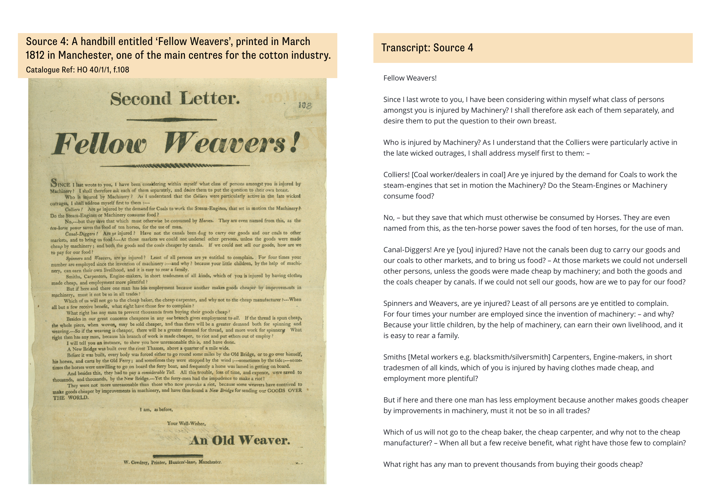

# 砸机器之后

## 卢德运动的力量、失败与劳动政治

1811—1813 年的毁机、组织与镇压，以及它们留给 AI 时代的问题

---

# 当你听到“卢德分子”，最先想到什么？

- 害怕新技术的人？
- 被机器夺走工作的工人？
- 以暴力阻止工业进步的保守力量？
- 面对失控变革，要求重新参与决定的人？

如果只能选一项，你会把哪一种联想放在最前面？

---

# 1811 年的英国，还不是“工厂已经取代手工业”的世界

**史实｜基本环境**

英国仍在同拿破仑作战。战争、贸易收缩、粮价上涨和周期性失业同时压在劳动者家庭身上。

纺织业内部也没有一条整齐的升级路线：家庭作坊、租赁机架、熟练整理工序、蒸汽动力工厂和城市零工长期并存。机器进入生产，往往伴随着转包、产品规格、工资和工场纪律的重新组合。

---

# 1811—1813 年，毁机浪潮从诺丁汉扩展到三个工业地区

| 时间 | 发生了什么 |
|---|---|
| 1811 年春 | 诺丁汉郡出现集中的织机破坏 |
| 1811 年秋冬 | “Ned Ludd”“General Ludd”等共享署名广泛出现 |
| 1812 年春 | 约克郡发生武装攻厂；兰开夏出现攻厂、纵火和群众冲突 |
| 1812—1813 年 | 军事驻防、特别立法、审判和公开处决升级 |
| 1813 年以后 | 集中的卢德浪潮衰退，停工、工会、请愿等形式继续发展 |

---

# 谁参加、做了什么、又面对什么力量？

| 参与者 | 行动 | 国家回应 |
|---|---|---|
| 框架针织工、剪绒工、手织工 | 定点毁机、工价谈判、停工 | 军队、厂卫、巡逻 |
| 部分工厂劳动者和社区支持者 | 请愿、代表会议、行业调查、筹款 | 间谍、悬赏、证人制度 |
| 不同地方的秘密小组与公开代表 | 秘密通信、夺枪、威胁、纵火、刺杀 | 死刑立法、特别法庭、流放与处决 |

卢德运动不是一个全国总部指挥的统一军队，也不是一种单一行动。

---

# “Luddite”后来被压缩成了一个反技术标签

机器破坏确实是运动最醒目的画面。后来，“Luddite”逐渐脱离这段历史，被用来指害怕新工具、拒绝现代生活的人。

但在 1811—1813 年，一台机器进入生产时，常常同时改变：

- 谁的工资下降，谁的技能仍然算数；
- 谁能规定产品质量，谁承担市场风险；
- 谁能决定生产怎样组织，谁只能接受结果。

问题因此不只是“支持还是反对机器”，而是机器为什么会成为这些冲突的目标。

---

# 同一个“卢德分子”，曾被写成七种形象

| 历史形象 | 其中包含的判断 |
|---|---|
| 反工具的怀旧者 | 新技术代表未来，抵抗只能来自恐惧 |
| 尚未成熟的机器破坏者 | 工人还不会区分机器与机器的资本主义使用 |
| 尚未成熟的工会主义者 | 毁机终将被合法、稳定的劳资谈判取代 |
| 贫困刺激下的暴徒 | 饥饿和失业会直接产生无组织的骚乱 |
| 反科学、反未来的文化人 | “Luddite”是一种拒绝现代性的文化性格 |
| 以骚乱进行集体谈判的劳动者 | 毁机可以是有目标的劳资施压 |
| 形成中的阶级，或地区化的行业行动者 | 争议在于：局部冲突形成了多大尺度的政治主体 |

这些形象并不只是对卢德派“评价不同”，它们对技术、行动理性和阶级形成提出了不同问题。

---

# 七种形象，可以压缩成三场贯穿全程的争论

| 争论 | 一个极端答案 | 需要历史材料回答的问题 |
|---|---|---|
| **进步还是阻碍** | 机器代表未来，抵抗只是落后 | 他们反对的是新技术本身，还是技术重组的工资、资格和权力？ |
| **痉挛还是策略** | 贫困直接造成暴乱 | 为什么不同地区选择不同目标，并同时使用谈判、请愿和破坏？ |
| **行业行动还是阶级政治** | 有工价诉求就只是经济斗争；出现激进口号就是革命 | 地方组织、共同名称、代表关系和国家冲突究竟连接到什么程度？ |

判断卢德运动，不只是判断“砸机器对不对”，而是回答这三个相互关联的问题。

---

# 同一场运动，在三个地区长成了三种不同的政治

| 地区 | 首要冲突 | 最突出的行动能力 |
|---|---|---|
| 诺丁汉与东米德兰 | 工价、产品规格、支付与行业资格 | 调查、代表、谈判与准监管 |
| 约克郡西区 | 熟练整理工序、机器替代、设防磨坊 | 秘密纪律、武装协调与社区沉默 |
| 兰开夏与西北 | 工作、工资、粮价、机器与政治改革 | 把行业冲突扩大为城市生计危机 |

地区差异不是背景细节。劳动怎样组织，决定了劳动者能够形成怎样的政治能力。

---

# 诺丁汉的核心不是一场“新机器淘汰旧机器”的冲突

**史实｜诺丁汉 1/5**

框架针织主要在家庭和小作坊中完成。袜商控制订单、原料和市场，织工承担机架租金、工价下降和产品规格变化的压力。

宽幅织机能够先织成大片织物，再裁剪缝合成袜子；未完成传统学徒训练者也会进入生产。冲突因此围绕整个行业秩序展开：谁能入行，什么产品合格，怎样支付，风险由谁承担。

---

# 被破坏的机器不一定“新”，关键是它怎样被使用

**史实｜诺丁汉 2/5**

宽幅织机因为改变产品规格而成为目标；旧机架如果被用于压低工价，同样可能被破坏。

这意味着毁机对象不能简单按“先进／落后”或“新／旧”分类。劳动者针对的是机器所承载的生产规则：低价竞争、裁剪件、实物工资、转包关系和行业资格都可能集中到一台具体机架上。

---

# 1811 年 11 月：谈判、请愿、威胁和毁机同时存在

**史实｜诺丁汉 3/5**

同一时期的材料包括：署名 “Ned Lud” 的威胁信、平丝袜工对加价袜商的公开感谢，以及要求袜商与工人共同向议会请愿的公开信。

> **11 月 8 日，Ned Lud 信（原信残损）：** “pull don the Frames … my Companey will [visit yr machines for execution]”
>
> **11 月 27 日，公开感谢书：** 52 家袜商同意为黑丝袜每双加价六便士。
>
> **11 月 28 日，框架针织工公开信：** 要求 “better Regulation of our Trade”，并希望行动 “peaceably and in good order”。

三份文本未必出自同一群人，却足以说明：公开协商与匿名强制并不是先后替代的两个阶段。

来源：HO 42/118；*Nottingham Review*, 29 November 1811。详见 [[1811年诺丁汉_同一报页上的谈判与威胁]]。

---

# 毁机在诺丁汉也可以是一种带有强制力的集体谈判

**史实与解释｜诺丁汉 4/5**

公开代表可以提出工价和规制方案，却未必能约束拒绝协议的袜商；夜间毁架则让破坏协议者立即承担成本。

霍布斯鲍姆把这种关系概括为“以骚乱进行集体谈判”：毁机不是谈判的反面，而是劳动者在缺少稳定制度保障时，让协议具有约束力的一种手段。

这个解释恢复了行动的策略性，但还不能说明劳动者认为什么样的生产规则具有正当性。

---

# 诺丁汉工人已经在试验一种行业代表政治

**史实｜诺丁汉 5/5**

1812 年，Gravener Henson 要求周边城镇和村庄各派两名可信人士。后来的总会自称有 106 名代表，其中 76 名来自诺丁汉十六英里以内。

> **会议广告：** “send Two credible Persons”——每个城镇或村庄派出两名可信人士；会议要集中 “the best Intelligence”，交给议员说明骚乱的原因。

联合委员会随后提出按机架规格规定产品与计件价格，反对裁剪件和实物工资。决议使用的制度语言包括：“by the Rack, or Count”、产品规格标记、禁止或标明低质产品、反对以货物支付工资。

它把地方知识变成了代表与方案；但它没有治理权，学徒资格也可能排除新人和女性。

来源：HO 42/120；*Nottingham Review*, 21 February 1812。详见 [[1812年Henson框架针织工会议广告_代表制、调查与秩序窗口]]、[[1812年框架针织工联合委员会决议_公开规制方案与全国化诉求]]。

---

# 约克郡的冲突发生在熟练工序与集中化磨坊之间

**史实｜约克郡 1/5**

剪绒工负责毛织物最后的整理，是技术熟练、行业认同很强的劳动者。起绒机和剪绒机改变了这道工序，也把更多生产环节集中进磨坊。

当地行动的武装程度明显更高：秘密誓约、夺取枪支、队列行进、骑马警戒、夜袭磨坊和对告密者的威慑，都出现在材料中。

---

# 秘密纪律把熟人网络转化成了夜间行动能力

**史实｜约克郡 2/5**

熟人、亲属、工场和酒馆网络有助于筛选成员、传递消息和保持沉默。匿名署名、誓词与遮字密钥降低了行动暴露的风险。

> **信件表层：** “The Committee for the relief of the Poor meet on Wednesday night at 8 o’clock …”
>
> **覆上遮字密钥后：** “The Committee / meet on Wednesday night at 8 o’clock / on Bullwell Common.”

同一组圆函还讨论雇主怎样消耗工人的 “fortitude and finances”、商品供应、长期斗争和读后销毁。保密保护了行动，却没有回答谁授权高风险行动、谁能质询“委员会”。

来源：TNA, HO 42/125、HO 42/127。详见 [[1812年“委员会”圆函与遮字密钥_协调、保密与组织规模]]。

---

# Rawfolds：劳动者面对的已经是一座设防的生产空间

**史实｜约克郡 3/5**

1812 年 4 月 11—12 日夜，袭击者携带枪、锤和斧攻击 Rawfolds Mill。冲突持续约十五至二十分钟，厂内守卫猛烈射击，攻击者没有破门。

John Booth 腿部重伤，截肢后死亡；Samuel Hartley 胸部中弹后死亡。磨坊由厂主、雇员和士兵共同防守。

工匠网络的突袭优势，在加固厂房、私人防卫和国家军力面前，迅速变成军事不对称。

---

# 国家把共同的工业冲突拆成了一个个刑事案件

**史实｜约克郡 4/5**

1813 年约克特别巡回法庭有 66 名被告进入审理名单；18 人获资本刑，其中 17 人被处决。

罪名并不是统一的“卢德派罪”，而是谋杀、入室盗窃或抢劫、暴动拆毁和非法宣誓等。Rawfolds 案中，法官概述控罪时称八名被告与其他人暴动集结，并：

> “began to demolish and pull down” Cartwright 的磨坊。

陪审团最终对同案八人作出五项有罪、三项无罪的区别裁断。国家由此把共同的工业冲突改写成若干个体案件，再以审判、流放和处决重组地方社会。

来源：Joseph Gurney, *Report of Proceedings … York* (1813), pp. 144, 165–166。详见 [[1813年约克特别巡回法庭_判决不是单一的毁机案]]。

---

# 同一个 John Booth，存在于事件证据与工人记忆的不同层次

**史料辨析｜约克郡 5/5**

1812 年 4 月 18 日的 *Leeds Mercury* 记载，Booth 腿部重伤、截肢后死亡，Hartley 胸部中弹后死亡；报道特别写道，两人：

> “without making any confession of their accomplices”  
> 没有供出任何同伴。

“旅馆拒绝止血”“用硝酸逼供”“你能保守秘密吗——我也能”等完整场景，来自 Frank Peel 1880 年记录的地方传说。它们能够说明沉默怎样被塑造成工人记忆，却不能作为 1812 年的逐字记录。

来源：*Leeds Mercury*, 18 April 1812；Frank Peel, *The Risings of the Luddites* (1880)。详见 [[1812年Rawfolds后的John Booth_新闻、验尸与地方传说]]。

---

# 兰开夏的危机无法被缩成“手织工反对动力织机”

**史实｜兰开夏 1/4**

动力机器、工资下降、失业、粮价、战争和出口萎缩纠缠在一起。参与者包括手织工、工厂工人以及城乡群众。

Stockport 有蒸汽织机被毁，Middleton 和 Westhoughton 出现攻厂和纵火；粮食骚动、夺枪、夜间操练、代表会议和政治改革传闻相互叠加。

机器冲突在这里扩展成了一场更广泛的生计与政治危机。

---

# Westhoughton：群众在场如何被拼接成纵火罪

**史实｜兰开夏 2/4**

1812 年 4 月 24 日，Westhoughton 的织造厂、仓库和织机作坊被焚。5 月 26 日，14 名男女和少年受审：四人被判死刑，十人无罪；四名被判者于 6 月 13 日被处决。

案件把不同动作拼接进一项资本罪。现存案情表述是：

> “wilfully and maliciously set on fire and burnt a Weaving Mill, Warehouse and Loom Shop”  
> 故意且恶意地放火焚烧织造厂、仓库与织机作坊。

审判摘要把 Abraham Charlson 记为 16 岁，指控其攻击窗框并取稻草助燃；这与后来“十二岁男孩钻窗、临刑喊妈妈”的故事冲突。

来源：*Lancaster Gazette*, 30 May、6 June 1812 的可追溯摘要。详见 [[1812年Westhoughton磨坊案_审判记录与查尔森叙事校正]]。

---

# 共同反对雇主，并不等于劳动者之间没有边界冲突

**史实｜兰开夏 3/4**

1812 年 2 月，一封写给 Ancoats 厂主 Kirkby 的匿名信，把“雇用如此多女性”与男性纺纱工及其孩子缺少面包联系起来。信的结尾是：

> **“Reform or Death.”**  
> 改变这种雇用安排，否则就是死亡。

另一封给 McConnel & Kennedy 的信先承认厂主的“礼貌和善意”，随后仍要求解雇女工、重新雇用男人。

传统规范可以支撑工价和生计诉求，也可以把女性、新进入者和弱势职业排除在“合法劳动者”之外。谁被包括、谁被牺牲，本身就是阶级形成的一部分。

来源：TNA, HO 42/120；McConnel, Kennedy and Company Papers 2/1/18/1。详见 [[1812年兰开夏棉纺材料_性别、机器与“面包”]]。

---

# 劳动者并没有因为处境相近，就自动形成同一种技术立场

**史实｜兰开夏 4/4**

1812 年 3 月，一份署名 “An Old Weaver” 的《Fellow Weavers!》为机械化辩护。它把机器、廉价商品、市场扩大和总体就业连接起来，并反问：

> “What right has any man to prevent thousands from buying their goods cheap?”  
> 一个人有什么权利阻止成千上万人购买更便宜的商品？

署名“老织工”不能证明作者身份，也不能证明机器确实增加了作者宣称的就业；它证明的是，当时的劳动者已经面对一套完整的“效率与消费者利益”论证。

来源：TNA, HO 40/1/1, f.108；英国国家档案馆教学材料 PDF 第 11 页。详见 [[1812年“Fellow Weavers”_机器辩护与工人分歧]]。

---

# 三种卢德主义，拥有三种能力，也以三种方式受挫

| 地区 | 形成的能力 | 内部矛盾 | 主要限度 |
|---|---|---|---|
| 诺丁汉 | 行业调查、公开代表、准监管方案 | 技能规范可能排除新人和女性 | 无法约束全部雇主，也没有治理权 |
| 约克郡 | 秘密纪律、武装协调、社区沉默 | 保密可能压制异议和问责 | 设防磨坊暴露军事不对称 |
| 兰开夏 | 把冲突扩大为城市生计危机 | 性别、职业与技术利益分化 | 目标异质，易被按骚乱和纵火分案镇压 |

所谓“卢德派为什么失败”，必须先回答：哪一种地方力量，在什么关系中失败？

---

# 三个地区给出了三项暂时答案

**进步还是阻碍：**卢德派并不只是害怕一切新技术，也不能被美化成完全不反机器。他们攻击了特定机器和产品；关键是机器、工价、产品、技能、市场和权力在现实中无法拆开。

**痉挛还是策略：**贫困、战争和粮食压力是重要条件，却不足以解释行动形式。谈判、请愿、毁机、武装袭击和群众纵火具有可以重建的目标与组织逻辑，也包含伤害、恐吓和内部强制。

**行业行动还是阶级政治：**卢德运动已经是政治，但“具有政治性”不等于“已经形成统一革命运动”。它争夺生产规则、制造共同名字并与国家权力相撞；三地却没有稳定共享的财政、纲领、命令链和公开授权。

真正的史学问题是：从地区性工资冲突、匿名文本和秘密行动中，可以合理推论出多大尺度的政治主体？

---

# 卢德派并不是“没有组织”

**力量转换｜问题的起点**

他们有公开委员会、秘密委员会和囚犯支援委员会，也有筹款、通信、誓词、纪律、夜间行动和跨地点联系。

但材料中的“委员会”不等于一个全国总部，共享 “General Ludd” 的名字也不等于共享固定成员、命令链和共同纲领。

更准确的判断是：卢德派拥有很强的地方组织性，却没有把这些力量稳定地转换到更大尺度。

---

# 运动的限度集中在四次没有完成的力量转换

| 已有能力 | 尚未稳定形成的能力 |
|---|---|
| 地方信任与行业知识 | 跨地区、跨行业协调 |
| 秘密纪律与行动安全 | 公开授权与内部问责 |
| 破坏性杠杆 | 财政、记忆和持续谈判 |
| 对个别雇主施压 | 改造法律、制度与国家的战略 |

这不是档案中现成的“失败原因”，而是一种比较历史的解释框架。

---

# 地方信任能够支持行动，却不能自动生成共同纲领

**力量转换 1｜地方 → 跨地区**

熟人、亲属、工场、酒馆和社区沉默降低了集体行动的风险。但跨出当地以后，诺丁汉的产品规制、约克郡的熟练工序和兰开夏的粮食危机并不会自动变成共同利益。

共同名字能够传播威慑和想象，却不能自动分配财政、排列诉求、处理分歧。扩大尺度需要新的调查、协商与决策机制。

---

# 秘密组织保护了行动，也遮蔽了授权关系

**力量转换 2｜秘密 → 公开授权**

秘密纪律适合保存夜袭能力，却很难公开回答：

- 谁代表谁？谈判结果由谁批准？
- 少数人能否以共同体名义采取高风险行动？
- 领导者怎样被质询、纠正和撤换？
- 社区沉默是授权、容忍，还是恐惧？

行动安全与内部民主都是真实需要，二者不会自然一致。

---

# 一次有效扰乱，怎样成为可以延续的集体能力？

**力量转换 3｜扰乱 → 保存**

毁机能够迫使雇主承担成本，甚至换来短期加价。但一次成功威慑不会自动留下会费、救济、档案、组织记忆、法律地位和持续谈判。

常设组织能够保存成果，也可能为了资产、承认和谈判席位，压低成员最有效的扰乱能力。

难题不是“行动还是组织”，而是组织怎样保存行动创造的力量，又不把它消耗掉。

---

# 对个别雇主施压，还不足以改变生产变化的制度条件

**力量转换 4｜行业 → 国家**

国家并不是在机器与工人之间保持中立。所有权、结社法、军队、地方官、情报、证人制度和刑罚，共同规定机器能够怎样进入生产，也规定劳动者能够怎样联合。

如果运动只能迫使个别雇主让步，却不能改变结社、代表和生产规制，那么局部胜利随时可能被另一家雇主、另一项法律或一次市场变化抵消。

---

# 霍布斯鲍姆恢复了毁机的策略性，也留下了一个缺口

**史学争论 1｜利益与行动**

霍布斯鲍姆反对把早期工人写成对经济刺激作出盲目反应的人。他概括道：

> “这种‘借由暴动来集体协商’的盛行已经被研究者充分地证实。”

毁机可以是有目标、有选择的工资与行业斗争，而不是工业化初期的非理性爆发。

但如果所有规范都被解释成谈判工具，劳动者关于公平价格、正当工艺和合法生产的判断就会消失。人们不仅计算行动是否有效，也在争论什么样的生产秩序值得服从。

来源：E. J. Hobsbawm, “The Machine Breakers,” *Past & Present* 1 (1952), pp. 57–70；引文采用工作区中译。

---

# 汤普森让工人重新成为历史行动者，但“共同经验”并不自动统一

**史学争论 2｜阶级形成**

汤普森拒绝把阶级当作经济结构自动生产的分类。在《英国工人阶级的形成》序言中，他写道：

> “工人阶级并不像太阳那样在预定的时间升起，它出现在它自身的形成中。”

共同处境只有经过斗争、语言、记忆和组织，才会形成有历史行动能力的关系。

这个视角让工人能动性重新进入历史；三地差异则提醒我们，共同经验可以形成团结，也可以形成冲突的政治方向。阶级在形成，阶级边界也在被争夺。

来源：E. P. Thompson, *The Making of the English Working Class*，序言；工作区中译 PDF 第 8—9 页。

---

# “道德经济”能解释正当性，却不能独自解释力量

**史学争论 3｜规范与能力**

汤普森对十八世纪粮食骚动的判断是：

> “An outrage to these moral assumptions, quite as much as actual deprivation, was the usual occasion for direct action.”  
> 对道德假设的冒犯，与现实剥夺本身一样，通常成为直接行动的契机。

道德经济解释人们为什么把某些价格、工价和生产规则视为不正当，也解释社区为什么可能支持直接行动。

但它不能单独说明地方组织怎样扩大、设防磨坊怎样改变力量对比、国家怎样拆解运动、代表者怎样获得授权。而且这个概念原本主要用于粮食骚动；把它延伸到卢德主义，需要明确边界。

来源：E. P. Thompson, “The Moral Economy of the English Crowd,” *Past & Present* 50 (1971), pp. 78–79。

---

# 修正主义研究防止过度统一，却可能把政治重新缩回行业纠纷

**史学争论 4｜差异与联系**

托米斯等研究强调行业、地区和行动目标的具体差别，提醒人们不要把激进口号直接当作全国革命组织的证明。

兰德尔则反对把毁机与后来“正常”的工会谈判截然分开：暴力、谈判、规范和组织并不是从落后到成熟的单向阶梯。

分辨差异十分必要；同样必要的是解释，不同地方为何仍共享名字、语言、恐惧和政治想象。

---

# 共享神话可以组织行动，但象征统一不等于实体统一

**史学争论 5｜General Ludd**

“Ned Ludd”“General Ludd”让分散行动获得可辨认的署名、威慑力和共同身份。纳维卡斯等研究说明，名字、歌曲、仪式和地方记忆确实能够组织情感与行动。

但同一名字并不能证明存在统一总部、固定成员和全国命令链。

卢德主义既有真实组织，也没有统一组织；既表现出阶级形成，也暴露出阶级内部的排除。

---

# 史学争论改变的，不只是“怎样评价卢德派”

如果卢德运动只是非理性毁机，问题只是现代化怎样清除阻力。

如果它是利益谈判，问题变成劳动者怎样制造成本。

如果它是阶级形成与正当秩序的冲突，问题还包括共同体怎样产生。

如果它已经有组织，真正需要解释的就是：地方力量为什么没有稳定转化为跨地区协调、公开授权、持久制度和国家战略。

---

# 1814 年以后，工价冲突仍在，组织技术开始改变

**组织实验｜从匿名威慑到常设组织**

1814 年，一封从诺丁汉寄往 Dumfries 的工人信记录了几组具体信息：

> 信中可核信息包括：约 **300 名 plain-silk hands** 已经停工六周以上，要求每双加价 **2d**。
>
> 写信人称：**“Hosiers have formed a powerful Combination against us.”**
>
> 同一封信寄出 **4 份 Articles** 和 **60 份 Diplomas**，邀请建立分会。

问题没有消失，但力量开始借助停工、章程、凭证和跨地区互助保存，而不再主要通过 “Ludd” 的匿名威慑传播。

这不是从“幼稚”走向“成熟”的直线，而是对工价、持续性和跨地区协调进行新的组织实验。

来源：S. Simpson 致 Dumfries 同行，16 June 1814，TNA HO 42/140。详见 [[1814年诺丁汉至Dumfries的工会信_停工、两便士与跨地区互助]]。

---

# 马克思与考茨基追问：分散冲突怎样积累成共同力量？

**理论交锋 1｜阶级与群众组织**

相似的工资处境不会自动产生共同主体。调查让经验可以比较，通信和报刊让冲突彼此可见，会议与纲领把不同要求排出优先次序，会费和组织让共同决定能够持续执行。

考茨基式群众政党的强项，是为这种积累提供全国尺度和进入国家的通道。

它也提出新的问题：谁来定义共同利益？哪些局部要求会在全国纲领中被放在边缘？

---

# 阶级组织不是把现成利益相加，而是在重新划定边界

**理论交锋 1｜阶级与群众组织**

框架针织工保护学徒资格，可以抵抗低价竞争，也可能排除女性和新进入者。现代组织保护稳定会员，也可能把外包、临时工和辅助岗位留在边界外。

组织扩大了劳动者的尺度，同时也在回答：谁是“我们”，谁的要求优先，谁可以被暂时牺牲。

因此，阶级形成既是团结的过程，也是边界政治。

---

# 卢森堡与皮文—克洛沃德都把力量放回“不再配合”的时刻

**理论交锋 2｜扰乱与组织**

弱者的力量常常不来自已有资源，而来自制度对日常配合的依赖。罢工、占领、拒绝执行和其他扰乱，会暴露哪些环节离不开劳动者，也让尚未组织的人进入政治。

组织不一定是行动之前准备好的容器，也可能是行动留下的结果。

卢德毁机的重要性正在这里：它迫使雇主和国家承认，生产秩序并不能在劳动者完全不合作的情况下自然运行。

---

# “自发还是组织”是一个假二选一

**理论交锋 2｜扰乱与组织**

一次扰乱如果没有救济、会费、记录、谈判程序和可执行协议，很容易随行动高峰消散。

常设组织如果只追求资产、承认和谈判席位，也可能失去成员真正能够制造中断的能力。

更可行的循环是：

**行动发现杠杆 → 组织保存成果 → 基层保留行动能力 → 用行动纠正组织**

---

# 列宁主义严肃处理了镇压下的连续性问题

**理论交锋 3｜战略集中**

地方组织可能被逐一摧毁，全国通信、保密、干部和战略集中因此不是多余装饰。卢德派的经历也表明，共享名字和秘密纪律可以保护行动，却不足以形成持续的整体战略。

但集中本身不回答：谁制定方向？谁批准高风险行动？错误怎样被发现？普通成员怎样撤换代表？

先锋队能够处理部分战略能力问题，却不会自动产生群众授权。

---

# 布迪厄提醒：代表让群体出现，也可能取代群体

**理论交锋 3｜代表与委托**

分散者需要一个名称、发言人和组织，才能作为公共群体被看见。正因为如此，代表者也可能垄断“这个群体是谁、需要什么”的定义权。

群众问责不能只依靠领导者谦逊，而要变成可以使用的制度：

- 明确授权范围与期限；
- 公开谈判信息与分歧；
- 保留基层独立结社和否决能力；
- 允许成员撤换代表。

---

# 彼得格勒的经验表明：夺取国家、改变所有权、控制生产是三件事

**理论交锋 3｜1917—1918**

革命能够改变国家权力，也能够推动国有化；但这并不自动意味着工人能够持续控制劳动过程、管理任命和生产决策。

> “真实的历史不可能在某个精准的时间点上完成转折，工人并不会在一夜之间就失去了对生产的控制，国有化要成为现实同样也是如此。”

三种目标彼此相关，却不能互相替代：

1. 谁掌握国家权力？
2. 谁拥有生产资料？
3. 谁在日常生产中拥有知情、决定和纠错能力？

来源：S. A. Smith, *Red Petrograd: Revolution in the Factories, 1917–1918*，工作区中译 PDF 第 8 页。详见 [[红色彼得格勒：工厂中的革命，1917-18.pdf]]。

---

# 葛兰西把工作场所力量放进更广的社会联盟

**理论交锋 4｜领导权与联盟**

一种行业要求要进入社会和国家，必须同消费者、社区、其他劳动群体和公共制度建立联系。教育、媒体、法律、专业机构与政党，都可能成为争夺方向的阵地。

这不只是为工人诉求寻找“外部支持”。劳动者还要说明：一种新的生产安排将怎样影响服务质量、公共责任、性别与职业分工，以及社会共同生活。

---

# 普沃斯基提醒：进入选举与国家，并不是力量的无损放大

**理论交锋 4｜群众政党与国家**

群众政党为了赢得多数，必须重新组合劳动者与其他公民的关系。这能够扩大联盟，也可能削弱组织同具体劳动过程的联系。

国家战略因此需要返回工作场所接受检验：宏观政策是否真正增加了劳动者的知情、协商、收益分享、暂停和纠错能力？

“以劳动者名义扩大管理权”，并不等于劳动者获得了权力。

---

# “寡头铁律”描述一种压力，不应被当成民主不可能的证明

**理论交锋 5｜官僚化**

大型组织确实倾向于集中信息、资源、专业知识和职位。领导层也可能用组织生存代替成员目标。

但危机、领导更替、基层独立组织、信息公开、撤换机制和外部运动压力，都可能打断这种集中。

官僚化不是一句宿命论结论，而是一组需要持续识别和制衡的机制。

---

# 没有一种组织形式能够单独解决全部难题

| 难题 | 可以使用的组织技术 | 必须同时设置的约束 |
|---|---|---|
| 地方知识怎样扩大 | 调查、通信、代表大会、群众组织 | 纳入边缘职业，公开共同边界怎样形成 |
| 扰乱怎样保存 | 会费、救济、协议、档案、常设委员会 | 基层保留自主行动，不让承认磨损杠杆 |
| 战略怎样集中 | 干部、报刊、跨地区协调、政党 | 明确授权、公开信息、撤换与独立组织 |
| 国家怎样进入 | 联盟、立法、公共机构、产业政策 | 用工作场所的实际权利检验宏观方案 |

判断一种组织形式，不只看它声称代表谁，还要看它增加了什么能力、遗漏了谁、由谁控制、怎样纠错。

这套检验同样可以进入当代技术冲突，但历史上的组织形式不能被原样复制。

---

# AI 不是十九世纪织机的重演

**当代问题｜技术是一条生产链**

AI 由算力、数据、知识产权、平台、采购、管理制度和不同劳动位置共同构成。模型研究者、程序员、标注审核者、教师、记者、翻译、客服和平台劳动者面对的风险并不相同。

历史不能提供类比答案，但能提供进入问题的顺序：先看劳动过程怎样被重组，再看谁拥有决定权；先形成可以共同执行的要求，再讨论需要什么组织和政策。

---

# 从一次普通的 AI 部署冲突开始

**当代问题｜分析场景**

一个机构宣布引入生成式 AI，用于制作初稿、分配任务、评价绩效，并据此调整人员。

管理层强调效率，却没有说明：

- 输入与训练数据怎样使用；
- 错误和合规责任由谁承担；
- 岗位是否减少，劳动强度是否上升；
- 节省下来的时间和收益归谁。

“支持还是反对 AI”仍然太抽象。冲突必须被拆成可以调查、协商和约束的问题。

---

# 第一步：把系统对劳动过程的改变画出来

**行动 1｜劳动影响图**

至少标出六项内容：

1. 哪些任务被自动化，哪些只是转移给人校对；
2. 谁提供数据、案例与隐性知识；
3. 新的错误、合规和情绪劳动由谁承担；
4. 考核指标与劳动强度怎样变化；
5. 岗位边界与责任链怎样变化；
6. 哪些节点能够暂停部署。

没有共同调查，个体经验很难变成共同要求。

---

# 第二步：把不同担忧翻译成最低共同要求

**行动 2｜共同条款**

- 部署前披露工具、供应商、数据用途、评价规则和人员影响；
- 不得仅凭系统结果处分或裁员；
- 保留人工复核、申诉和明确责任主体；
- 节省的时间进入工时、工资、培训或人员配置谈判；
- 高技能员工、辅助岗位、外包人员和服务对象都能进入协商。

共同要求不必先解决整个 AI 制度，但必须能够被执行和检验。

---

# 第三步：找出系统仍然依赖哪些劳动者配合

**行动 3｜杠杆清单**

可能的杠杆包括：拒绝无偿提供训练材料、集体记录错误、专业伦理拒绝、要求公开风险、按既有规程工作、集体谈判、工作场所行动，以及用户与社区压力。

每一项手段都要写清：

**目标｜参与者｜成本｜风险｜升级条件｜退出条件**

历史不会告诉人们应当复制哪一种手段；它提醒人们先识别生产秩序对劳动配合的具体依赖。

---

# 第四步：把一次让步写成不依赖管理者善意的制度

**行动 4｜制度条款草案**

口头承诺可以转化为：

- 书面部署条款与资料取得权；
- 民选技术委员会与独立评估；
- 暂停权、申诉程序和明确责任链；
- 培训时间、人员配置与收益分享；
- 定期复议、公开记录和成员撤换。

一份有效条款要回答：谁能看、谁能谈、谁能叫停、谁来复核、多久重新审议一次。

---

# 第五步：让共同条款跨出单一工作场所

**行动 5｜跨尺度扩展**

单一机构的协议可能被外包、同行竞争或供应商规则绕开。已经在地方验证过的要求，可以继续进入：

- 行业协议与跨企业最低条款；
- 专业伦理和职业标准；
- 公共采购条件；
- 劳动法规与社会保障。

扩大尺度不是把决定权全部交给国家，而是让局部成果获得更广的执行力。

---

# 第六步：扩大力量的同时，约束代表者

**行动 6｜代表问责**

代表者需要公开：自己代表谁、依据什么授权谈判、哪些内容必须由成员批准。

基层需要保留：

- 独立取得信息和提出替代方案的能力；
- 自主组织行动和表达少数意见的空间；
- 否决协议和撤换代表的权利。

外包人员、女性、低技能岗位和受服务影响者，不能只在口号中被“包括”。

---

# 同一次 AI 冲突，需要在四个尺度上留下成果

| 尺度 | 首要任务 | 可以留下的制度成果 |
|---|---|---|
| 工作场所 | 调查任务变化，争取部署协商与暂停权 | 部署条款、技术委员会、申诉与收益分享 |
| 行业／职业 | 阻止企业借竞争和外包绕开标准 | 行业协议、专业规范、跨企业最低条款 |
| 社会联盟 | 连接劳动条件、服务质量、歧视和公共责任 | 用户参与、公共倡议、社会监督 |
| 国家／跨国 | 改变采购、劳动法、知识产权、福利与产业激励 | 法律权利、监管能力和普遍保障 |

四个尺度不是四选一；任何一个尺度上的成果，都可能被其他尺度上的力量绕开。

---

# 可以用五种能力检验技术政治是否真正前进

1. **知情与调查**：劳动者能否理解系统怎样改变任务、评价、数据和责任？
2. **协商与叫停**：部署能否被谈判、修改、暂停或拒绝？
3. **成本与收益分配**：生产率、风险、失业和培训成本由谁承担？
4. **跨职业协调**：稳定、专业岗位能否同外包、辅助岗位和服务对象形成共同要求？
5. **代表问责**：普通成员能否取得信息、否决、撤换和纠正代表？

---

# 技术必须从少数人的私人决定，变成受影响者能够共同决定的对象

诺丁汉的织机连接着工价、产品规格和行业代表；约克郡的机器被设防磨坊、厂卫和国家军力包围；兰开夏的动力织机同面包、性别分工和城市政治纠缠。

卢德派让生产变化付出了政治代价，却没有把地方力量稳定转换成跨地区协调、公开授权、持久制度和国家规则。后来的工会、群众政治、政党和先锋队补上了一部分，也各自制造了新的代表权力。

“砸机器之后”的问题仍然是：谁能调查改变、提出要求、制造杠杆、固定成果，并在扩大力量时继续控制自己的代表？

---

# 备用材料｜1811 年诺丁汉：同一个月里的三种政治语言

**匿名威胁｜11 月 8 日**

> “pull don the Frames … my Companey will [visit yr machines for execution]”

机器、支付安排与 “execution” 的拟司法语言被写进同一个条件句。

**具名谈判｜11 月 27 日**

> William Crump 代表平丝袜工，感谢 52 家袜商同意黑丝袜每双加价六便士。

**共同请愿｜11 月 28 日**

> “better Regulation of our Trade” · “peaceably and in good order”

三份材料不能证明作者相同，却直接否定了“先协商、协商穷尽后才暴力”的整齐顺序。

来源：HO 42/118；*Nottingham Review*, 29 November 1811。详见 [[1811年诺丁汉_同一报页上的谈判与威胁]]、[[1812年Henson框架针织工会议广告_代表制、调查与秩序窗口]]、[[1812年框架针织工联合委员会决议_公开规制方案与全国化诉求]]。

---

# 备用材料｜秘密组织使用了哪些实际技术？

**M39 圆函：谈判、财政与纪律**

> 雇主企图拖垮工人的 “fortitude and finances”；通信者要求维持既有的 “steady line of conduct”，并在读后销毁信件。

**M40 遮字信：慈善文字中的会议通知**

> 表层：“The Committee for the relief of the Poor meet on Wednesday night at 8 o’clock …”
>
> 密钥：“The Committee / meet on Wednesday night at 8 o’clock / on Bullwell Common.”

这些材料证明具体的协调和保密技术存在，却没有提供成员名单、议程或全国命令链。

来源：TNA, HO 42/125、HO 42/127。详见 [[1812年“委员会”的四种含义_不要把术语变成总部]]、[[1812年“委员会”圆函与遮字密钥_协调、保密与组织规模]]。

---

# 备用材料｜Rawfolds：事件、消息与记忆是三种材料

**1812 年同期新闻**

> Booth 与 Hartley “without making any confession of their accomplices”。

这能支持两人没有供出同伴，不能支持后来完整的临终对白。

**1812 年被截获的私人信**

> 如果有人 “be obliged to leave”，写信人已替他们找到一个 “seat of work”。

这表明行动风险与谋生互助被联系起来，却不能证明存在成熟的逃亡网络。

**1880 年地方叙事**

> “Can you keep a secret?” — “So can I.”

这句话属于 Frank Peel 记录的晚出记忆，不是验尸记录。

详见 [[1812年Rawfolds后的John Booth_新闻、验尸与地方传说]]、[[1812年Rawfolds后的两封私人信_消息、哀悼与工作网络]]。

---

# 备用材料｜国家用不同法律语言拆解同一场冲突

**1812 年 3 月 20 日：毁机死刑法生效**

法条把旧规定称为 “ineffectual”，并把故意毁坏、损坏或使框架针织机器失效的行为推入资本刑范围。它并不只处理“整台机器被砸烂”。

**1813 年 1 月：约克特别巡回法庭**

> Rawfolds 控罪：“began to demolish and pull down” the mill。

17 名被处决者中，有人因谋杀、有人因入室盗窃或抢劫、有人因参与磨坊袭击被判死。共同危机因此被翻译成不同的个体罪名。

详见 [[1812年毁机死刑法_时间线与议会争论]]、[[1813年约克特别巡回法庭_判决不是单一的毁机案]]。

---

# 备用材料｜兰开夏内部存在互相冲突的技术政治

**男性就业与女性劳动**

> 匿名纺纱工信件把女性就业与孩子缺少面包相连，以 “Reform or Death” 结尾。

**廉价商品与总体就业**

> “What right has any man to prevent thousands from buying their goods cheap?”  
> ——《Fellow Weavers!》，署名 “An Old Weaver”

**群众参与与资本罪**

> Westhoughton 控罪：“wilfully and maliciously set on fire and burnt a Weaving Mill, Warehouse and Loom Shop”。

共同处境没有自动产生共同技术立场，传统规范也没有自动产生平等共同体。

详见 [[1812年兰开夏棉纺材料_性别、机器与“面包”]]、[[1812年Westhoughton磨坊案_审判记录与查尔森叙事校正]]、[[1812年“Fellow Weavers”_机器辩护与工人分歧]]。

---

# 备用材料｜1814 年：问题延续了，组织形式改变了

S. Simpson 从诺丁汉写给 Dumfries 同行的信，把工价冲突和组织扩展写在一起：

> 约 **300 名 plain-silk hands** · 停工六周以上 · 每双加价 **2d**
>
> **“Hosiers have formed a powerful Combination against us.”**
>
> **4 Articles** · **60 Diplomas** · 邀请建立分会

这封信没有使用 Ludd 署名，也不命令毁机。它证明停工、章程、凭状和跨地区互助正在发展；不能证明卢德组织完整延续。

1799—1800 年反结社法的标题则直接针对 “Unlawful Combinations of Workmen”。组织并未消失，而是在公开请愿、互助、停工与秘密通信之间分化。

详见 [[1814年诺丁汉至Dumfries的工会信_停工、两便士与跨地区互助]]、[[1799至1825年反结社法_禁止范围与实际组织空间]]。

---

# 备用讨论｜“这不就是汤普森的阶级形成吗？”

汤普森的重要性，在于拒绝把阶级当作结构自动生产的东西：共同经验只有在斗争和解释中才形成有行动能力的关系。

但阶级形成之后仍有新的问题：共同体怎样获得跨地区协调、财政、代表和国家战略？组织怎样放大力量，又怎样重新划定阶级边界？

只强调经验与文化，无法解释力量转换与组织权力。

---

# 备用讨论｜“道德经济还重要吗？”

重要。它解释劳动者为什么把某些价格、工价和生产规则视为不正当，也解释社区为什么可能支持直接行动。

但它不能单独解释组织尺度、军事不对称、国家镇压和代表政治。汤普森的“道德经济”原本主要用于粮食骚动，把它延伸到卢德主义也需要说明边界。

---

# 备用讨论｜“是不是最后还是得靠先锋队？”

先锋队理论严肃处理了镇压、战略连续性和国家危机，不能被简化成少数知识分子的傲慢。

但它不自动解决群众怎样控制生产、代表者怎样被问责。彼得格勒经验说明，夺权、国有化和工人自我管理不是同一件事。

问题不是接受或拒绝一个标签，而是战略能力怎样产生、由谁控制、如何纠错。

---

# 备用讨论｜“群众自发性是不是更民主？”

直接参与能够打破群众与代表之间的固定分工，也能让尚未组织的人进入政治。

但直接参与并不自动包容。兰开夏男性劳动者排斥女性就业就是反例；群众行动也可能短促、信息不对称，难以跨地区协调。

民主既需要参与，也需要让参与能够持续并被纠正的制度。

---

# 备用讨论｜“组织官僚化不是不可避免的吗？”

大型组织确实有集中信息、资源和职位的倾向。但把“寡头铁律”当成宿命，会取消对具体制度和历史条件的分析。

危机、领导更替、基层独立组织、信息公开、撤换机制和外部运动压力，都可能打断寡头化。

它是一种必须持续对抗的机制，不是民主组织不可能的证明。

---

# 证据边界｜这些流行说法不宜继续使用

- “卢德派只破坏伤害工人的机器，从不伤人。”
- “卢德派完全不反技术，只反资本主义。”
- “General Ludd 领导了全国革命组织。”
- “卢德运动失败只是因为没有政党或先锋队。”

约克郡有刺杀、夺枪和交火；机器、工资、工艺与权力无法拆开；共享署名不等于全国总部；“如果拥有某种后来组织就会成功”也是无法验证的反事实。

---

# 证据边界｜历史联系不能被写成一条直线

- “卢德运动直接催生了工会和宪章运动。”
- “英国镇压卢德派的军队多于伊比利亚半岛的对法军队。”
- “Westhoughton 有十二岁男孩钻窗开门，临刑前呼喊母亲。”

可以讨论问题、策略和地方传统的有限延续，但不能宣称线性组织谱系。驻军比较的统计口径与时间点不稳定；Westhoughton 的流行叙事也同现有审判证据冲突。

---

# 延伸阅读｜史料与历史研究入口

- [英国国家档案馆：The proclamation of Ned Ludd](https://www.nationalarchives.gov.uk/explore-the-collection/stories/the-proclamation-of-ned-ludd/)
- [英国国家档案馆：Why did the Luddites protest?](https://www.nationalarchives.gov.uk/education/resources/why-did-the-luddites-protest/)
- [1812 年上院秘密委员会报告与辩论](https://hansard.parliament.uk/Lords/1812-07-14/debates/ae8fae91-aae9-4d37-af80-2ed3460013ae/LordsChamber)
- [1812 年下院毁机死刑法辩论](https://hansard.parliament.uk/Commons/1812-02-20/debates/615b15e9-9ed1-4c74-8b91-25f92b99cc54/CommonsChamber)
- [诺丁汉大学框架针织档案展](https://www.nottingham.ac.uk/manuscriptsandspecialcollections/exhibitions/online/fullyfashioned/index.aspx)

---

# 延伸阅读｜卢德主义研究

- [Katrina Navickas：The Search for General Ludd](https://researchprofiles.herts.ac.uk/en/publications/the-search-for-general-ludd-the-mythology-of-luddism/)
- [Kevin Binfield 编：Writings of the Luddites](https://press.jhu.edu/books/title/3144/writings-luddites)
- [Adrian Randall：Reinterpreting Luddism](https://www.cambridge.org/core/books/abs/resistance-to-new-technology/reinterpreting-luddism-resistance-to-new-technology-in-the-british-industrial-revolution/B3E8AE7F9B38458CB3AA67814361F2FA)
- [Robert Poole：Petitioners and Rebels](https://www.cambridge.org/core/journals/social-science-history/article/abs/petitioners-and-rebels-petitioning-for-parliamentary-reform-in-regency-england/ADA610BC6EA4CED1132AE8F0D5EA1647)

研究笔记：[[卢德主义专题文献]]、[[卢德主义微观史实补充笔记]]

---

# 延伸阅读｜组织与阶级形成

- [[阶级形成理论谱系_从马克思到当代]]
- [[理论资源08_皮文克洛沃德_破坏性力量与组织化张力]]
- [[欧洲的抗争与民主（蒂利）_章节深度学术总结]]
- [[Arguments Within English Marxism - Perry Anderson]]
- [[红色彼得格勒：工厂中的革命，1917-18.pdf]]

原典入口：[马克思：国际工人协会总章程](https://www.marxists.org/archive/marx/works/1871/10/24.htm) · [考茨基：爱尔福特纲领释义](https://www.marxists.org/archive/kautsky/1892/erfurt/) · [卢森堡：群众罢工、政党和工会](https://www.marxists.org/archive/luxemburg/1906/mass-strike/index.htm) · [列宁：怎么办？](https://www.marxists.org/archive/lenin/works/1901/witbd/index.htm)

---

# 延伸阅读｜国家、联盟与代表

- [马克思：给临时总委员会代表的指示](https://www.marxists.org/archive/marx/works/1866/08/instructions.htm)
- [Antonio Gramsci｜Stanford Encyclopedia of Philosophy](https://plato.stanford.edu/entries/gramsci/)
- [Adam Przeworski：Proletariat into a Class](https://www.cambridge.org/core/books/abs/capitalism-and-social-democracy/proletariat-into-a-class-the-process-of-class-formation/E39496586954E773689F99CB6B32C1A3)
- [Pierre Bourdieu：La délégation et le fétichisme politique](https://www.persee.fr/doc/arss_0335-5322_1984_num_52_1_3331)
